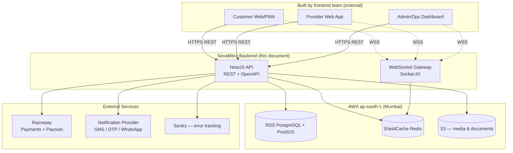
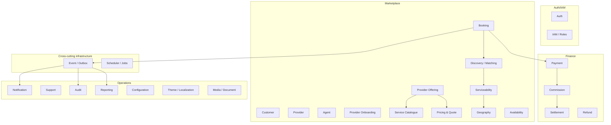
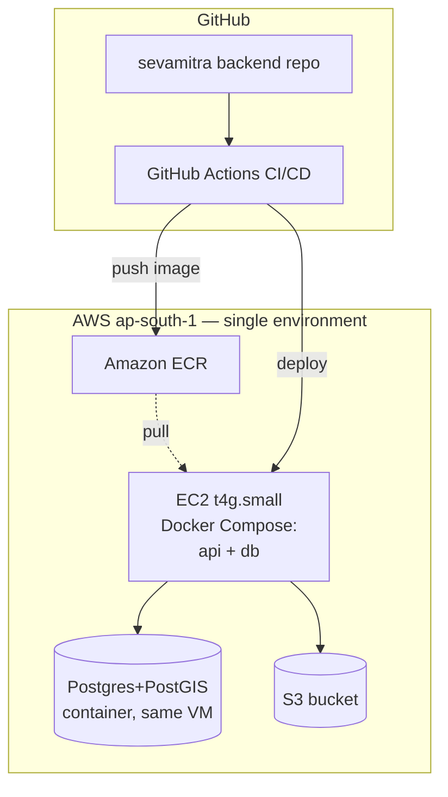

# SevaMitra — System Architecture Document

**Version:** 1.1 (Draft for review)
**Status:** Baseline architecture for pilot (3-taluk rollout)
**Owner:** Engineering / Tech Lead
**Derived from:** `BRD.pdf` / `brd_extracted.md` (BRD v4.3), `Developmet plan.pdf` (backend module plan email), and architecture clarification session on 2026-09-17
**Audience:** Backend engineering team, frontend team (external), DevOps/founders

**v1.1 change (2026-09-17):** Reverses two v1.0 decisions after an explicit
cost-minimization request, once real ap-south-1 pricing showed the
fully-managed staging stack (RDS + ElastiCache + EC2) running closer to
**~$49/month**, not the ~$25-30 originally assumed. See the updated §4 and
§14 for what changed and why. This is exactly the kind of decision
§23.3/§46 call for tracking explicitly rather than letting drift silently.

---

## 1. Purpose & Scope

The BRD (v4.3) is deliberately technology-neutral — it defines *what* SevaMitra must do as a business, not *how* it is built. This document is the first technology-specific answer to that BRD: it defines the system architecture for the **pilot phase** (three selected taluks, small controlled rollout) in a way that does not need to be redesigned as the business scales through the BRD's stated rollout path (taluk → district → state → pan-India).

This document covers:
- Application architecture (modular monolith, module boundaries)
- Data architecture
- API contracts and integration surface for the **separately-built frontend**
- Authentication/authorization model
- Deployment, infrastructure, and CI/CD
- Security, observability, backup/DR
- The explicit evolution path from pilot-scale to national-scale

It does **not** cover UI/UX design, detailed database DDL, or the frontend's internal architecture — those are owned by the frontend team and by a subsequent low-level design pass.

### 1.1 Relationship to source documents

| Source | What it contributed |
|---|---|
| BRD v4.3 | Business scope, roles/permissions model, configurability requirements, pricing/commission model, trust & SLA requirements, phased rollout strategy |
| Dev-plan email (Prasanna) | Initial technical direction: NestJS modular monolith, ~35 logical domain modules, critical module-boundary rules, event/outbox pattern, 14-module MVP milestone |
| Clarification Q&A (this session) | Concrete infra, hosting, integration vendor, and operating-model decisions recorded in §4 |

---

## 2. Guiding Principles

1. **Configuration over redeployment.** Commission rules, SLAs, pricing guidance, promotions, roles/permissions, and geography must be data-driven, not hardcoded — per BRD §6, §9, §23.3, §26.
2. **Provider-controlled pricing, platform-guided.** The Pricing module never enforces price; it stores guidance and provider-set prices as separate concepts.
3. **Open service catalog.** The Service Catalogue is decoupled from what any given provider offers (Provider Offering) — new categories must not require new backend modules (BRD §12, dev-plan email).
4. **Real domain modules, not microservices — yet.** One deployable NestJS application for the pilot, organized into strictly-bounded internal modules so that high-load modules can be extracted later without a rewrite.
5. **Low operational burden.** No dedicated DevOps/SRE in the pilot team — architecture favors managed AWS services over self-operated infrastructure wherever the cost delta is small.
6. **Design for the pilot's actual scale, not imagined scale.** Three taluks, a small provider/customer base — but design the *seams* (module boundaries, event outbox, schema separation) so growth doesn't force a rebuild.
7. **Geography ≠ Serviceability.** Geography is master data; serviceability is business logic evaluated per provider/customer/service combination (BRD §13, dev-plan email).
8. **Auth ≠ IAM.** Authentication answers "who are you," IAM answers "what can you do, and where" — via a User Type → Role → Permissions → Scope model, never hardcoded roles (BRD §9).
9. **The frontend is an external consumer.** All customer-, provider-, agent-, and admin-facing surfaces are being built by a separate team against this backend's API. The backend's job is to expose a complete, well-documented, stable contract — not to assume any particular UI framework.

---

## 3. System Context



The frontend team consumes the backend purely through the REST/OpenAPI contract (§8) and the WebSocket channel (§10). No shared code or shared framework assumptions are required between the two teams.

---

## 4. Confirmed Architecture Decisions (decision log)

These were confirmed explicitly during architecture clarification and are treated as locked for the pilot unless revisited. Rows marked **[v1.1]** revise a v1.0 decision after a cost-minimization pass — the struck-through original is kept visible rather than deleted, per §23.3's versioning principle.

| # | Decision area | Decision | Rationale |
|---|---|---|---|
| 1 | Runtime packaging | Docker containers, orchestrated with **Docker Compose** (not Kubernetes) | No dedicated DevOps; matches dev-plan email's "not paying for Kafka/Kubernetes today" |
| 2 | Cloud provider | **AWS**, region **ap-south-1 (Mumbai)** | Latency for Indian users, data residency comfort |
| 3 | Ops capacity | Solo/very small team, no dedicated DevOps | Drives preference for managed services throughout |
| 4 | Pilot scale target | Very small — matches BRD's 3-taluk pilot | Avoid over-engineering; optimize for cost and simplicity |
| 5 | Frontend ownership | Built entirely by a **separate team**; backend exposes APIs only | Backend architecture must prioritize contract clarity/stability |
| 6 | API style | **REST + OpenAPI/Swagger**, plus WebSockets for real-time | Easiest for an external team to integrate against; NestJS-native |
| 7 | Payment gateway | **Razorpay** (Orders + Route/RazorpayX for payouts) | Strong UPI + marketplace payout support, common in Indian marketplaces |
| 8 | Notifications | Provider-agnostic interface; **default implementation: MSG91** (SMS/OTP + WhatsApp) | Undecided vendor by user; architecture must allow swapping |
| 9 | Geo/serviceability | **PostgreSQL + PostGIS**, no third-party maps API in pilot | Keeps serviceability logic in-database; avoids per-request geocoding cost for pilot |
| 10 | Authentication | **OTP + password + social login (Google/Apple)**, JWT access+refresh tokens | Matches rural/low-literacy UX needs (OTP-first) while keeping options open |
| 11 | Background jobs | ~~BullMQ + Redis~~ **[v1.1] Deferred — no Redis in the pilot yet.** In-process/DB-polling for the outbox until a module actually needs a queue | Redis was costing ~$12/mo unused (no BullMQ jobs, no WebSocket gateway exist yet). Add BullMQ+Redis (self-hosted or managed) exactly when Notification/Scheduler or the real-time layer gets built — see §11 |
| 12 | File/media storage | **AWS S3** with presigned URLs | Standard, cheap, compliance-appropriate for verification documents |
| 13 | Real-time updates | **WebSockets** (Socket.IO via NestJS Gateway) | Providers need fast push of new job offers; live booking status |
| 14 | Database schema strategy | **One PostgreSQL schema per domain area** within a single database | Preserves the dev-plan's strict module-boundary intent; eases future extraction |
| 15 | CI/CD | **GitHub Actions** → build & test → push to **ECR** → deploy to ~~staging + prod~~ **[v1.1] a single EC2 VM** | Automated pipeline; single environment per decision #20 below |
| 16 | Observability | **Sentry** (errors) + **CloudWatch** (logs/metrics/alarms) | Managed, low setup effort, no infra to operate |
| 17 | Compliance/region | ap-south-1, standard PII encryption at rest; no extra DPDP-specific tooling in pilot | Sensible default; revisit before wider rollout |
| 18 | Postgres hosting | ~~Managed RDS~~ **[v1.1] Self-hosted Postgres container on the app EC2 instance** | RDS cost ~$21/mo; self-hosted is ~$0 extra. Pilot has zero real users/financial data yet, so the backup/patching trade is acceptable now — **revisit before real customer or payment data exists** (§19, §36) |
| 19 | Provisioning | This document includes a provisioning checklist (§20) | No accounts/services provisioned yet |
| 20 | Environments | ~~Staging + production~~ **[v1.1] One shared environment for the pilot** | Halves every cost above. A second environment is added once closer to a real launch, not speculatively now |
| 21 | EC2 instance | **t4g.small** (ARM/Graviton, 2GB RAM) — ~50% cheaper than the x86 `t3` equivalent at the same size | Enough headroom to run the app + self-hosted Postgres without swapping; ARM works fine since the Docker image is built from `node:20-slim`, which publishes multi-arch |

---

## 5. Application Architecture

### 5.1 Why a modular monolith

A single deployable NestJS application, internally organized into ~35 logical domain modules grouped into 4 functional areas. This avoids the operational cost of microservices (service discovery, distributed tracing, network hops, multiple deployment pipelines) that a 3-taluk pilot with no dedicated DevOps cannot justify, while the **strict module boundaries** (§6) mean specific modules (e.g., Discovery/Matching, Notification) can be extracted into their own services later without redesigning the domain model.

### 5.2 Module map



### 5.3 Delivery phasing

The dev-plan email's 14-module MVP milestone is treated as **Phase 1a**; the remaining modules marked "✅ Basic" or "✅" in the pilot column are **Phase 1b** (needed to actually run the pilot end-to-end, including money movement and support); BRD-tagged **[P1]** items are **Phase 2**; BRD-tagged **[P2]** items are **Phase 3+**.

**Phase 1a — first working journey** (customer registers → finds service → finds provider → books → provider accepts → completes → customer pays → notified → reviews):

| # | Module | Responsibility |
|---|---|---|
| 1 | Auth | Login, OTP, password, social login, tokens, sessions |
| 2 | IAM / Role Management | Dynamic roles, permissions, scopes, role assignments |
| 3 | Customer | Profile, addresses, preferences, account lifecycle |
| 4 | Provider | Individual provider profiles, verification, status |
| 5 | Agent | Individual/company agents, attribution |
| 6 | Provider Onboarding | Self/agent/bulk onboarding, documents, approval workflow |
| 7 | Service Catalogue | Categories, services, variants, attributes |
| 8 | Geography | Country/state/district/taluk/town/village/PIN master data |
| 9 | Serviceability | PIN/radius/polygon coverage, provider coverage matching |
| 10 | Provider Offering & Pricing | What a provider offers, at what price, price rules/quotes |
| 11 | Availability | Working hours, leave, exceptions, bookable slots |
| 12 | Booking | Service request, booking, assignment, lifecycle, cancellation |
| 13 | Payment | Payment intent, Razorpay integration, transaction status |
| 14 | Audit + Notification | Who-changed-what audit trail; SMS/WhatsApp/push delivery |

*Discovery/Matching* logic exists from day one but initially lives as query logic inside Booking + Serviceability (nearest-available-provider, customer choice); it is formalized as its own module once ranking rules (rating-weighted, round-robin, broadcast-to-multiple) grow complex enough to warrant isolation — this is a refactor within existing boundaries, not new scope.

**Phase 1b — complete the pilot's money and trust loop:**

| Module | Why needed before pilot go-live |
|---|---|
| Commission | Platform must calculate what it earns per booking |
| Settlement | Providers must actually get paid out |
| Refund (basic) | Cancellations/no-shows require refund handling |
| Provider Organization (basic) | Provider companies with staff need at least basic support |
| Support (basic) | Customer/provider complaints need a case-tracking surface |
| Theme/Localization (basic) | Kannada-first requirement (BRD §30.4, §44) |
| Media/Document | Provider verification documents, service photos (needed by Onboarding from day one) |
| Reporting/Dashboard (basic) | Ops needs visibility into bookings/GMV/commission (BRD §23.1) |
| Configuration | Commission %, SLA targets, price guidance must be editable without redeploy (BRD §26) |
| Event/Outbox + Scheduler | Cross-cutting from day one — see §11 |

**Phase 2 [P1 in BRD] — post-pilot-validation:**
Promotion/Coupon, Wallet/Cashback, Loyalty/Referral, Dispute, Safety/Incident, full Provider Organization, full Reporting.

**Phase 3+ [P2 in BRD / "Later" in dev-plan] — future opportunity:**
Fraud/Risk, B2B customer segment, recurring/contract services, membership & promoted listings.

A full module-to-phase mapping table is in the Appendix (§22).

---

## 6. Domain Boundaries & Key Design Rules

These boundaries are called out explicitly because violating them is the most likely way this codebase becomes unmaintainable as it grows — each is a direct requirement from the BRD or the dev-plan email.

### 6.1 Auth vs. IAM
- **Auth** answers "who are you" — credential verification, OTP issuance/verification, password hashing, social OAuth, token issuance/refresh/revocation.
- **IAM** answers "what can you do, and where" — roles are compositions of permissions (e.g. `provider.view`, `booking.reassign`, `refund.approve`) plus a **scope** (platform-wide, a geography, an organization, a provider group/company, or an assigned operational area). New organizational responsibilities (e.g. a future "Verification Manager" role) are created by composing existing permissions — never by adding a hardcoded role enum or shipping new code (BRD §9).

### 6.2 Service Catalogue vs. Provider Offering
- **Catalogue** is platform master data: categories → services → variants/attributes. Adding a legitimate new service category is a data operation, not a code change (BRD §12.1).
- **Provider Offering** links a specific provider to specific catalogue services, with that provider's price, coverage, availability, and status. This separation is what makes the "open service marketplace" principle real rather than aspirational.

### 6.3 The pricing → payment → earning chain
Five distinct concepts, five distinct data models — never collapsed into one "amount" field:

```
Provider Pricing        "What does the provider charge?"
        │
        ▼
Booking Price            "What did the customer agree to?"
        │
        ▼
Payment                  "What did the customer actually pay?"
        │
        ▼
Commission               "What does SevaMitra earn?"
        │
        ▼
Provider Earning          "What does the provider receive?"
        │
        ▼
Settlement                "Has that money actually been paid out?"
```

### 6.4 Geography vs. Serviceability
- **Geography** stores static master data: state, district, taluk, town, village, PIN, coordinates.
- **Serviceability** answers a dynamic business question at request time: *"Can provider X deliver service Y at customer location Z, right now?"* — evaluated from PIN/radius/polygon coverage + service eligibility + provider status + availability. Serviceability logic lives in one place (the Serviceability module), never duplicated inside Provider or Booking (dev-plan email; BRD §13.3 explicitly forbids exposing a provider's service outside their real coverage area just because they exist "somewhere in the district").

### 6.5 Booking as the system's spine
Booking is deliberately the largest, most central module — Customer, Serviceability, Matching, Provider, Quote, Payment, Commission, Settlement, and Review all converge on it. Booking methods are never scattered into Customer or Provider modules.

### 6.6 Event/Outbox from day one
Even though the pilot has no Kafka, business events are modeled explicitly from the start:

```
BookingConfirmed
    ├──→ Notification
    ├──→ Payment
    ├──→ Provider workflow
    ├──→ Audit
    └──→ Analytics/Reporting
```

Pilot implementation: NestJS writes an event row to an `event_outbox` table **in the same DB transaction** as the state change, and a BullMQ worker polls/dispatches unprocessed events to in-process handlers (via NestJS's internal event emitter). This gives transactional-outbox correctness now, with a clean seam to replace the dispatch mechanism with Kafka/SNS+SQS later — consumers (Notification, Audit, Reporting) don't change; only the transport does.

---

## 7. Data Architecture

### 7.1 Database

- **Engine:** PostgreSQL, with the **PostGIS** extension enabled for serviceability/geo queries (radius search, polygon containment).
- **[v1.1] Self-hosted as a Docker container on the app EC2 instance**, not AWS RDS — decision #18 in §4. Not a permanent stance: move to managed RDS before real customer/financial data exists (see §19 data retention, §36 payments), since self-hosting means backups/patching/failover are our responsibility, not AWS's. A cron `pg_dump` → S3 job is the minimum viable backup story until then (not yet implemented — tracked as an open item).
- **One environment for the pilot** (§4 decision #20) — so one Postgres instance total, not one per environment.
- **Schema-per-domain-area** within a single database — preserves the dev-plan's module-boundary discipline while keeping operational overhead (one DB to back up, one connection pool to manage) minimal for a no-DevOps team.

Proposed schemas:

| Schema | Modules |
|---|---|
| `auth` | Auth, IAM |
| `marketplace` | Customer, Provider, Agent, Provider Onboarding, Catalogue, Offering, Pricing, Geography, Serviceability, Availability, Booking |
| `finance` | Payment, Commission, Settlement, Refund |
| `ops` | Notification, Support, Audit, Reporting, Configuration, Theme/Localization, Media/Document |
| `platform` | Event Outbox, Scheduler/Jobs metadata |

Cross-schema foreign keys are permitted (single database), but **application-level module boundaries must still be respected** — a module accesses another module's tables only through that module's service layer, never directly, even though the DB technically allows it. This is a code-review-enforced rule, not a DB-enforced one, and is the main safeguard against the boundaries in §6 eroding over time.

### 7.2 Illustrative table groups (not exhaustive — a full ERD is a follow-on deliverable)

- `auth.users`, `auth.credentials`, `auth.oauth_identities`, `auth.refresh_tokens`, `auth.otp_challenges`
- `auth.roles`, `auth.permissions`, `auth.role_permissions`, `auth.user_role_assignments` (with `scope_type` + `scope_id` columns implementing the User Type → Role → Permissions → Scope model from BRD §9)
- `marketplace.geography_*` (country/state/district/taluk/town/village/pincode, each with PostGIS geometry columns where relevant)
- `marketplace.provider_coverage` (radius/polygon per provider, PostGIS-indexed)
- `marketplace.catalogue_categories`, `marketplace.catalogue_services`, `marketplace.catalogue_variants`
- `marketplace.provider_offerings`, `marketplace.provider_prices`
- `marketplace.bookings`, `marketplace.booking_status_history`
- `finance.payments`, `finance.commission_rules`, `finance.commission_calculations`, `finance.settlements`, `finance.refunds`
- `ops.notifications`, `ops.support_cases`, `ops.audit_log`, `ops.config_entries` (versioned, with `effective_from`/`effective_to` per BRD §23.3), `ops.locale_strings`
- `platform.event_outbox`

### 7.3 ORM / migrations (recommended default — not explicitly confirmed with you)

Recommend **Prisma** (or TypeORM if the team is more comfortable with it) for schema migrations and type-safe data access, given NestJS's first-class support for both. This is flagged in §21 as an open item since it wasn't part of the confirmed decision set.

### 7.4 Caching

**[v1.1] No Redis in the pilot yet** (§4 decision #11) — nothing in the codebase currently needs it (no BullMQ jobs, no WebSocket gateway built). When a module that actually needs a queue or pub/sub arrives (Notification, Scheduler, or the real-time layer in §10), add Redis then — self-hosted alongside Postgres on the same instance if still cost-sensitive, or ElastiCache if reliability matters more by that point.

---

## 8. API Layer

The API is the **primary deliverable this team owns** for the frontend team to build against.

- **Style:** REST, versioned at the path level: `/api/v1/...`
- **Documentation:** Auto-generated **OpenAPI 3.0 spec** from NestJS decorators (`@nestjs/swagger`), published as a live Swagger UI on staging and as a downloadable `openapi.json` the frontend team can use to generate typed clients.
- **Auth header:** `Authorization: Bearer <JWT access token>`.
- **Error format:** consistent JSON envelope, e.g.
  ```json
  { "error": { "code": "BOOKING_NOT_SERVICEABLE", "message": "...", "details": {} } }
  ```
- **Pagination:** cursor or offset/limit query params, consistent across all list endpoints.
- **Rate limiting:** NestJS Throttler module, per-IP and per-authenticated-user limits, tuned per endpoint sensitivity (OTP request endpoints get the strictest limits).
- **Idempotency:** booking/payment mutation endpoints accept an `Idempotency-Key` header to safely handle frontend retries.

The OpenAPI spec is treated as a **contract** — breaking changes require versioning (`/api/v2`), not silent modification, once the frontend team is integrating.

---

## 9. Authentication & Authorization

### 9.1 Authentication
- **Customers/Providers/Agents:** mobile OTP as the primary login method (fits low-literacy, rural-first UX); optional password set-up and Google/Apple social login as convenience alternatives.
- **Admin/Ops staff:** email + password (2FA optional, recommended for high-privilege roles).
- **Tokens:** short-lived JWT access tokens + longer-lived refresh tokens, refresh tokens revocable server-side (stored hashed in `auth.refresh_tokens`) so an account can be force-logged-out (needed for offboarding, fraud response — BRD §14.4, §19.5).

### 9.2 Authorization
Implements BRD §9's model directly:

```
User Type → Role → Permissions → Scope
```

- A **Role** is a named, admin-configurable bundle of **Permissions** (`provider.approve`, `booking.reassign`, `refund.view`, ...).
- A **Scope** limits where that role applies: entire platform, a specific geography (state/district/taluk), a specific organization, a provider group/company, or an assigned operational area.
- New organizational responsibilities are created by composing roles/permissions/scopes through the admin panel's IAM screens — **no code change or redeploy required**, satisfying BRD §9's explicit requirement.
- Every privileged action is checked against the caller's effective (role × scope) permission set via a NestJS guard, and the check itself is logged to `ops.audit_log`.

---

## 10. Real-Time Layer

- **Transport:** WebSockets via a NestJS Gateway (Socket.IO).
- **Backing:** Redis adapter from day one (even on a single app instance) so horizontal scaling later is a config change, not a redesign.
- **Auth:** JWT passed in the socket handshake, validated the same way as REST requests.
- **Primary channels (pilot scope):**
  - Booking status changes pushed to the relevant customer/provider
  - New job offers pushed to eligible providers (matching/assignment)
  - Admin/ops live operational dashboard updates (active bookings, SLA breaches)
- Falls back gracefully: if a client can't hold a socket open (poor rural connectivity), the same events are also delivered via the Notification module (SMS/WhatsApp/push) so nothing is real-time-only.

---

## 11. Background Jobs & Event Architecture

**[v1.1]** No Redis in the pilot (§4 decision #11), so no BullMQ yet either — the plan below is unchanged in *shape*, but its pilot implementation is deferred:

- **Interim (pilot, no Redis):** the `platform.event_outbox` table is polled by a simple `@nestjs/schedule` interval job running in the same process, dispatching to in-process handlers (Notification, Audit, Reporting). Fine for pilot-scale volume; not horizontally scalable and has weaker retry/backoff semantics than a real queue — acceptable while there's a single app instance and no real job volume.
- **Add BullMQ + Redis** the moment any of these become true: a second app instance is needed (in-process polling would double-process), a queue needs real retry/backoff/dead-letter behavior (e.g. payment webhook retries), or scheduled jobs need to survive a process restart mid-run.
- **Planned queues, once Redis exists:**
  - `outbox-dispatch`, `notifications` (SMS/WhatsApp/push retry/backoff), `booking-reminders`, `settlement`, `sla-monitor` (BRD §21.2), `housekeeping`
- All jobs (interim or queued) are designed to be idempotent and safe to retry.

---

## 12. External Integrations

### 12.1 Payments — Razorpay
- **Collection:** Razorpay Orders API for customer payments (online prepaid, advance payment, quote-based payment per BRD §36).
- **Payouts:** Razorpay Route or RazorpayX Payouts for provider settlement (BRD §36, §18).
- **Webhooks:** signature-verified webhook endpoint for payment/payout status changes, feeding the Payment and Settlement modules.
- Payment module wraps Razorpay behind an internal interface so a second gateway could be added per BRD's config-first philosophy without touching Booking/Commission logic.

### 12.2 Notifications — provider-agnostic
- A `NotificationProvider` interface (send SMS, send WhatsApp message, send push, send email) is implemented per vendor.
- **Default pilot implementation: MSG91** (SMS/OTP + WhatsApp Business API) — chosen as a sensible India-market default; swappable to Gupshup/Twilio/others without changing calling code, since no vendor was locked in during clarification.
- Delivery retry handling goes through the interim outbox-polling mechanism in §11 until BullMQ+Redis exist.

### 12.3 Geo — PostGIS only (pilot)
- Serviceability radius/polygon matching runs entirely inside PostgreSQL/PostGIS.
- **No third-party maps/geocoding API in the pilot** (confirmed decision) — customer address entry relies on structured Geography master data (state → district → taluk → town/village → PIN selection) rather than free-text autocomplete. Adding Google Maps/OSM-based autocomplete later is a pure addition, not a rework, since Geography/Serviceability are already isolated modules.

### 12.4 Media/Documents — AWS S3
- Provider verification documents, service/profile photos, review images.
- Upload flow: backend issues a presigned S3 PUT URL; client uploads directly to S3; backend stores only the object reference + verification status + metadata in `ops.media_documents` — sensitive documents (ID proofs) are never stored inline in the database.
- Bucket encryption (SSE-S3 or SSE-KMS) enabled; access restricted via IAM to the app role only.

### 12.5 Error tracking — Sentry
Backend errors reported to Sentry with request context (scrubbed of PII); the frontend team can use the same Sentry project/org for their own error tracking if desired, giving unified visibility.

---

## 13. Configuration-First & Multi-Language Design

- The **Configuration module** stores business-critical rules as versioned, effective-dated records (commission %, SLA targets, cancellation/refund policy, price guidance, feature flags) per BRD §23.3 — read by other modules at evaluation time, edited by authorized admin users via API, never hardcoded or requiring redeploy.
- The **Theme/Localization module** stores locale-keyed UI strings and theme tokens; the backend serves these via API so the (separately-built) frontend renders in the correct language/theme without needing its own translation pipeline. Kannada is the pilot's default locale; the architecture is language-neutral so additional Indian languages are a data addition (BRD §30.4, §44).

---

## 14. Deployment Architecture

### 14.1 Topology **[v1.1 — cost-minimized]**

One shared environment, one EC2 instance, Postgres self-hosted alongside the
app. No RDS, no ElastiCache, no staging/production split (§4 decisions
#15/#18/#20/#21). Total infra cost ≈ **$8-10/month** (EC2 `t4g.small`) vs.
the v1.0 fully-managed design's real measured cost of ≈ **$49/month** for
staging alone.



### 14.2 Docker Compose stack (`docker-compose.prod.yml`)

- `api` — the NestJS application (single container, single process for pilot scale)
- `db` — Postgres+PostGIS container, **not** exposed on a host port, reachable only from `api` over the compose network
- No `worker` container yet (§11 — no BullMQ/Redis in the pilot) and no reverse-proxy/TLS container yet (§14.3 — no domain provisioned)

### 14.3 Environments

| Environment | Purpose | Sizing |
|---|---|---|
| Local (dev) | Engineer laptops | `docker-compose.yml` — Postgres+PostGIS container (Redis omitted; nothing uses it yet) |
| Staging/pilot (single, shared) | Everything until closer to real launch | EC2 `t4g.small` (2GB RAM), self-hosted Postgres+PostGIS container on the same box |

A second (production) environment is added once real users/money are
involved — not spun up speculatively now. Revisit sizing based on
CloudWatch metrics once real traffic exists, rather than guessing upward.

### 14.4 Known gaps in this pilot setup (tracked, not yet resolved)

- **No domain/TLS yet.** The app is reachable over plain HTTP on the
  instance's public IP until a domain is registered — Caddy/Let's Encrypt
  auto-HTTPS needs a resolvable hostname to issue a certificate against.
- **No automated Postgres backups.** RDS would have handled this
  automatically; self-hosted means a scheduled `pg_dump` → S3 job needs to
  be written before this holds anything that matters to lose.
- **EC2 launch is currently blocked** by AWS's account-verification hold —
  see the provisioning checklist (§20) update below.

---

## 15. Networking & Security

- **VPC** with public subnet (EC2 instances only, behind security groups allowing 443/80 from the internet and 22 restricted to admin IPs) and private subnets (RDS, ElastiCache — no public internet access).
- **IAM roles** attached to EC2 instances (not long-lived access keys) granting least-privilege access to: the specific S3 bucket, ECR pull, CloudWatch Logs/metrics write, and SSM Parameter Store read (for secrets).
- **Secrets management:** application secrets (DB credentials, Razorpay keys, JWT signing secret, notification provider API key) stored in **AWS Systems Manager Parameter Store** (SecureString) or Secrets Manager, injected as environment variables at container start — never committed to the repo.
- **Encryption in transit:** TLS everywhere (Caddy-terminated HTTPS to clients, TLS to RDS/ElastiCache/S3).
- **Encryption at rest:** RDS storage encryption, S3 bucket encryption, EBS volume encryption — all enabled by default on provisioning.
- **Input validation:** NestJS DTOs with `class-validator` at every API boundary.
- **Password hashing:** argon2 (or bcrypt) for the admin/password login path.
- **OTP security:** rate-limited generation/verification, short expiry, single-use.
- **PII handling:** identity/verification documents live in S3 with access-controlled references in the DB, not inline blobs; audit log (BRD §23.1) captures who accessed/changed sensitive records.

---

## 16. CI/CD Pipeline

- **Branching:** `main` → production (deploy on tagged release + manual approval gate), `staging` → staging (auto-deploy on merge).
- **GitHub Actions workflow (per push):**
  1. Lint + unit tests
  2. Build Docker image, tag with git SHA
  3. Push image to Amazon ECR
  4. Run DB migrations against target environment (`prisma migrate deploy` or equivalent) as a pipeline step, before app restart
  5. Deploy: SSH into the target EC2 instance, `docker compose pull && docker compose up -d`
  6. Post-deploy smoke test against `/health` endpoints; automatic rollback to previous image tag on failure
- **Production deploys** require a manual approval step in GitHub Actions (protects against accidental prod pushes given no dedicated release manager).

---

## 17. Observability & Operations

- **Error tracking:** Sentry, both API and worker processes report exceptions with request/job context (PII-scrubbed).
- **Logs:** structured JSON logging (pino), shipped to **CloudWatch Logs** via the Docker `awslogs` driver.
- **Metrics/alarms:** CloudWatch alarms on EC2 CPU/disk, RDS CPU/storage/connections, ElastiCache memory, and BullMQ queue backlog depth (via a small custom metric published from the worker) — alerting to email/SNS since there's no on-call rotation yet.
- **Health checks:** `/health`, `/health/db`, `/health/redis` endpoints for both external monitoring and the deploy pipeline's smoke test.

---

## 18. Backup, Retention & Disaster Recovery

- **RDS:** automated daily snapshots with point-in-time recovery, retention 7–14 days (adjust once real usage patterns are known).
- **S3:** versioning enabled on the media/documents bucket to protect against accidental overwrite/delete.
- **Financial/audit data retention:** per BRD §23.2 — transaction ledgers, settlement history, and dispute records are retained for statutory tax/legal periods **even after a user deletes their account**; account deletion triggers PII anonymization, not record deletion, per BRD §14.4.
- **Recovery drill:** recommend a periodic (e.g. quarterly) manual restore-from-snapshot test once the pilot is live, to validate the backup is actually restorable.

---

## 19. Scalability & Evolution Path

The pilot architecture is intentionally minimal, but every major seam is placed where the BRD says growth will happen:

| Trigger | Evolution step | Why the architecture already supports it |
|---|---|---|
| Single VM CPU/memory maxed | Move `api`/`worker` to ECS Fargate or add a second EC2 behind a load balancer | Stateless app containers; sessions live in Redis/JWT, not local memory |
| Outbox/event volume grows | Swap outbox dispatch transport from BullMQ-poll to SNS+SQS or Kafka | Consumers (Notification, Audit, Reporting) already talk to an abstract event interface, not directly to BullMQ |
| One module (e.g. Notification, Matching) becomes a bottleneck | Extract that module into its own service, keep the rest of the monolith | Module boundaries (§6) already enforced at the code level; schema-per-domain already isolates its tables |
| District/state-level rollout (BRD §30.2 Phase 2/3) | Add read replicas to RDS; consider multi-AZ; add caching layer for catalogue/geography reads | Schema separation and stateless app tier make this additive, not a rewrite |
| Pan-India scale (BRD §30.2 Phase 4) | Full move to Kubernetes/managed container orchestration if justified by then | Docker images are already the unit of deployment — moving orchestrators doesn't require re-containerizing |
| Search/discovery outgrows PostGIS+Postgres full text | Introduce Elasticsearch/OpenSearch for Discovery/Matching only | Discovery/Matching is already a bounded module with its own data-access layer |

This is the direct technical expression of the BRD's own principle: *"start locally, build trust, prove the model, expand responsibly"* (BRD §34) — applied to infrastructure, not just geography.

---

## 20. Provisioning Checklist

**[v1.1]** Status as of 2026-09-17, account `104211806246`, region ap-south-1 (single environment, "staging" naming kept — see §4 decision #20):

**AWS**
- [x] AWS account — pre-existing, shared with other unrelated projects (not dedicated to SevaMitra); all resources tagged `Project=sevamitra` to stay identifiable
- [x] IAM admin access confirmed (IAM user `sevamitra`)
- [x] Default VPC reused (`vpc-5d9c6a36`); no custom VPC/NAT built — not needed once Postgres is self-hosted on the app instance rather than in an isolated private subnet
- [ ] **EC2 instance — BLOCKED.** AWS has this account flagged for EC2 specifically ("not recognized as a valid account"). Requires an AWS Support case for account verification before any instance can launch: https://support.console.aws.amazon.com/support/home#/case/create?issueType=customer-service&serviceCode=account-management&categoryCode=account-verification
- [x] ~~RDS PostgreSQL~~ — superseded by self-hosted Postgres container (§4 #18); not provisioned
- [x] ~~ElastiCache Redis~~ — superseded by "no Redis yet" (§4 #11); not provisioned
- [x] S3 bucket `sevamitra-staging-media-104211806246` — versioning + SSE-S3 encryption + public access block enabled
- [x] ECR repository `sevamitra-backend`
- [x] IAM role `sevamitra-staging-ec2-role` + instance profile `sevamitra-staging-ec2-profile` — scoped to ECR pull, the one S3 bucket, `/sevamitra/staging/*` in SSM, and CloudWatch Logs
- [x] SSM Parameter Store: `POSTGRES_PASSWORD`, `JWT_ACCESS_SECRET`, `JWT_REFRESH_SECRET`, `JWT_RESET_SECRET` under `/sevamitra/staging/`
- [x] EC2 key pair `sevamitra-staging` generated (private key held locally only, not in git)

**Domain & TLS**
- [ ] Domain name — not registered yet. App will be reachable over plain HTTP on the instance's public IP until this exists (see §14.4)
- [ ] DNS records
- [ ] Caddy/TLS — deferred until a domain exists

**Third-party**
- [ ] Razorpay merchant account (test + live keys), Route/RazorpayX enabled for payouts
- [ ] MSG91 (or chosen notification vendor) account, SMS sender ID + WhatsApp Business API approval
- [ ] Sentry project (backend)

**Source control / CI**
- [x] GitHub repository: https://github.com/meetarundev/sevamitra_v2 (private)
- [ ] GitHub Actions workflow + secrets (AWS credentials, ECR repo URL, SSH deploy key) — not yet written; holding until the EC2 block clears so the pipeline can actually be tested end-to-end rather than shipped untested

---

## 21. Open Items / Recommended Defaults (not explicitly confirmed)

These are architecturally reasonable defaults chosen to keep this document complete, but were **not** part of the confirmed decision set in §4 — flagging them so they get a deliberate yes/no rather than silently becoming "the architecture":

| Item | Recommended default | Needs your confirmation because |
|---|---|---|
| ORM / migration tool | Prisma (or TypeORM) | Not asked; affects schema-per-module tooling and migration workflow |
| Reverse proxy / TLS | Caddy (automatic HTTPS) | Nginx+Certbot is an equally valid alternative with more manual cert config |
| Notification vendor | MSG91 | You explicitly deferred this — needs a real decision before integration work starts |
| Address geocoding/autocomplete | None in pilot (PostGIS + structured Geography picker only) | Confirm this UX is acceptable for the pilot before frontend team designs address entry |
| Instance sizing | ~~`t3.small` app VM, `db.t4g.micro` RDS, `cache.t4g.micro` Redis~~ **[v1.1] `t4g.small` EC2, self-hosted Postgres** | Confirmed via cost-minimization pass (§4 #20/#21) |
| Testing strategy | Jest (unit + integration), Supertest for API e2e tests | Not discussed; standard NestJS default. In use for the Auth module already |
| Node.js/NestJS version | NestJS 11 on Node.js 20 LTS (not NestJS 12 — requires Node ≥22, which this environment doesn't have) | Confirmed while scaffolding the Auth module |
| Monorepo vs. single repo | Single backend repo (frontend is a separate team/repo) | Implied by "frontend built by another team," not explicitly asked |
| **[v1.1] Postgres backup strategy** | Not yet implemented | Self-hosting Postgres (§4 #18) means we own backups now — needs a scheduled `pg_dump` → S3 job before any data worth keeping exists |
| **[v1.1] Domain name** | Not yet registered | Blocks TLS/Caddy setup (§14.4) |

---

## 22. Appendix: Full Module Reference (35 modules, mapped to phase)

| # | Module | Phase | Notes |
|---|---|---|---|
| 1 | Auth | 1a | |
| 2 | IAM / Role Management | 1a | |
| 3 | Customer | 1a | |
| 4 | Provider | 1a | |
| 5 | Provider Organization | 1b (basic) → 2 (full) | Companies, groups, staff/memberships |
| 6 | Agent | 1a | |
| 7 | Provider Onboarding | 1a | |
| 8 | Service Catalogue | 1a | |
| 9 | Provider Offering | 1a | |
| 10 | Pricing & Quote | 1a | |
| 11 | Geography | 1a | |
| 12 | Serviceability | 1a | |
| 13 | Availability | 1a | |
| 14 | Discovery / Matching | 1a (as logic within Booking/Serviceability) → formalized module in 1b/2 | |
| 15 | Booking | 1a | |
| 16 | Payment | 1a | |
| 17 | Commission | 1b | |
| 18 | Settlement | 1b | |
| 19 | Refund | 1b (basic) → 2 (full) | |
| 20 | Promotion / Coupon | 2 | BRD [P1] |
| 21 | Wallet / Cashback | 2 | BRD [P1] |
| 22 | Loyalty / Referral | 2 | BRD [P1] |
| 23 | Review & Rating | 1b | |
| 24 | Notification | 1a | |
| 25 | Support | 1b (basic) → 2 (full) | |
| 26 | Dispute | 2 | BRD [P1] |
| 27 | Safety / Incident | 2 | BRD [P1] |
| 28 | Fraud / Risk | 3 | dev-plan: "Later" |
| 29 | Configuration | 1b | |
| 30 | Theme / Localization | 1b (basic) → 2 (full) | |
| 31 | Media / Document | 1b | Needed by Onboarding from day one |
| 32 | Audit | 1a | |
| 33 | Reporting / Dashboard | 1b (basic) → 2 (full) | |
| 34 | Event / Outbox | 1a | Cross-cutting infra, not a business milestone |
| 35 | Scheduler / Jobs | 1b | Cross-cutting infra |

Plus BRD [P2] future-opportunity segments outside the 35-module technical list: B2B customer segment (§42), recurring/contract services (§43), membership/promoted listings (§45) — Phase 3+.

---

*End of document. This is a living architecture baseline — update it through deliberate change requests as decisions in §21 get confirmed and as the pilot's real traffic informs sizing/scaling choices, consistent with BRD §46's approach to controlled change management.*
