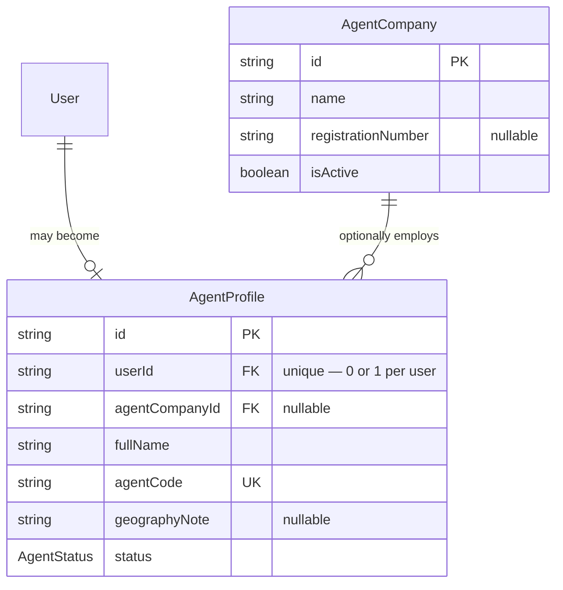
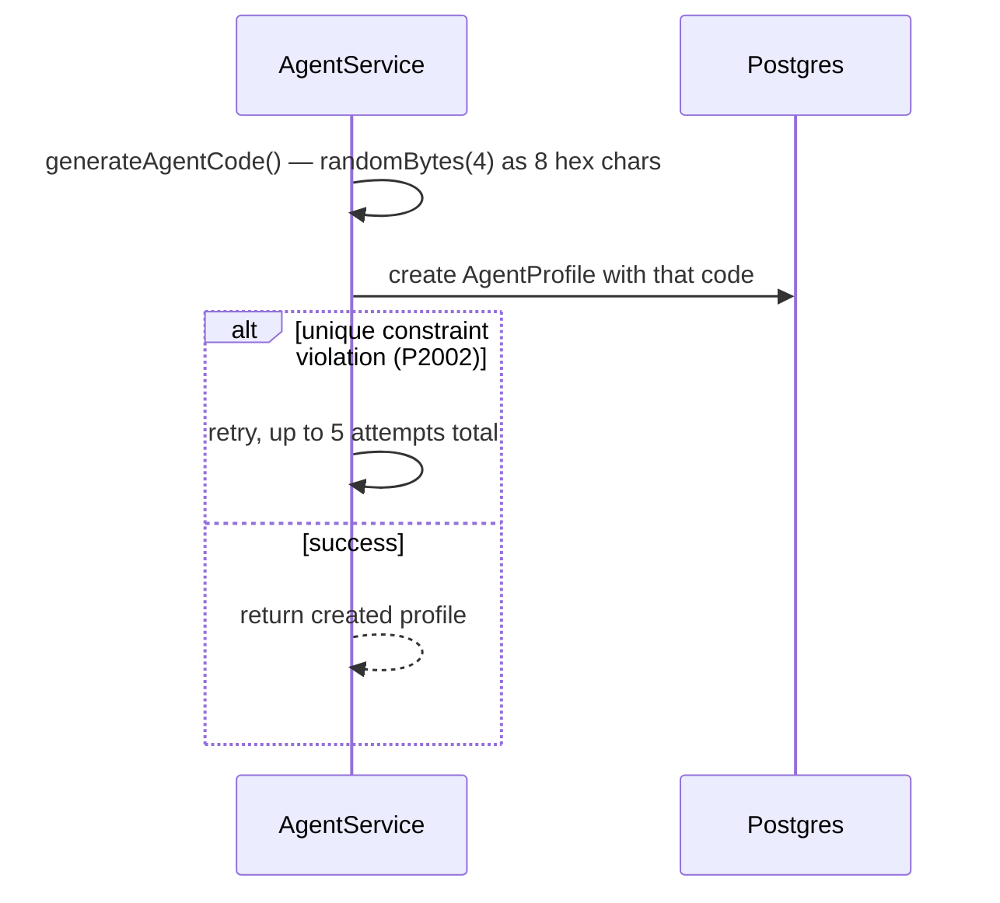

# Agent Module — Implementation Documentation

This documents **how** the Agent module (`src/agent/`) actually works
internally — control flow, data model, and the reasoning behind each
design decision. Same three-document split as the other modules
(`docs/modules/AUTH_IMPLEMENTATION.md` §0).

| Document | Answers |
|---|---|
| `docs/ARCHITECTURE.md` §5.3 | Why the system is shaped this way, system-wide |
| `docs/api/AGENT.md` + `docs/api/openapi.json` | What the HTTP contract is (external, for the frontend team) |
| **This document** | How the contract is actually implemented (internal, for backend engineers) |

If code and this document disagree, the code wins.

## 1. Scope boundary

Per `docs/ARCHITECTURE.md`'s module map (§5.2/§5.3, Phase 1a module #5):
**"Individual/company agents, attribution."** Unlike Provider — where
company/staff support was deliberately deferred to a later-phase Provider
Organization module — the phasing doc bundles agent-company support into
this same Phase 1a module. That one difference shapes the whole module:
Provider has no company concept yet at all; Agent has one, kept
deliberately thin (§3).

"Attribution" in the module's one-line BRD description is handled
narrowly: this module issues and owns a stable `agentCode` per agent. It
does **not** record attribution events (which provider was onboarded by
which agent) — there is no Provider Onboarding module yet to produce those
events, so nothing here invents a shadow copy of that future workflow.

## 2. File map

```
src/agent/
├── agent.module.ts              wires everything below together; imports IamModule
├── agent.controller.ts          POST/GET/PATCH/DELETE /agents/me (self-service, login only)
├── agent.service.ts             profile CRUD, agentCode generation, company validation, soft-delete
├── company/
│   ├── agent-company.controller.ts   /agent-companies — mixed auth (see §4.3)
│   └── agent-company.service.ts      CRUD + assertActiveOrThrow() used by AgentService
└── dto/                            request DTOs + dto/responses/
```

`AgentModule` is the first module to `imports: [IamModule]` and reuse its
`PermissionsGuard` from outside IAM itself — exactly the extension point
IAM's own docs describe (`docs/modules/IAM_IMPLEMENTATION.md` §7). This
required exporting `PermissionsGuard` from `IamModule`, which it didn't do
before this module existed (nothing had needed it yet).

## 3. Data model



**Why `AgentCompany` is a real model here but Provider has no equivalent
yet:** this is a phasing decision already made in `docs/ARCHITECTURE.md`
§5.3, not something this module chose independently — Agent's BRD
description explicitly says "Individual/company agents" as one Phase 1a
unit, while Provider's company support is named as a separate,
later-phase module (Provider Organization). Given that, building
`AgentCompany` now and *not* building an equivalent for Provider is the
correct reading of the roadmap, not an inconsistency between the two
modules.

**Why `AgentCompany` is kept deliberately thin (no staff, branches, or
membership roles):** the same complexity that justified deferring Provider
Organization to a later phase — managing staff, teams, and locations — is
exactly what's being avoided here. `AgentCompany` today is "a name and a
registration number an `AgentProfile` can optionally point at," nothing
more. There is no concept of who "owns" or "administers" a company beyond
whoever holds `agent.company.manage` platform-wide (§4.3) — a real
company-membership/ownership model is future scope if BRD ever asks for
one.

**Why `agentCompanyId` uses `onDelete: SetNull`:** there's no delete
endpoint for `AgentCompany` (§4.3), so this only matters as a safety net —
if a company row were ever removed by direct DB access, affiliated agents
should fall back to individual rather than being cascade-deleted or
leaving a dangling FK.

**Why `geographyNote` is free text, not a structured field:** identical
reasoning to Customer's address fields and IAM's `scopeId`
(`docs/modules/CUSTOMER_IMPLEMENTATION.md` §3,
`docs/modules/IAM_IMPLEMENTATION.md` §3) — no Geography module exists yet
to normalize against.

**Why BRD §15's "responsibilities, geography, permissions" aren't modeled
as AgentProfile fields at all:** this is the one place this module
deliberately does *less* than it could, because the right infrastructure
already exists elsewhere. IAM's Role + Scope model
(`docs/modules/IAM_IMPLEMENTATION.md`) is exactly "a named bundle of
permissions applied within a scope" — assigning an agent a
`GEOGRAPHY`-scoped role via `POST /iam/assignments` is the intended
mechanism, not a parallel `permissions: string[]` column here that would
duplicate IAM's job. `geographyNote` is explicitly just a human-readable
note, not the enforcement mechanism.

## 4. Core flows

### 4.1 agentCode generation and collision handling



8 hex characters is 32 bits of entropy — a collision is astronomically
unlikely at pilot scale, but "unlikely" isn't "impossible," and a
`@unique` constraint means Postgres *will* reject a collision if one ever
occurs. The bounded retry loop (`createWithGeneratedCode` in
`agent.service.ts`) exists specifically so that rare case degrades to "try
again" rather than a raw, confusing `500` from an unhandled `P2002`.
Non-collision errors are rethrown immediately, not retried — verified in
`agent.service.spec.ts`'s "does not swallow non-collision errors" case.
`agentCode` is never accepted as client input (absent from
`CreateAgentProfileDto`) — it is always server-generated.

### 4.2 agentCompanyId validation and the three-state update

`AgentService.create`/`update` both call
`AgentCompanyService.assertActiveOrThrow(id)` whenever `agentCompanyId` is
a truthy string — this is a same-module call (Agent → its own
`company/` submodule), not a cross-module boundary concern.

The update path specifically distinguishes three wire states for
`agentCompanyId`, which only works because `UpdateAgentProfileDto`
declares the field as `string | null | undefined` rather than reusing
`CreateAgentProfileDto`'s `string | undefined` via plain `PartialType`
(see the DTO's own doc comment for the class-validator mechanics):

| Value sent | Meaning | Company validated? |
|---|---|---|
| omitted (`undefined`) | leave affiliation unchanged | no |
| a UUID string | join/switch to that company | yes — must be active |
| explicit `null` | leave the current company | no |

This is the same Prisma `undefined`-means-"don't touch"-vs-`null`-means-
"set to NULL" distinction that shows up nowhere else in this codebase
yet, because no other optional-relation field has needed an explicit
"clear it" operation before.

### 4.3 Why company endpoints have mixed authorization

`AgentCompanyController` is the first controller in the codebase to mix
permission-gated and login-only endpoints in the same class:
- `GET` (list/one) — `@UseGuards(JwtAuthGuard)` only, at the class level.
  Any agent needs to browse companies to decide which one to join at
  profile-creation time; gating reads behind a permission would make the
  join flow itself impossible without already holding that permission.
- `POST`/`PATCH` — additionally `@UseGuards(PermissionsGuard)` +
  `@RequirePermissions('agent.company.manage')` at the method level,
  layered on top of the class-level `JwtAuthGuard`. Companies are shared
  entities (unlike a profile's own data), so mutating one needs to be
  gated the same way IAM gates Role mutations
  (`docs/modules/IAM_IMPLEMENTATION.md` — `iam.role.manage`).

### 4.4 Soft delete

Single `agentProfile.update` call (no `$transaction` — there's nothing
else to clean up alongside it, unlike Customer's addresses). Anonymizes
`fullName`, clears `agentCompanyId` and `geographyNote`, sets
`status: DELETED`. Same BRD §14.4 policy as every other profile module.

## 5. Why `status` can't be set through the API

Identical mechanism to Provider
(`docs/modules/PROVIDER_IMPLEMENTATION.md` §5): `status` simply isn't a
field on `CreateAgentProfileDto` or `UpdateAgentProfileDto`, so the global
`ValidationPipe({ whitelist: true, forbidNonWhitelisted: true })` in
`main.ts` rejects any request body containing it with
`400 property status should not exist`, structurally rather than by
convention. Verified directly at the HTTP layer during manual smoke
testing (§8).

## 6. Configuration reference

No new environment variables.

## 7. Extension points for future modules

- **Provider Onboarding**, once built, is the intended consumer of
  `agentCode` — capturing it at provider-signup time to create the actual
  attribution record this module only issues the handle for (§1).
- **Provider Onboarding** is also the intended owner of transitioning
  `AgentProfile.status` from `PENDING`, the same relationship it will have
  with `ProviderProfile.status`
  (`docs/modules/PROVIDER_IMPLEMENTATION.md` §7).
- **IAM Role/Scope assignments** are the intended mechanism for BRD §15's
  agent responsibilities/geography/permissions — see §3's note on why
  those aren't modeled as fields here.
- **Fraud/Risk** (BRD §15's "agent collusion prevention," Phase 3+ per
  `docs/ARCHITECTURE.md` §5.3) is the eventual home for detecting
  inactive/duplicate/fake provider accounts created for commission — no
  validation for this exists anywhere yet, tracked in §8.

`AgentModule` exports both `AgentService` and `AgentCompanyService` so
future modules can resolve profiles/companies through the service layer
rather than querying `marketplace.agent_profiles`/`agent_companies`
directly.

## 8. Known gaps (tracked, not yet done)

- **No verification/approval workflow** — identical gap to Provider
  (`docs/modules/PROVIDER_IMPLEMENTATION.md` §8). An agent stays `PENDING`
  forever today.
- ~~No attribution records~~ **Resolved by the Provider Onboarding
  module** (`docs/modules/PROVIDER_ONBOARDING_IMPLEMENTATION.md`) —
  `AgentService.getActiveByCode` is the method it added to resolve a
  referral code, called from outside this module for the first time.
- **No agent collusion prevention** (BRD §15) — still true even with
  Provider Onboarding built; see that module's own §7 known gaps.
- **`AgentCompany` has no membership/ownership model.** Any holder of
  `agent.company.manage` platform-wide can edit any company; there is no
  concept of "this agent administers this specific company."
- **No integration/e2e tests** — only unit tests with mocked Prisma
  (`agent.service.spec.ts`, `company/agent-company.service.spec.ts`),
  mirroring every other module. Manually smoke-tested against a real
  database: individual profile create (PENDING, agentCode generated) →
  company creation blocked without permission (403) → bootstrapped
  SUPER_ADMIN → company created → join company → join a nonexistent
  company (404) → explicit-null leave → soft-delete → anonymization
  verified directly in Postgres (row retained, `status=DELETED`, PII and
  company affiliation cleared).
