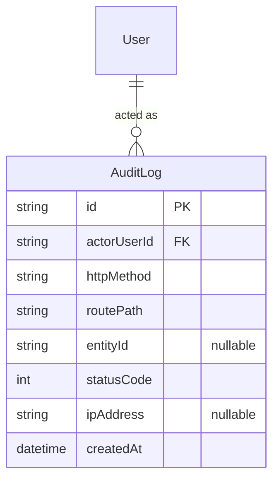
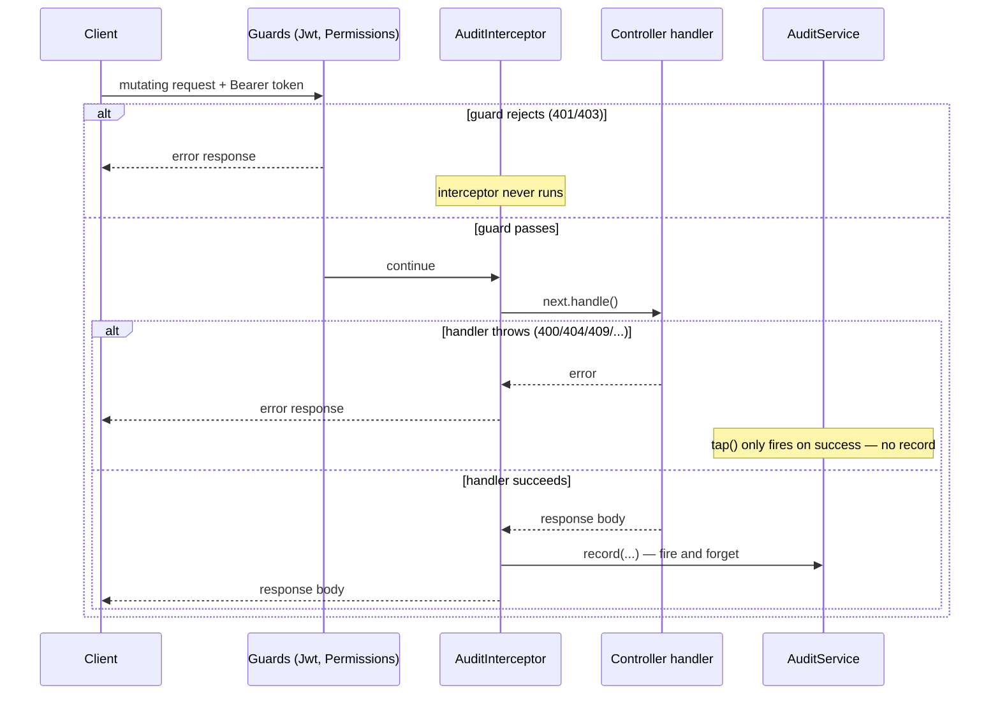

# Audit Module — Implementation Documentation

This documents **how** the Audit module (`src/audit/`) actually works
internally — control flow, data model, and the reasoning behind each
design decision. Same three-document split as every other module
(`docs/modules/AUTH_IMPLEMENTATION.md` §0).

| Document | Answers |
|---|---|
| `docs/ARCHITECTURE.md` §5.3 | Why the system is shaped this way, system-wide |
| `docs/api/AUDIT.md` + `docs/api/openapi.json` | What the HTTP contract is (external, for the frontend team) |
| **This document** | How the contract is actually implemented (internal, for backend engineers) |

If code and this document disagree, the code wins.

## 1. Scope boundary

Per `docs/ARCHITECTURE.md`'s module map (§5.3, Phase 1a module #14,
half of the last module in the roadmap): "who-changed-what audit
trail." BRD §23.1 requires "key business activities" to be recorded
"for operational visibility, accountability, reporting, and
investigation," and explicitly says business-audit information and
operational-event information should be kept separate.

**Why a global interceptor instead of a curated per-action list or
per-endpoint decorator:** BRD §23.1's "key business activities" implies
some curation — not literally every request. Two alternatives were
considered and rejected in favor of the interceptor actually built:

- **Modify `PermissionsGuard` itself** (the literal reading of
  `docs/ARCHITECTURE.md` §9's "the check itself is logged to
  `ops.audit_log`") would require `IamModule` to depend on
  `AuditModule` for `AuditService`, while `AuditModule`'s own `GET
  /audit/logs` endpoint needs `PermissionsGuard` from `IamModule` — a
  circular module dependency. Not worth a `forwardRef()` workaround for
  a Phase 1a module.
- **A `@Audit('action.name')` decorator on every controller method**
  worth logging would need go back and touch every existing controller
  across 13 already-shipped, tested, committed modules — real scope
  creep for a "build the last module" task, and easy to forget to add
  to the *next* module too.

The blanket interceptor instead logs every authenticated mutating
request automatically, with zero per-module wiring, at the cost of
being a superset of "key" actions (it also logs, say, updating your own
notification-read state) rather than a hand-curated subset. This is
judged the better trade-off for a pilot: nothing can be missed by
forgetting to annotate it, and the "known gaps" section is honest about
the superset/no-curation trade-off rather than hiding it.

**Why only successful (2xx) mutations are recorded:** a rejected
request (wrong permission, validation failure, business-rule conflict)
never changed anything, so there is nothing to say "changed" about it.
Recording attempts too would be a legitimate security-log feature, but
is explicitly out of scope here — BRD §23.1 frames this as a *business*
audit trail ("what changed"), not a security/intrusion log.

## 2. File map

```
src/audit/
├── audit.module.ts        imports IamModule; registers AuditInterceptor as APP_INTERCEPTOR
├── audit.service.ts        record() + list()
├── audit.service.spec.ts
├── audit.interceptor.ts    the actual capture logic
├── audit.interceptor.spec.ts
├── audit.controller.ts     GET /audit/logs
└── dto/
    ├── list-audit-logs-query.dto.ts
    └── responses/audit-log.dto.ts
```

`AuditModule` registers `AuditInterceptor` as an `APP_INTERCEPTOR`
provider **inside its own `providers` array**, not in `AppModule` — the
same "the module owns its cross-cutting behavior" approach, just
scoped one level lower than `ThrottlerGuard`/`HttpExceptionFilter`
(which are bound directly in `AppModule` since they have no natural
owning module). NestJS resolves `APP_INTERCEPTOR` globally regardless
of which module registers it, as long as that module is imported
somewhere in the graph — `AppModule` just imports `AuditModule`
normally.

## 3. Data model



`AuditLog` lives in a new `ops` Postgres schema (`docs/ARCHITECTURE.md`
§7.1) — the first module to use it. Append-only: there is no update or
delete path anywhere in this module, matching what an audit trail is
supposed to guarantee (nothing here enforces immutability at the DB
level yet — see §7).

## 4. Core flow



`AuditInterceptor.intercept` bails out immediately (returns
`next.handle()` untouched) unless the request is both an authenticated
user (`req.user` present — set by `JwtAuthGuard`, which always runs
before any interceptor) and a mutating HTTP method. The actual
`auditService.record(...)` call happens inside an RxJS `tap()` callback,
which by construction only fires on a successful emission, never on an
error — this is what makes "only log successes" fall out of the
pipeline shape rather than needing an explicit status-code check.

**Why the write is fire-and-forget (`.catch()`, not `await`ed into the
response):** audit logging is observability, not a guarantee the
underlying operation depends on. If the audit insert itself fails (DB
hiccup), the real response the client is waiting for must not fail
because of it — the failure is logged via `Logger.error` and otherwise
swallowed. This is a deliberate, documented deviation from
`docs/ARCHITECTURE.md`'s eventual "same DB transaction as the state
change" Event/Outbox model (§6.6, §11) — that infrastructure doesn't
exist yet (Phase 1b), so this module accepts a small window where a
crash between the state change and the audit write loses that one
entry, in exchange for adding zero latency/failure-coupling to every
mutating request in the pilot.

**Entity id resolution:** `req.params.id` first (covers `PATCH`/
`DELETE`/`POST .../:id/action` routes), falling back to an `id` field on
the response body (covers plain `POST` creates, which return the new
resource), falling back to `null`. Both are best-effort string
extraction with no schema awareness — see §7.

## 5. Configuration reference

No new environment variables.

## 6. Extension points for future modules

- **Reporting** (Phase 1b) could read `AuditLog` for operational
  dashboards, though BRD §23.1 also calls for a separate `Reporting`
  surface over bookings/GMV/commission that has nothing to do with this
  table.
- **Event/Outbox** (Phase 1b, `docs/ARCHITECTURE.md` §6.6/§11), once
  built, is the natural place to move audit writing into the same
  transaction as the state change — this interceptor's fire-and-forget
  write would be replaced by an outbox row written in the same
  transaction, consumed by an Audit handler exactly as the architecture
  describes.

## 7. Known gaps (tracked, not yet done)

- **No pagination** on `GET /audit/logs` — capped at the most recent
  100 rows.
- **No immutability enforcement** — nothing at the DB or Prisma layer
  prevents an `UPDATE`/`DELETE` against `ops.audit_log`; the guarantee
  is purely "no code path in this module ever does it."
- **Route-pattern-based `entityId`/`routePath` extraction is best-effort
  string matching**, not schema-aware — a response body that happens to
  contain an `id` field unrelated to "the entity this request acted on"
  (unlikely given this codebase's response DTO conventions, but not
  structurally prevented) would be misattributed.
- **No integration/e2e tests** — unit tests with mocked Prisma
  (`audit.service.spec.ts`) and a directly-constructed interceptor with
  mocked `ExecutionContext`/`CallHandler` (`audit.interceptor.spec.ts`).
  Manually smoke-tested against a real database and the full guard
  pipeline: a provider's self-service `PATCH` correctly produced one
  entry with the right actor/route/entity/status/IP → an admin's
  `audit.view`-gated `GET /audit/logs` returned it → a customer without
  `audit.view` correctly got **403** → an unauthenticated request
  correctly got **401** → `?actorUserId=` filtering confirmed → after
  three more successful admin actions (two notification sends, one
  mark-read) and several *failed* attempts (403 permission denials, 404
  ownership checks, 400 validation), the log grew by exactly the
  successful count and none of the failures — confirming the
  success-only `tap()` behavior end-to-end, not just in the unit test.
