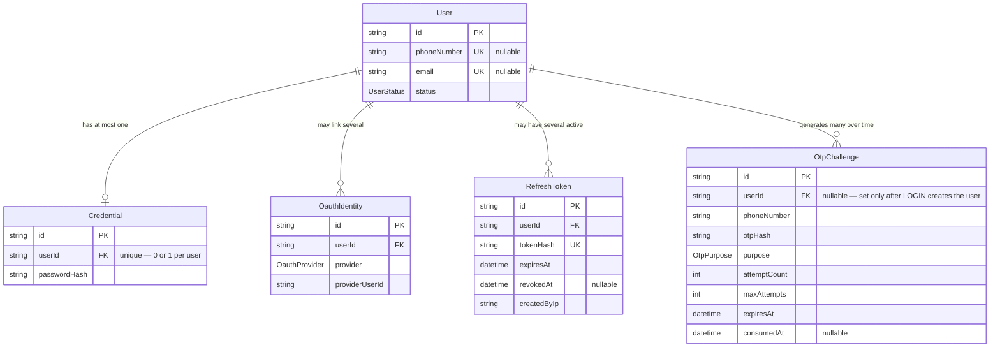
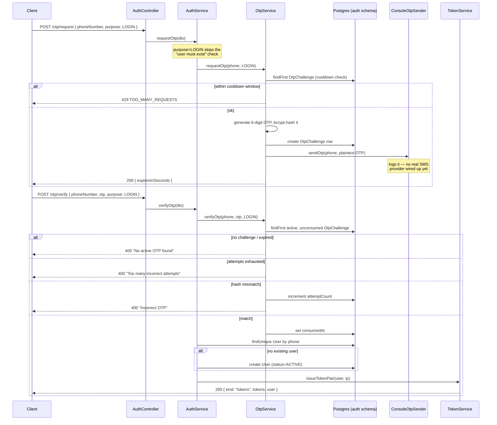
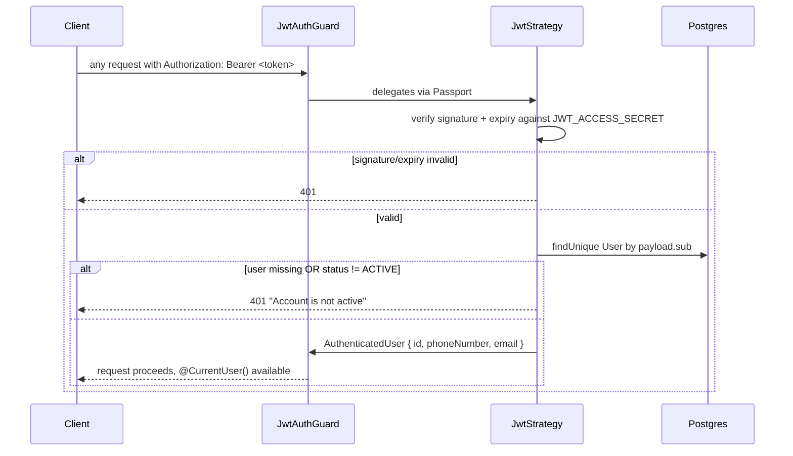

# Auth Module — Implementation Documentation

This documents **how** the Auth module (`src/auth/`) actually works
internally — control flow, data model, and the reasoning behind each
security decision. It is the third of three documents covering this module,
each at a different altitude:

| Document | Answers |
|---|---|
| `docs/ARCHITECTURE.md` | Why the system is shaped this way, system-wide |
| `docs/api/AUTH.md` + `docs/api/openapi.json` | What the HTTP contract is (external, for the frontend team) |
| **This document** | How the contract is actually implemented (internal, for backend engineers) |

If code and this document disagree, the code wins — regenerate/update this
doc when the implementation changes, the same discipline as `docs/api/`.

## 1. Scope boundary

Per `docs/ARCHITECTURE.md` §6.1: **Auth answers "who are you," never "what
are you allowed to do."** This module has no concept of roles, permissions,
or scopes — that's the IAM module (not built yet). Auth's only job is to
produce a trustworthy `{ userId, phoneNumber, email }` from a request, and
to manage the credentials/tokens that make that possible.

Profile data (name, address, preferences) is explicitly **not** here either
— that belongs to Customer/Provider/Agent. The `User` model in this module
is deliberately minimal: identity and account status only.

## 2. File map

```
src/auth/
├── auth.module.ts              wires everything below together
├── auth.controller.ts          10 HTTP endpoints — thin, delegates to AuthService
├── auth.service.ts             orchestrates OTP/Token/Social services; no HTTP or Prisma-schema knowledge of its own beyond User/Credential/OauthIdentity
├── dto/                        request DTOs (class-validator + @ApiProperty)
│   └── responses/               response DTOs (for OpenAPI generation only — see §7)
├── otp/
│   ├── otp.service.ts          generate/hash/verify OTPs, cooldown + attempt-limit enforcement
│   ├── otp-sender.interface.ts the seam to the (not-yet-built) Notification module
│   └── console-otp.sender.ts   stub implementation — logs instead of sending SMS
├── token/
│   ├── token.service.ts        issues/rotates/revokes access+refresh tokens, signs/verifies reset tokens
│   └── jwt-payload.interface.ts shared payload/user shape types
├── social/
│   └── social-auth.service.ts  STUB — Google/Apple ID token verification (throws 501)
├── strategies/
│   └── jwt.strategy.ts         Passport strategy: validates Bearer tokens, re-checks account status
├── guards/
│   └── jwt-auth.guard.ts       thin AuthGuard('jwt') wrapper — apply via @UseGuards
└── decorators/
    └── current-user.decorator.ts  @CurrentUser() — pulls req.user into a controller param
```

`src/prisma/prisma.service.ts` (global module) is Auth's only dependency
outside its own folder, besides framework packages.

## 3. Data model

Five tables, all in the `auth` Postgres schema (see
`prisma/schema.prisma`):



**Why `Credential` is a separate table, not a column on `User`:** a user
can exist and be fully functional with only OTP login — no password ever
set. Modeling password as an optional 1:1 relation (rather than a nullable
column) makes "has this user ever set a password" a join instead of a null
check, and keeps `User` itself free of auth-mechanism-specific columns as
more login methods get added.

**Why `RefreshToken` stores a hash, never the plaintext:** identical
reasoning to why passwords are hashed — if the `refresh_tokens` table ever
leaked (backup exposure, SQL injection, insider access), the tokens
themselves would still be useless. See §5 for why this is a *different*
hash algorithm than passwords/OTPs use.

**Why `OtpChallenge.userId` is nullable:** an OTP for `purpose=LOGIN` is
requested *before* it's known whether the phone number belongs to an
existing user — the user might not exist yet (see §4.1). The row is
created without a `userId`; the user only gets created at successful
verification.

## 4. Core flows

### 4.1 OTP login (auto-registration on first use)



Key implementation detail: **there is no separate "register" endpoint.**
`purpose=LOGIN` verification either finds or creates the user
(`AuthService.findOrCreateUserByPhone`) in the same code path. A
`REGISTER` value exists in the `OtpPurpose` Prisma enum but is unused by
any controller route — reserved for a future explicit-registration flow
(e.g. one that collects additional fields) if the product ever needs one.

### 4.2 OTP-driven password reset

Same `otp/request` → `otp/verify` pair, but `purpose=PASSWORD_RESET`
diverges at two points:

1. **`requestOtp`** first checks a `User` with that phone number actually
   exists (`AuthService.requestOtp`) — 400 if not. (LOGIN skips this
   check entirely; that asymmetry is deliberate, see §4.1.)
2. **`verifyOtp`** does not issue login tokens. It calls
   `TokenService.signResetToken(user.id)` and returns
   `{ kind: "resetToken", resetToken, expiresIn: "10m" }`.

The client then calls `POST /password/reset` with that token:

```
AuthService.resetPassword(dto)
  → TokenService.verifyResetToken(dto.resetToken)   // throws 401 if invalid/expired/wrong-secret
  → bcrypt.hash(newPassword) → Credential upsert
  → TokenService.revokeAllForUser(userId)           // force logout everywhere
```

**Why reset tokens are signed with `JWT_RESET_SECRET`, not
`JWT_ACCESS_SECRET`:** `JwtStrategy` (§4.4) only knows how to validate
tokens signed with the access secret. If reset tokens shared that secret,
a reset token — which anyone who intercepts an OTP-verify response holds
briefly — could be replayed as a Bearer access token against every other
authenticated endpoint. Using a distinct secret means `JwtStrategy` will
never accept a reset token no matter what claims it carries; this is
enforced structurally, not by a convention someone could forget to check.
Verified directly in `token.service.spec.ts`'s "rejects a normal access
token presented as a reset token" and "rejects a reset token signed with a
different secret" cases.

### 4.3 Password login / set / change

`POST /login` (`AuthService.loginWithPassword`):
1. `identifier.includes('@')` picks email vs. phone lookup — not a
   separate parameter the client has to set.
2. `findUnique` **with** `include: { credential: true }` — if there's no
   `Credential` row (OTP-only user who never set a password), this is
   `401 Invalid credentials`, same message as a wrong password. No
   distinction is surfaced to the client between "no password set" and
   "wrong password" — both collapse to the same generic error (§5.4).
3. `bcrypt.compare`, then a separate `user.status !== ACTIVE` check —
   deliberately *after* the password check succeeds, so a disabled
   account with a correct password still gets a generic-sounding
   rejection rather than confirming the account exists and is disabled.

`PUT /password` (`AuthService.setPassword`, requires a valid access
token): looks up any existing `Credential` for the caller.
- **No existing credential** → `currentPassword` must be omitted (first-time
  set). If it's provided anyway, that's fine (not rejected) — the check is
  only that it's *not required*, not that it's forbidden.
- **Existing credential** → `currentPassword` is required and must match,
  or the whole request is rejected (400 if missing, 401 if wrong) before
  any write happens.

### 4.4 Every authenticated request (`JwtStrategy`)



**This DB lookup on every request is deliberate, not an oversight.** A
purely stateless JWT check (signature+expiry only) would mean a suspended
account keeps working until its access token naturally expires (up to
`JWT_ACCESS_TTL`, 15 minutes). Re-checking status per-request means
suspension/deletion takes effect on the *next* request, not up to 15
minutes later — worth the extra query given how short-lived access tokens
already are (the query only runs on protected routes, not every request in
the app).

### 4.5 Refresh rotation

`TokenService.rotateRefreshToken`:
1. Hash the presented token (SHA-256, not bcrypt — see §5.1), look it up.
2. Reject (401) if not found, already `revokedAt`, or past `expiresAt`.
3. **Revoke the presented token immediately**, then issue an entirely new
   pair via the same `issueTokenPair` path as login.

A refresh token is therefore single-use. Presenting the same one twice —
whether by a legitimate retry or a stolen token being used after the
rightful owner already refreshed — fails the second time. This module does
**not** yet implement reuse-detection response (e.g. revoking the entire
token family and forcing re-login when a revoked token is presented again,
which would signal likely theft) — the current behavior just 401s the
second attempt. That's a real gap worth closing before this handles
production traffic; noted in §8.

### 4.6 Social login (Google/Apple) — stub

`AuthService.loginWithGoogle` / `loginWithApple` call
`SocialAuthService.verifyGoogleIdToken` / `verifyAppleIdToken`, which
**unconditionally throw `NotImplementedException` (501)**. The
`findOrCreateUserBySocialIdentity` method below them is fully implemented
and unit-tested-by-implication through `OauthIdentity`'s schema, but is
currently unreachable — nothing calls it — because the verification step
in front of it always throws first.

This is intentional scope, not an oversight: `GOOGLE_CLIENT_ID` /
`APPLE_CLIENT_ID` aren't provisioned (`docs/ARCHITECTURE.md` §20), so
there's nothing to verify a token *against* yet. The controller
endpoints, DTOs, and response shapes are real and documented (`docs/api/AUTH.md`)
so the frontend team can build against the contract now. When credentials
exist, the fix is scoped entirely to `social-auth.service.ts` — swap the
two `throw` statements for real verification calls
(`google-auth-library`'s `OAuth2Client.verifyIdToken` for Google; a JWKS
fetch + signature check against `https://appleid.apple.com/auth/keys` for
Apple). Nothing in `AuthService` or the controller needs to change.

## 5. Security design decisions

### 5.1 Two different hashing strategies, deliberately

| What | Algorithm | Why |
|---|---|---|
| Passwords, OTPs | `bcrypt` (via `bcryptjs`) | Low-entropy secrets a human chose or a 6-digit generator produced — need a slow, salted hash resistant to offline brute-force. `bcryptjs` (pure JS) was chosen over native `bcrypt`/`argon2` specifically because those need `node-gyp`/Python to compile, which wasn't available in the dev environment — see `docs/ARCHITECTURE.md` §4 decision log. |
| Refresh tokens | `SHA-256` (`crypto.createHash`) | High-entropy (48 random bytes → 96 hex chars) — already unguessable, so a slow hash buys nothing and would just add latency to every refresh call. `token.service.ts` has this reasoning as an inline comment specifically so it doesn't get "fixed" to bcrypt by someone applying the password pattern uniformly. |

### 5.2 Rate limiting is layered, not singular

Three independent layers, each catching a different abuse pattern:
1. **`@Throttle` decorator** (NestJS Throttler, IP-based) — `otp/request`
   capped at 3/min, `otp/verify` and `login` at 10/min. Stops raw
   high-volume hammering.
2. **`OTP_REQUEST_COOLDOWN_SECONDS`** (default 60s, per phone number, in
   `OtpService.requestOtp`) — stops requesting a fresh OTP before the
   previous one even expires, independent of which IP asks.
3. **`OTP_MAX_ATTEMPTS`** (default 5, per challenge) — stops brute-forcing
   a single OTP's 6-digit space within its validity window, independent
   of request rate.

None of these alone is suffici­ent (IP throttling doesn't stop a botnet;
cooldown doesn't stop guessing an already-issued OTP; attempt-limiting
doesn't stop requesting fresh OTPs rapidly) — they're intentionally
orthogonal.

### 5.3 Refresh tokens are opaque, not JWTs

Unlike access/reset tokens, refresh tokens are `crypto.randomBytes(48)`
hex strings with no embedded claims — not JWTs. This is what makes
server-side revocation actually work: a JWT refresh token would need a
denylist to revoke (defeating the point of a stateless token), whereas an
opaque token's *only* valid form already lives in a DB row that can simply
be deleted/marked revoked. The tradeoff is a DB round-trip on every
refresh — acceptable since refresh calls are infrequent compared to
access-token-validated requests (which stay fully stateless per §4.4
modulo the status check).

### 5.4 Deliberately generic error messages

Both `loginWithPassword` (§4.3) and the OTP flows return the same error
for meaningfully different failure reasons (wrong password vs. no
password set; wrong phone vs. wrong OTP). This trades debuggability for
not confirming to an attacker which identifiers/accounts exist — standard
practice for authentication endpoints specifically (internal error logs
still capture the real reason; the *client-facing* message is
intentionally collapsed).

## 6. Configuration reference

All validated at startup by `src/common/config/env.validation.ts` — the
app refuses to boot with a clear error rather than fail confusingly later
if any of these are missing/malformed.

| Variable | Used by | Notes |
|---|---|---|
| `JWT_ACCESS_SECRET` / `JWT_ACCESS_TTL` | `TokenService.signAccessToken`, `JwtStrategy` | Default TTL 15m |
| `JWT_REFRESH_SECRET` / `JWT_REFRESH_TTL` | *(secret currently unused — see below)* / `TokenService` TTL calc | Default TTL 30d |
| `JWT_RESET_SECRET` / `JWT_RESET_TTL` | `TokenService.signResetToken`/`verifyResetToken` | Default TTL 10m — deliberately separate from access secret, §5 |
| `OTP_LENGTH` | `OtpService.generateOtp` | Default 6 digits |
| `OTP_TTL_SECONDS` | `OtpService` | Default 300 (5 min) |
| `OTP_MAX_ATTEMPTS` | `OtpService` | Default 5 |
| `OTP_REQUEST_COOLDOWN_SECONDS` | `OtpService.requestOtp` | Default 60 |
| `NOTIFICATION_PROVIDER` | *(read but not yet branched on)* | Only `ConsoleOtpSender` exists regardless of value — see §8 |
| `GOOGLE_CLIENT_ID` / `APPLE_CLIENT_ID` | *(validated as present, not yet consumed)* | `SocialAuthService` doesn't read these yet since it always throws first — §4.6 |

**Known inconsistency worth flagging:** `JWT_REFRESH_SECRET` is validated
at startup and documented in `.env.example`, but refresh tokens are opaque
random strings (§5.3), not JWTs — nothing in the code actually signs or
verifies anything with this secret. It's vestigial from an earlier design
and should either be removed or repurposed (e.g. as an HMAC key if refresh
token hashing ever needs to move off plain SHA-256 to resist a scenario
where the hash algorithm itself needs a secret). Left as-is for now; noted
in §8.

## 7. Why response DTOs exist that nothing "produces" as classes

`src/auth/dto/responses/*.ts` (e.g. `TokenPairDto`, `LoginResponseDto`)
are never instantiated anywhere in `auth.service.ts` — the service returns
plain object literals / TypeScript interfaces (`TokenPair`, `PublicUser`).
The response DTO classes exist **purely so `@nestjs/swagger` can generate
accurate OpenAPI response schemas** (`@ApiOkResponse({ type: ... })` in
`auth.controller.ts`) — Nest's Swagger integration can only introspect
`@ApiProperty()`-decorated classes, not plain interfaces. This is a
deliberate split: runtime shape is defined once (the interfaces in
`auth.service.ts` / `token.service.ts`), and the documentation-only shape
is defined separately in `dto/responses/`, kept in sync by convention
(nothing enforces they match automatically — a mismatch would only surface
as `docs/api/openapi.json` disagreeing with reality, not a compile error).

## 8. Known gaps (tracked, not yet done)

- No refresh-token-reuse detection (§4.5) — a revoked token being
  presented again just 401s, rather than treating it as a signal to revoke
  the whole session family.
- `NOTIFICATION_PROVIDER` env var is read but never branched on —
  `ConsoleOtpSender` is hardcoded as the only `OTP_SENDER` implementation
  in `auth.module.ts` regardless of its value (`docs/ARCHITECTURE.md` §21
  flags MSG91 as the intended default once the Notification module
  exists).
- `JWT_REFRESH_SECRET` is validated/documented but unused (§6).
- Social login is fully stubbed (§4.6).
- No integration/e2e tests exist yet — only unit tests with mocked Prisma
  (`*.spec.ts` files, 25 tests across `OtpService`, `TokenService`,
  `AuthService`). The full flow has been manually smoke-tested against a
  real database (local and containerized), but there's no automated test
  exercising the real HTTP layer + real Postgres together.
- Account status re-check (§4.4) adds one DB query per authenticated
  request — fine at pilot scale, worth revisiting (e.g. a short-TTL cache)
  if/when request volume grows enough for it to matter.

## 9. Extension points for future modules

- **IAM** will need to read `auth.users` (likely via a shared read path,
  not a new copy of user data) to attach roles/permissions/scope. The
  User model's minimalism (§1) is specifically so IAM can layer on top
  without Auth needing to change.
- **Notification module**, once built, replaces `ConsoleOtpSender` by
  implementing `OtpSender` (`otp-sender.interface.ts`) and swapping the
  `OTP_SENDER` provider binding in `auth.module.ts` — no other file
  changes.
- **Audit module**, once built, is a natural consumer of auth events
  (login, logout, password change, account suspension) — none of that is
  emitted anywhere yet (no Event/Outbox usage in this module currently;
  `docs/ARCHITECTURE.md` §6.6/§11 describes the pattern this would follow
  once it's wired up).
