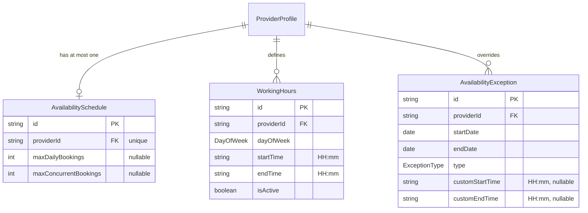
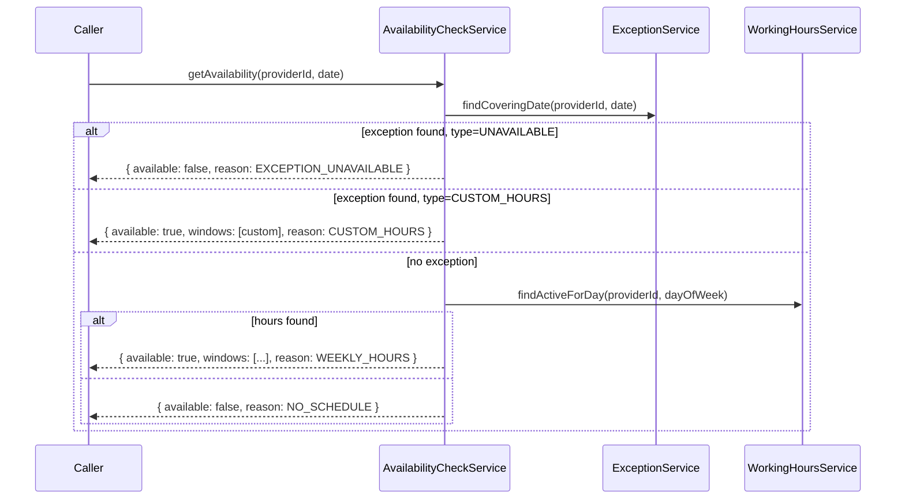

# Availability Module — Implementation Documentation

This documents **how** the Availability module (`src/availability/`)
actually works internally — control flow, data model, and the reasoning
behind each design decision. Same three-document split as every other
module (`docs/modules/AUTH_IMPLEMENTATION.md` §0).

| Document | Answers |
|---|---|
| `docs/ARCHITECTURE.md` §5.3 | Why the system is shaped this way, system-wide |
| `docs/api/AVAILABILITY.md` + `docs/api/openapi.json` | What the HTTP contract is (external, for the frontend team) |
| **This document** | How the contract is actually implemented (internal, for backend engineers) |

If code and this document disagree, the code wins.

## 1. Scope boundary

Per `docs/ARCHITECTURE.md`'s module map (§5.2/§5.3, Phase 1a module #11,
the last one before Booking): **"Working hours, leave, exceptions,
bookable slots."** BRD §41 lists what this covers: working hours,
holidays, temporary unavailability, booking capacity, and a set of
"availability exceptions" (emergency/unplanned unavailability, temporary
service pause, seasonal availability, provider leave, service-specific
availability) that all collapse to the same two shapes — see §3.

**Why "bookable slots" is open time *ranges*, not discrete slots:** a
real bookable slot (e.g. "10:00-10:30, 10:30-11:00...") requires a slot
duration, which comes from the *service* being booked (Catalogue's
`Service.expectedDurationMinutes`) intersected with what's already
booked (a future Booking module). This module has no opinion on either —
it answers "what hours is this provider open," and generating actual
bookable slots from that is deliberately left to whichever future module
has both a service duration and existing bookings to intersect against.
Returning ranges rather than discretized slots also avoids this module
guessing a granularity (15 min? 30 min? 1 hour?) that varies per service.

**Why capacity limits (`maxDailyBookings`/`maxConcurrentBookings`) are
stored but not enforced:** identical reasoning to Serviceability's
`ProviderCoverageProfile.radiusKm` before anything queried against it —
there's no Booking module yet to count bookings against these limits.
Storing the config now means Booking, once built, reads an existing
value rather than requiring a schema migration to add it.

**Why this module has no admin approval gate:** same reasoning as
Provider Offering (`docs/modules/PROVIDER_OFFERING_IMPLEMENTATION.md`
§1) — BRD §41 describes availability as something a provider defines
themselves, with no SevaMitra-operations approval step the way
Serviceability's coverage areas explicitly need (BRD §13.3). This is the
second module in the codebase with zero IAM-gated endpoints.

## 2. File map

```
src/availability/
├── availability.module.ts       imports ProviderModule
├── schedule/                    /availability/schedule/me — capacity limits, 1:1 with provider
├── working-hours/                /availability/working-hours/me — recurring weekly windows
├── exception/                    /availability/exceptions/me — date-range overrides
└── check/
    ├── check.controller.ts       /availability/check — read-only, login only
    └── availability-check.service.ts   the computation itself — exported for Booking
```

Also added `src/common/util/time-of-day.ts` (`TIME_OF_DAY_PATTERN`,
`isTimeBefore`) as a shared utility, the same "small pure function,
directly unit-tested" pattern as `haversine.ts`
(`docs/modules/SERVICEABILITY_IMPLEMENTATION.md` §1) — this is the first
module needing time-of-day validation/comparison.

## 3. Data model



**Why `startTime`/`endTime` are plain `"HH:mm"` strings, not a Postgres
`TIME` column or a `DateTime`:** these are wall-clock times of day with
no associated date or timezone — a `DateTime` would force an arbitrary
reference date and invite timezone-conversion bugs on every read/write
for zero benefit, since nothing here ever needs to do date arithmetic on
them. String comparison (`isTimeBefore`, `a < b`) is correct specifically
*because* both values are validated to be zero-padded `"HH:mm"` at the
DTO layer (`TIME_OF_DAY_PATTERN`) — this only works because the format
is enforced, not despite it.

**Why BRD §41's several exception types collapse into two
(`UNAVAILABLE`/`CUSTOM_HOURS`):** "emergency/unplanned unavailability,"
"temporary service pause," "seasonal availability," and "provider leave"
are all, from a data-modeling standpoint, "this provider is not working
during this date range" — one shape (`UNAVAILABLE`), distinguished only
by `reason` (free text) if at all. "Service-specific availability" isn't
modeled as a third type because this module has no concept of
per-service scheduling — availability here is provider-wide, matching
how `ProviderProfile` itself is provider-wide, not per-offering.
`CUSTOM_HOURS` covers the remaining real distinction: not fully closed,
but different hours than the recurring weekly schedule.

## 4. Core flows

### 4.1 Exception overrides working hours completely, never merges



An exception is checked **first** and, if found, is the entire answer —
`WorkingHoursService` is never even queried once an exception matches
(verified in `availability-check.service.spec.ts`'s "without checking
weekly hours" case). This is a deliberate override model, not a merge:
a provider who's normally open 09:00-18:00 but has a `CUSTOM_HOURS`
exception for 10:00-12:00 on one date is available *only* 10:00-12:00
that day, not both ranges combined.

### 4.2 Day-of-week resolution is UTC-based, not local-timezone

`AvailabilityCheckService` parses the `date` query param with
`new Date(dateString)` and reads `.getUTCDay()`, mapped through a fixed
`UTC_DAY_INDEX` array — never `.getDay()` (local timezone). A bare
`"YYYY-MM-DD"` string parses as UTC midnight in JavaScript regardless of
server timezone, so using the UTC day-of-week is what keeps "2026-10-20"
resolving to Tuesday consistently no matter where this code runs.
Verified directly against real calendar dates in
`availability-check.service.spec.ts` (2026-10-18 Sunday through
2026-10-24 Saturday), cross-checked against Node's own date formatting
before writing the assertions rather than assumed.

### 4.3 Conditional custom-time validation on update accounts for type switching

`ExceptionService.update` computes the *effective* `type` and custom
times (`dto.field ?? existing.field ?? undefined`) before validating —
the same "existing value as fallback" pattern as Provider Offering's
`update` (`docs/modules/PROVIDER_OFFERING_IMPLEMENTATION.md` §4.3) and
Geography's re-parenting checks
(`docs/modules/GEOGRAPHY_IMPLEMENTATION.md` §4.2). This specifically
catches switching `type` from `UNAVAILABLE` to `CUSTOM_HOURS` in an
update that doesn't also supply new custom times — the existing
`customStartTime`/`customEndTime` are `null` (never set, since the
exception was previously `UNAVAILABLE`), so the effective values resolve
to `undefined` and the "required" check correctly fires. Covered in
`exception.service.spec.ts`'s "requires custom times when switching
type... without providing them" case.

## 5. Configuration reference

No new environment variables.

## 6. Extension points for future modules

- **Booking** (`src/booking/`) is now the real caller of
  `AvailabilityCheckService.getAvailability`, via `AvailabilityModule`'s
  export — see `docs/modules/BOOKING_IMPLEMENTATION.md` §4.1. It checks
  that a requested time fits entirely within a returned window, but does
  not yet intersect those windows with existing bookings or enforce
  `AvailabilitySchedule`'s capacity limits — both remain open (§7, and
  `docs/modules/BOOKING_IMPLEMENTATION.md` §7).

## 7. Known gaps (tracked, not yet done)

- **No booking-aware slot generation** — see §1.
- **Capacity limits are unenforced** — see §1.
- **No recurring exceptions** (e.g. a fixed monthly day off) — every
  exception is one explicit date range.
- **No overlap validation between exceptions** — a provider could create
  two exceptions covering the same date; `findCoveringDate` uses
  `findFirst`, so whichever row Postgres returns first wins silently.
  Not a correctness bug for a well-behaved single provider managing
  their own schedule, but not actively prevented either.
- **No integration/e2e tests** — only unit tests with mocked Prisma
  (`schedule.service.spec.ts`, `working-hours.service.spec.ts`,
  `exception.service.spec.ts`, `availability-check.service.spec.ts`,
  plus `time-of-day.spec.ts` for the shared utility). Manually
  smoke-tested against a real database: invalid time order rejected
  (400) → split-shift Tuesday windows created → check confirmed both
  windows (`WEEKLY_HOURS`) → an `UNAVAILABLE` exception added for that
  exact date → check confirmed it overrode the weekly schedule entirely
  (`EXCEPTION_UNAVAILABLE`) → a `CUSTOM_HOURS` exception on a different
  date confirmed its own narrower window (`CUSTOM_HOURS`) → capacity
  schedule created successfully.
