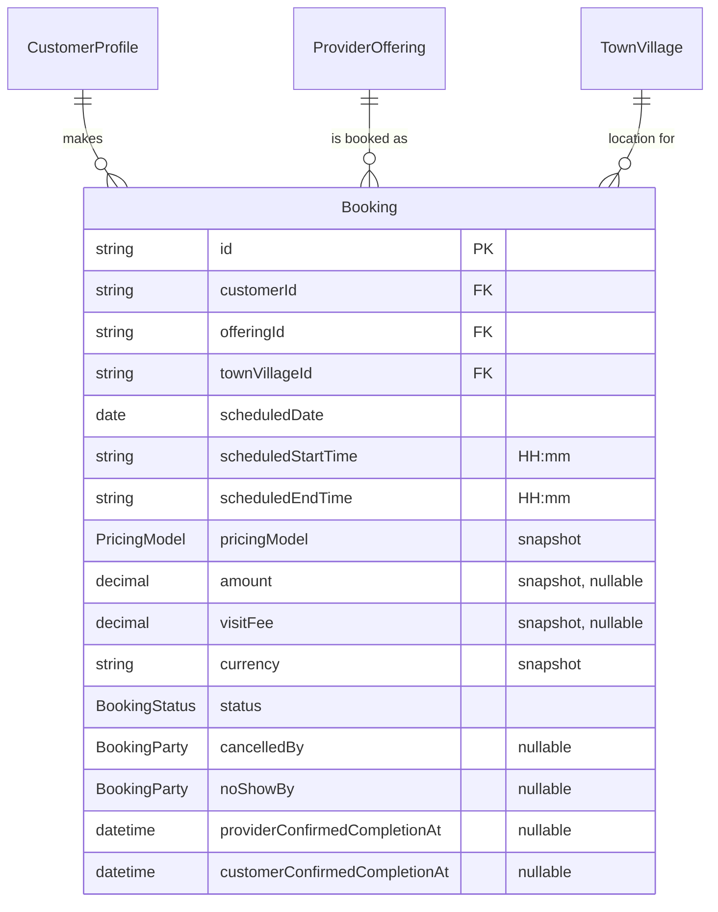

# Booking Module — Implementation Documentation

This documents **how** the Booking module (`src/booking/`) actually
works internally — control flow, data model, and the reasoning behind
each design decision. Same three-document split as every other module
(`docs/modules/AUTH_IMPLEMENTATION.md` §0).

| Document | Answers |
|---|---|
| `docs/ARCHITECTURE.md` §5.3 | Why the system is shaped this way, system-wide |
| `docs/api/BOOKING.md` + `docs/api/openapi.json` | What the HTTP contract is (external, for the frontend team) |
| **This document** | How the contract is actually implemented (internal, for backend engineers) |

If code and this document disagree, the code wins.

## 1. Scope boundary

Per `docs/ARCHITECTURE.md`'s module map (§5.2/§5.3, Phase 1a module
#12): the central transaction of the marketplace — a customer requests
a specific provider's offering, and the two parties move it through
accept/reject/cancel/no-show/complete.

**Why matching is "customer choice" only, not broadcast/round-robin:**
the customer picks a specific `offeringId` (already resolved to one
provider) directly, the same way Provider Offering's public browse
endpoint already lets a customer find and compare offerings. BRD §16.3
anticipates a future matching/discovery layer that could broadcast a
request to several serviceable providers, but `docs/ARCHITECTURE.md`
itself flags that as an anticipated future refactor, not part of this
module's initial scope — building it speculatively here would be
designing for a requirement that doesn't exist yet.

**Why a booking carries an explicit `townVillageId`, not a reference to
a `CustomerAddress`:** `CustomerModule` exports only `CustomerService`,
not `AddressService` — `CustomerAddress` has no relationship to
Geography (no `townVillageId` on it) as of this module. Rather than
either reaching past `CustomerModule`'s export boundary or unilaterally
extending the Customer module's scope to backfill that link, Booking
takes the same approach Serviceability and Availability already
established: a bare `townVillageId` supplied directly on the request.
Linking saved addresses to Geography is a Customer-module concern to
pick up later, not Booking's to solve.

**Why pricing fields are copied onto the booking, not referenced live
from the offering:** BRD §6.3 describes the price a customer sees and
agrees to at booking time as what they should be charged, even if the
provider edits their offering's price afterward. `pricingModel`,
`amount`, `visitFee`, and `currency` are therefore a point-in-time
snapshot, copied once at `create` and never revisited.

**Why Payment, Commission, Settlement, and Review are explicitly out of
scope:** `docs/ARCHITECTURE.md` §5.3 lists Payment as module #13, a
separate future module; Review is Phase 1b. This module records the
price snapshot Payment will eventually need but does nothing with
money, and has no rating/feedback concept at all.

**Why `BookingStatus`/`BookingParty` are consolidated rather than
exploded per-scenario:** BRD §37 (cancellation/no-show/refund) and §38
(completion/confirmation) describe several cancellation and no-show
scenarios that all reduce, from a data-modeling standpoint, to "which
status is this in" plus "which of the two parties caused it" — the same
enum-plus-qualifier consolidation already used for `ExceptionType`
(`docs/modules/AVAILABILITY_IMPLEMENTATION.md` §3) and `PricingModel`
(`docs/modules/PROVIDER_OFFERING_IMPLEMENTATION.md`).

## 2. File map

```
src/booking/
├── booking.module.ts             imports Customer, Provider, ProviderOffering,
│                                  Geography, Serviceability, Availability
├── booking.service.ts             all business logic — both sides
├── booking.service.spec.ts
├── customer/
│   └── customer-booking.controller.ts   /bookings/me
├── provider/
│   └── provider-booking.controller.ts   /bookings/provider/me
└── dto/
    ├── create-booking.dto.ts
    ├── cancel-booking.dto.ts
    ├── reject-booking.dto.ts
    ├── list-bookings-query.dto.ts
    └── responses/booking.dto.ts
```

One service, two controllers — deliberately not two services. Both
sides of a booking transition the *same* row through the *same* status
machine, so the transition logic (`applyTransition`, `applyCancellation`,
`applyNoShow`) lives once in `BookingService` and is called from both
the customer-facing and provider-facing methods, parameterized by which
`BookingParty` triggered it. This mirrors Provider Offering's
self-service/public-browse controller split
(`docs/modules/PROVIDER_OFFERING_IMPLEMENTATION.md` §2) but for two
*authenticated* perspectives on the same resource rather than
authenticated-vs-public.

## 3. Data model



A provider is reached only via `offering.providerId` — there is no
denormalized `providerId` column directly on `Booking`. Every
provider-scoped query (`listAsProvider`, `getOwnedByProviderOrThrow`)
filters through the `offering` relation instead
(`where: { offering: { providerId } }`), the same "relation filter over
redundant FK" preference used throughout (e.g. Provider Offering's own
queries).

**Why `scheduledStartTime`/`scheduledEndTime` are `"HH:mm"` strings, not
`DateTime`:** identical reasoning to Availability
(`docs/modules/AVAILABILITY_IMPLEMENTATION.md` §3) — these are
compared directly against the `"HH:mm"` windows `AvailabilityCheckService`
returns, so keeping the same representation avoids a conversion step on
every booking creation.

## 4. Core flows

### 4.1 Creation validates through three other modules' services, never their tables

```mermaid
sequenceDiagram
    participant Cust as Customer
    participant BS as BookingService
    participant Off as OfferingService
    participant Cov as CoverageCheckService
    participant Avail as AvailabilityCheckService

    Cust->>BS: create(dto)
    BS->>Off: findOneActive(offeringId)
    BS->>BS: assert offering.isActive
    BS->>BS: assert startTime < endTime
    BS->>Cov: isServiceable(providerId, townVillageId)
    alt not serviceable
        BS-->>Cust: 409
    end
    BS->>Avail: getAvailability(providerId, scheduledDate)
    alt requested window doesn't fit any returned window
        BS-->>Cust: 409
    end
    BS->>BS: prisma.booking.create (copies pricing snapshot)
    BS-->>Cust: 201 Booking
```

`OfferingService.findOneActive` does not actually filter by `isActive`
despite its name (verified by reading `offering.service.ts` before
depending on it) — so `create` adds its own explicit
`if (!offering.isActive) throw NotFoundException` immediately after,
rather than assuming the pre-existing method already guarantees it.

"Fits a window" means the requested `[start, end)` falls entirely
within one returned window's `[w.start, w.end)`
(`w.start <= start && end <= w.end`) — a request that only partially
overlaps a window (e.g. starts inside a window but runs past its end)
is rejected, not clipped.

### 4.2 `confirmCompletionAsCustomer` corroborates, it does not transition

Unlike every other customer/provider action, confirming completion does
not call `applyTransition` — it only requires the booking already be
`COMPLETED` (**409** otherwise) and stamps
`customerConfirmedCompletionAt`. `status` stays `COMPLETED` regardless
of whether the customer ever confirms. This is deliberate: completion
is the provider's assertion (`completeAsProvider` is what actually
moves the status), and the customer's confirmation is corroborating
evidence for a future dispute/review process, not a gate on the
booking's own lifecycle. A customer who never confirms doesn't leave
the booking stuck.

### 4.3 Shared transition guard is `Prisma.BookingUncheckedUpdateInput`, not `Partial<Booking>`

`applyTransition(booking, allowedFrom, data)` takes
`data: Prisma.BookingUncheckedUpdateInput` rather than
`Partial<Booking>` — the Prisma-generated update-input type is what the
`prisma.booking.update` call actually accepts (it diverges from the
plain model type for relation-scalar fields), so typing against it
directly is correct where `Partial<Booking>` would only coincidentally
work. Every terminal-state check (`allowedFrom.includes(booking.status)`)
happens against the row already fetched by
`getOwnedByCustomerOrThrow`/`getOwnedByProviderOrThrow`, so there's no
separate "does this booking exist" check duplicated inside the
transition helper.

## 5. Configuration reference

No new environment variables.

## 6. Extension points for future modules

- **Payment** (`src/payment/`) now reads a `Booking`'s
  `amount`/`visitFee`/`currency` snapshot to validate and record
  payments against it, via `BookingModule`'s `BookingService` export —
  see `docs/modules/PAYMENT_IMPLEMENTATION.md` §2. `BookingModule` did
  not export anything until Payment needed `findAsCustomer`/
  `findAsProvider` for ownership-checked booking lookups.
- **Commission** (`src/commission/`) now reads a `COMPLETED` booking's
  `offeringId`/`townVillageId`/`currency` to resolve and calculate its
  commission, via a new ownership-agnostic `BookingService.
  findByIdOrThrow` — the first method here that isn't scoped to "as
  this customer" or "as this provider," since Commission is an
  admin/system operation, not either party's own action. See
  `docs/modules/COMMISSION_IMPLEMENTATION.md` §2.
- **Refund** (`src/refund/`) reuses that same `findByIdOrThrow` to read
  a `CANCELLED`/`NO_SHOW`/`REJECTED` booking's `status`/`cancelledBy`/
  `noShowBy` and derive which of five refund reasons applies — see
  `docs/modules/REFUND_IMPLEMENTATION.md` §1. Commission and Refund
  never read the same booking: `findByIdOrThrow` callers only ever see
  a `COMPLETED` booking (Commission) or a non-`COMPLETED` terminal one
  (Refund), by construction of this module's own status transitions.
- **Review** (Phase 1b) will need a reference to a `COMPLETED` booking
  to attach a rating to.
- **A future Discovery/Matching module** could sit in front of this
  one's `create`, resolving "which offering should this request go to"
  before calling the same `create` — see §1.

## 7. Known gaps (tracked, not yet done)

- **No double-booking prevention.** `AvailabilityCheckService`'s
  returned windows are not reduced by other bookings already occupying
  part of that time — two customers can both successfully book the same
  provider for overlapping windows. Fixing this requires Availability
  itself to become booking-aware (its own documented gap,
  `docs/modules/AVAILABILITY_IMPLEMENTATION.md` §7), or Booking to add
  its own overlap check; neither exists yet.
- **`AvailabilitySchedule.maxDailyBookings`/`maxConcurrentBookings` are
  still unenforced** — this module was the natural place to start
  counting bookings against them, and doesn't.
- **No integration/e2e tests** — only unit tests with mocked Prisma and
  mocked cross-module services (`booking.service.spec.ts`). Manually
  smoke-tested against a real database end-to-end: offering/serviceability/
  availability rejection paths (unserviceable location, outside working
  hours, wrong weekday, invalid time range) all correctly returned
  **409** → a valid booking created with a `QUOTE_BASED` offering's
  pricing snapshot copied (`amount: null`) → provider accept → provider
  complete → customer confirm-completion (stamps timestamp, status
  unchanged) → cancelling a `COMPLETED` booking correctly **409**s →
  separate bookings exercised for provider-reject (with and without a
  required `reason`), customer-cancel-with-reason, and both directions
  of no-show reporting → cross-party ownership checks confirmed **404**
  (a customer token against a provider-only route, a bogus id against
  the provider's own route) → status query-filter confirmed against a
  live list, invalid enum value correctly **400**s.
