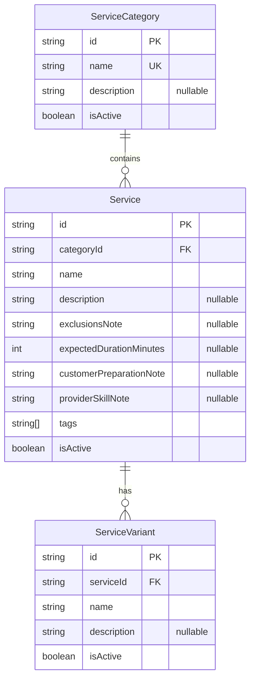

# Catalogue Module — Implementation Documentation

This documents **how** the Service Catalogue module (`src/catalogue/`)
actually works internally — control flow, data model, and the reasoning
behind each design decision. Same three-document split as every other
module (`docs/modules/AUTH_IMPLEMENTATION.md` §0).

| Document | Answers |
|---|---|
| `docs/ARCHITECTURE.md` §5.3 / §6.2 | Why the system is shaped this way, system-wide |
| `docs/api/CATALOGUE.md` + `docs/api/openapi.json` | What the HTTP contract is (external, for the frontend team) |
| **This document** | How the contract is actually implemented (internal, for backend engineers) |

If code and this document disagree, the code wins.

## 1. Scope boundary

Per `docs/ARCHITECTURE.md`'s module map (§5.2/§5.3, Phase 1a module #7):
**"Categories, services, variants, attributes."** §6.2 draws the boundary
this module lives inside explicitly:

> **Catalogue** is platform master data: categories → services →
> variants/attributes. Adding a legitimate new service category is a data
> operation, not a code change (BRD §12.1).
>
> **Provider Offering** links a specific provider to specific catalogue
> services, with that provider's price, coverage, availability, and
> status. This separation is what makes the "open service marketplace"
> principle real rather than aspirational.

BRD §12.2's list of what a standardized service definition needs splits
cleanly across that boundary: name/description (what's included),
exclusions, expected duration, customer preparation notes, and provider
skill notes all landed on `Service` here (§3). **Indicative/fixed price,
material handling rules, and travel charges** — named in the same BRD
paragraph — do **not** appear anywhere in this module's schema or DTOs.
They belong to Provider Offering (module #10, not yet built) once it
exists to attach a specific provider's price to a specific
category/service/variant.

## 2. File map

```
src/catalogue/
├── catalogue.module.ts          imports IamModule; exports CategoryService, ServiceService
├── category/
│   ├── category.controller.ts   /catalogue/categories — mixed auth (reads open, writes gated)
│   └── category.service.ts      CRUD + assertExistsOrThrow() used by ServiceService
├── service/
│   ├── service.controller.ts    /catalogue/services — same mixed-auth pattern
│   └── service.service.ts       CRUD + assertExistsOrThrow() used by VariantService
├── variant/
│   ├── variant.controller.ts    /catalogue/services/:serviceId/variants — nested, mixed auth
│   └── variant.service.ts       CRUD, ownership-checked against serviceId
└── dto/                            request DTOs + dto/responses/
```

Three controllers form a chain: `VariantService` depends on
`ServiceService.assertExistsOrThrow`, which depends on
`CategoryService.assertExistsOrThrow` — each layer validates its
immediate parent exists before writing, the same "resolve through the
owning service, never query the parent's table directly" discipline as
`AddressService` depending on `CustomerService`
(`docs/modules/CUSTOMER_IMPLEMENTATION.md` §4) and `AgentService`
depending on `AgentCompanyService`
(`docs/modules/AGENT_IMPLEMENTATION.md` §4.2) — except here it's three
levels deep instead of two.

## 3. Data model



**Why `tags` is a plain `String[]` (Postgres native array via Prisma),
not a separate attribute table:** the module description says
"categories, services, variants, **attributes**," but nothing downstream
(Discovery/Matching, Provider Offering) exists yet to actually query or
facet-filter on structured attributes. A flat tag array is the same
"minimum real structure, no speculative EAV system" choice as
`AgentProfile.geographyNote` being free text
(`docs/modules/AGENT_IMPLEMENTATION.md` §3) — cheap to add, doesn't block
building a real structured-attribute system later since nothing consumes
this one yet.

**Why there's no category nesting (subcategories):** BRD §12.1's example
categories (home repair, appliance services, cleaning, ...) are listed
flat, with no stated subcategory requirement. A three-level hierarchy
(category → service → variant) already matches "categories, services,
variants" from the module description one-to-one; adding a fourth level
of self-referential category nesting would be structure without a named
requirement driving it.

**Why deletion doesn't exist anywhere in this module:** identical
reasoning to `AgentCompany`
(`docs/modules/AGENT_IMPLEMENTATION.md` §3) — these are shared reference
entities that other modules (eventually Provider Offering, Booking) will
hold durable references to. `isActive: false` via `PATCH` is the only
deactivation path across all three entity types, avoiding both the
"block delete if referenced" complexity IAM's `RoleService.remove` has to
implement (`docs/modules/IAM_IMPLEMENTATION.md` §3) and the risk of
silently orphaning data a future module already points at.

## 4. Core flows

### 4.1 Three-level existence validation, not three-level ownership

Unlike Customer's addresses or the Catalogue's own variants (§4.2),
`Service.categoryId` and `ServiceVariant.serviceId` are validated for
**existence only** (`assertExistsOrThrow`), not activeness — creating a
service under an inactive category, or a variant under an inactive
service, is allowed. This is a deliberate, narrower check than
`AgentCompanyService.assertActiveOrThrow`
(`docs/modules/AGENT_IMPLEMENTATION.md` §4.2), which does require the
target to be active. The difference: joining an inactive *company* as an
agent is a real-world action with a person opting in, worth blocking;
attaching a *service* to a temporarily-deactivated *category* is a
routine admin catalogue-maintenance operation (e.g. reorganizing before
flipping the category back on) that shouldn't be blocked by ordering.

### 4.2 Variant ownership is a 404, not a 403

`VariantService`'s private `getOwnedVariantOrThrow` mirrors the same
"wrong parent reads as not found" pattern as `AddressService`
(`docs/modules/CUSTOMER_IMPLEMENTATION.md` §4.4): a variant that exists
but belongs to a different `serviceId` than the one in the URL produces
the exact same `404 Variant not found` as a variant that doesn't exist at
all — verified in `variant.service.spec.ts` and directly against a live
database (two services created, a variant update attempted through the
wrong service's path, confirmed 404 rather than leaking the variant's
real owner).

### 4.3 Rename-to-same-name is not a conflict

`CategoryService.update`'s duplicate-name check explicitly excludes the
category being updated (`existing.id !== id`) before raising a 409 — a
`PATCH` that doesn't actually change `name` (or changes only
`description`/`isActive` while re-sending the current name) succeeds
rather than colliding with itself. Covered in
`category.service.spec.ts`'s "allows renaming to the same name" case.

## 5. Why mixed authorization, again

`CategoryController`/`ServiceController`/`VariantController` all follow
the same pattern `AgentCompanyController` established
(`docs/modules/AGENT_IMPLEMENTATION.md` §4.3): class-level
`@UseGuards(JwtAuthGuard)` for "must be logged in," with
`@UseGuards(PermissionsGuard)` + `@RequirePermissions('catalogue.manage')`
layered on only the mutating handlers. The reasoning repeats identically
here — any customer or provider needs to browse the catalogue to decide
what to book, so gating reads behind a permission would break browsing
for everyone who isn't an admin; only mutation of this shared reference
data needs gating.

## 6. Configuration reference

No new environment variables.

## 7. Extension points for future modules

- **Provider Offering** (`docs/modules/PROVIDER_OFFERING_IMPLEMENTATION.md`)
  is now built and attaches a price to a `(providerId, serviceId,
  variantId?)` tuple — see §1. It reads `Service`/`ServiceVariant` through
  `ServiceService`/`VariantService`, never `prisma.service` directly.
  Building it required exporting `VariantService` from `CatalogueModule`
  (it wasn't exported before — every prior consumer of variants worked
  entirely within Catalogue itself) and adding
  `VariantService.assertBelongsToService`, a flat cross-module ownership
  check.
- **Discovery/Matching**, once built or formalized out of Booking +
  Serviceability query logic (`docs/ARCHITECTURE.md` §5.3), is the
  natural consumer of `Service.tags` for search/filtering — and the
  trigger for eventually replacing tags with a structured attribute
  system if faceted search needs it (§3).
- **Booking**, once built, references `Service`/`ServiceVariant` ids
  directly (never scattered into Customer/Provider per §6.5) to record
  what was actually booked.

## 8. Known gaps (tracked, not yet done)

- **No pricing anywhere in this module** — by design, see §1.
- **`tags` is unstructured** — no category-specific attribute schema, no
  validation that a tag means anything to any other module yet (§3).
- **No category nesting.**
- **`isActive` doesn't cascade** — deactivating a category leaves its
  services' own `isActive` flags untouched, and likewise for
  services → variants. A future admin UI would need to surface this
  explicitly (e.g. "this category has 4 active services") rather than
  assume deactivation is transitive.
- **No integration/e2e tests** — only unit tests with mocked Prisma
  (`category.service.spec.ts`, `service.service.spec.ts`,
  `variant.service.spec.ts`), mirroring every other module. Manually
  smoke-tested against a real database: permission gate blocks a non-admin
  create (403) → category created → duplicate name rejected (409) →
  service created under a bogus category (404) then a real one → variant
  added → nested `GET .../services/:id` confirmed the variant appears →
  category-filtered service list confirmed → a second service created and
  used to confirm cross-service variant access 404s → variant deactivated
  via its correct path.
