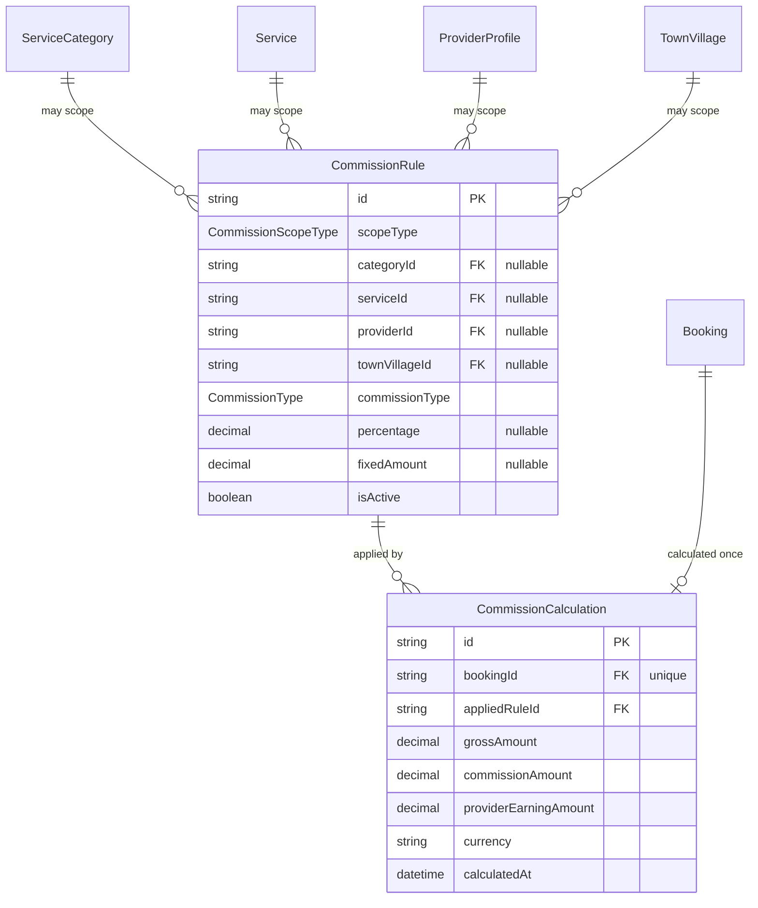
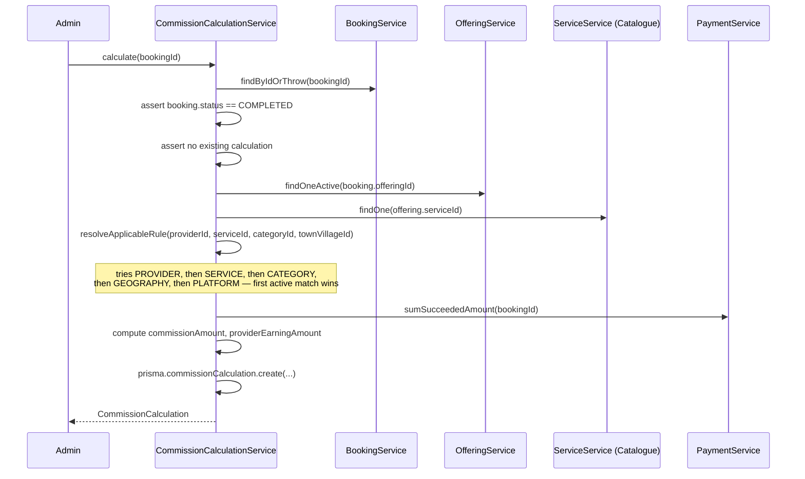

# Commission Module — Implementation Documentation

This documents **how** the Commission module (`src/commission/`)
actually works internally — control flow, data model, and the
reasoning behind each design decision. Same three-document split as
every other module (`docs/modules/AUTH_IMPLEMENTATION.md` §0).

| Document | Answers |
|---|---|
| `docs/ARCHITECTURE.md` §5.3 | Why the system is shaped this way, system-wide |
| `docs/api/COMMISSION.md` + `docs/api/openapi.json` | What the HTTP contract is (external, for the frontend team) |
| **This document** | How the contract is actually implemented (internal, for backend engineers) |

If code and this document disagree, the code wins.

## 1. Scope boundary

Per `docs/ARCHITECTURE.md`'s Phase 1b module list (§5.3): "Platform
must calculate what it earns per booking" — the first Phase 1b module,
picked as the natural next step after Payment (#13) since the
architecture's own pricing chain (§6.3) draws `Payment → Commission →
Provider Earning → Settlement` as the very next links. BRD §18 governs
scope: §18.1 (configurable commission, not a fixed platform-wide
number), §18.2 (multiple configuration levels with a defined
precedence), §18.3 (market economics/reporting — explicitly **not**
this module's job, see below).

**Why two of BRD §18.2's seven configuration levels are dropped:**
"provider-group commission" and "special promotional/introductory
commission" have no home — there is no `ProviderGroup` model (Provider
Organization is Phase 1b, not yet built) and no `Promotion` model
(Phase 2) to scope a rule to. Building placeholder models for either
now would be designing for requirements that don't exist yet. The
remaining five levels — platform default, category, service, provider,
geography — all map onto models that already exist.

**Why `GEOGRAPHY` scope is a single `TownVillage`, not a
state/district/taluk hierarchy:** BRD §18.2 says "geographical or
market-specific commission" without specifying a level. Matching how
Serviceability and Booking already treat location — a bare
`TownVillage` reference, never a multi-level geography walk — keeps
this consistent with the rest of the codebase rather than inventing a
different geography model for Commission alone.

**Why `PERCENTAGE`/`FIXED_AMOUNT` only, not a "tiered structure":** BRD
§18.2 mentions tiered commission as a possibility, but no tier-
threshold model exists anywhere in the codebase and nothing currently
needs one — the same "don't build for a requirement with no concrete
shape yet" reasoning as the two dropped scope types above.

**Why BRD §18.3 (market economics — average booking value, CAC,
contribution margin by service/geography) is explicitly out of
scope:** that is aggregate analytics over completed transactions, not
a business rule this module needs to enforce or calculate per-booking.
It belongs to the Reporting module (Phase 1b, listed separately in
`docs/ARCHITECTURE.md` §5.3) once built.

**Why this module has no automatic trigger from Booking's completion
flow:** identical reasoning to Notification not auto-firing on Booking/
Payment state changes (`docs/modules/NOTIFICATION_IMPLEMENTATION.md`
§1) — wiring `BookingService.completeAsProvider` to call into Commission
would mean reaching back into an already-shipped, tested, committed
module. `docs/ARCHITECTURE.md` §6.6 frames this kind of cross-module
fan-out as belonging to the Event/Outbox architecture, which is also
Phase 1b and doesn't exist yet. `POST /commission/calculations` is an
explicit, admin-triggered action for now — the same posture already
taken for Serviceability's coverage-area review and Provider
Onboarding's application review.

## 2. File map

```
src/commission/
├── commission.module.ts     imports IAM, Catalogue, Provider, Geography, Booking, Payment, ProviderOffering
├── rule/                     /commission/rules — admin-managed configuration
│   ├── commission-rule.controller.ts
│   ├── commission-rule.service.ts
│   └── commission-rule.service.spec.ts
└── calculation/
    ├── commission-calculation.controller.ts   /commission/calculations — admin trigger + view
    ├── commission-calculation.service.ts        resolution + calculation + provider self-view
    ├── commission-calculation.service.spec.ts
    └── provider/
        └── provider-commission.controller.ts    /commission/calculations/provider/me
```

Two new lookup methods were added to already-exported services this
module needed and nothing previously did — the same "add the one
method the new module needs" pattern as `TownVillageService.
findByIdOrThrow` or `AuthService.getPublicUserByIdOrThrow`:

- **`BookingService.findByIdOrThrow(id)`** — a plain, ownership-agnostic
  booking lookup. Every existing `BookingService` method is scoped to
  "as this customer" or "as this provider"; Commission is the first
  caller that needs *any* booking regardless of which party it belongs
  to, since calculation is an admin/system operation.
- **`PaymentService.sumSucceededAmount(bookingId)`** — sums a booking's
  `SUCCEEDED` payments. Same reasoning: existing `PaymentService`
  methods are all ownership-scoped; Commission needs the actual total
  collected regardless of who paid it.

Both `BookingModule` and `PaymentModule` needed their service exported
for the first time to make these callable — `PaymentModule` in
particular had no `exports` array at all before this module.

## 3. Data model



`CommissionRule` lives in the `finance` Postgres schema, alongside
`Payment`. Exactly one of `categoryId`/`serviceId`/`providerId`/
`townVillageId` is set, matching `scopeType` (or none, for `PLATFORM`)
— enforced entirely in `CommissionRuleService`, since Prisma's
declarative schema has no conditional-required-field constraint.

**Why at most one active rule per exact scope is application-enforced,
not a DB constraint:** Prisma has no partial/filtered unique index in
its schema DSL (a `WHERE isActive = true` unique index would need raw
SQL bolted onto the migration). `CommissionRuleService.
assertNoActiveRuleAtScope` does a `findFirst` check immediately before
every `create` and every reactivating `update` — the same "check then
create" pattern already used for Provider Offering's duplicate-
offering check.

**Why `CommissionCalculation.bookingId` is `@unique`, one row per
booking forever:** the applied rule and gross amount are a snapshot of
"what actually happened, calculated once" — identical reasoning to
Booking's own price snapshot (`docs/modules/BOOKING_IMPLEMENTATION.md`
§1) and Provider Offering's separation of "provider pricing" from
"booking price." Nothing in this module ever updates or recalculates
an existing row; a mistake would need a manual DB fix, not an API call
— there's no `PATCH`/`DELETE` on calculations at all.

## 4. Core flows

### 4.1 Calculation resolves a rule via fixed precedence, then computes



`resolveApplicableRule` queries each scope level in turn, in the fixed
`PRECEDENCE` array order, and returns on the first active match —
never queries a lower-precedence level once a higher one matches. If
nothing matches even at `PLATFORM`, it throws `ConflictException`
rather than silently defaulting to zero commission, since a booking
with no rule at all indicates a genuine admin-configuration gap (no
platform default has ever been set), not a valid business state.

**Why precedence is `PROVIDER > SERVICE > CATEGORY > GEOGRAPHY >
PLATFORM`:** BRD §18.2 requires "a defined business priority" without
specifying the order — this was a deliberate design call, reasoned as
"most specific business relationship wins": a provider's own
personally-negotiated rate is the most specific (tied to one legal
entity's agreement), followed by a specific service, then its broader
category, then a cross-cutting geography rule, with `PLATFORM` as the
universal catch-all. A different, equally defensible order could put
`GEOGRAPHY` above `CATEGORY`/`SERVICE` (a regional deal overriding
generic service pricing) — this codebase picked one and documents why,
rather than leaving it ambiguous.

### 4.2 `FIXED_AMOUNT` commission is capped at the gross amount collected

`computeCommissionAmount` for a `FIXED_AMOUNT` rule returns
`Math.min(fixedAmount, grossAmount)`, never `fixedAmount` outright —
without the cap, a booking that collected less than the configured
flat fee would produce a negative `providerEarningAmount`, which is
never a valid business state. A `PERCENTAGE` rule can't produce this
problem structurally (a percentage of `grossAmount` is always ≤
`grossAmount`), so only the `FIXED_AMOUNT` branch needs the guard.
Covered directly in `commission-calculation.service.spec.ts`'s "caps a
FIXED_AMOUNT commission at the gross amount collected" case.

## 5. Configuration reference

No new environment variables.

## 6. Extension points for future modules

- **Settlement** (`src/settlement/`) now reads
  `CommissionCalculation.providerEarningAmount` to actually pay
  providers out, and added `CommissionCalculation.settlementId`
  (nullable — `null` means "not yet settled") to track which
  calculations a payout covered. See
  `docs/modules/SETTLEMENT_IMPLEMENTATION.md` §3. `SettlementConfig`
  also directly reuses this module's `CommissionScopeType` enum rather
  than defining its own — see that document's §1.
- **Event/Outbox** (Phase 1b), once built, is where an automatic
  `BookingCompleted → calculate commission` trigger belongs — see §1.
- **Reporting** (Phase 1b) would aggregate `CommissionCalculation` rows
  for the market-economics tracking BRD §18.3 calls for (§1).
- **Provider Organization** (Phase 1b) and **Promotion** (Phase 2),
  once built, are where `CommissionScopeType.PROVIDER_GROUP` and a
  promotional scope would be added — see §1.

## 7. Known gaps (tracked, not yet done)

- **No provider-group or promotional commission scoping** — see §1.
- **No tiered commission structure** — see §1.
- **Not wired into Booking's completion flow** — admin-triggered only.
  See §1.
- **No concurrency guard** on the "no active rule at this scope"
  check — the same read-then-write race already documented for
  Payment's outstanding-balance check
  (`docs/modules/PAYMENT_IMPLEMENTATION.md` §7) applies here.
- **No market-economics/reporting** — see §1.
- **No integration/e2e tests** — only unit tests with mocked Prisma and
  mocked cross-module services (`commission-rule.service.spec.ts`,
  `commission-calculation.service.spec.ts`). Manually smoke-tested
  against a real database: a `PLATFORM` default rule (15%) created,
  a duplicate active `PLATFORM` rule correctly **409**'d, missing
  scope/rate fields correctly **400**'d → a `PROVIDER`-scoped rule
  (12%) created for a real provider, a non-existent provider id
  correctly **404**'d → non-admin access to rule listing correctly
  **403**'d → a rate update succeeded, and setting the wrong rate
  field for the rule's `commissionType` correctly **409**'d → a real
  booking driven through `ACCEPTED`→`COMPLETED` with an existing
  `SUCCEEDED` payment of 599 → commission calculation correctly
  resolved the `PROVIDER` rule over the `PLATFORM` default (12% →
  71.88 commission, 527.12 earning) → recalculating the same booking
  correctly **409**'d → calculating a non-`COMPLETED` booking and a
  non-existent booking correctly **409**'d/**404**'d → admin listing
  and the provider's own self-service view both confirmed the
  calculation, and a different party's access to it correctly
  **404**'d → deactivating and reactivating the `PROVIDER` rule at the
  same scope confirmed the uniqueness re-check.
