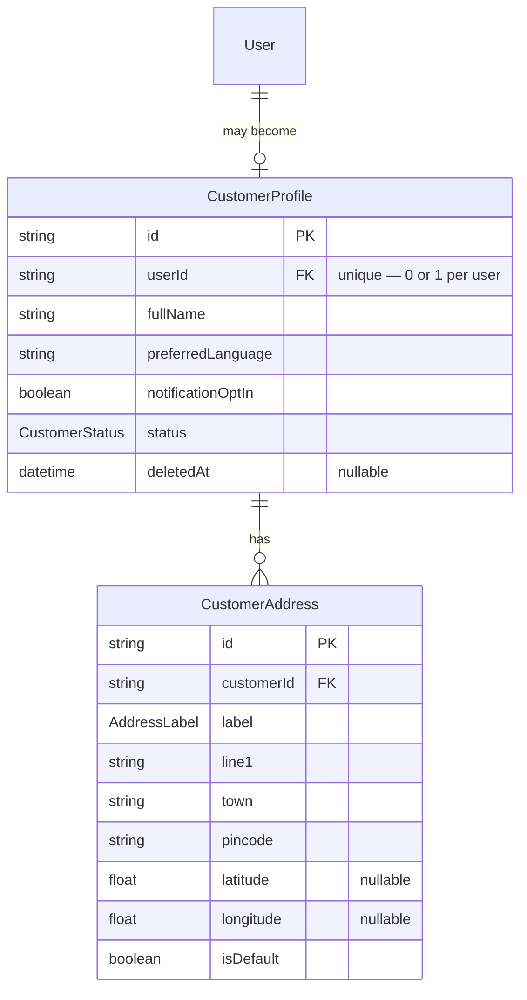
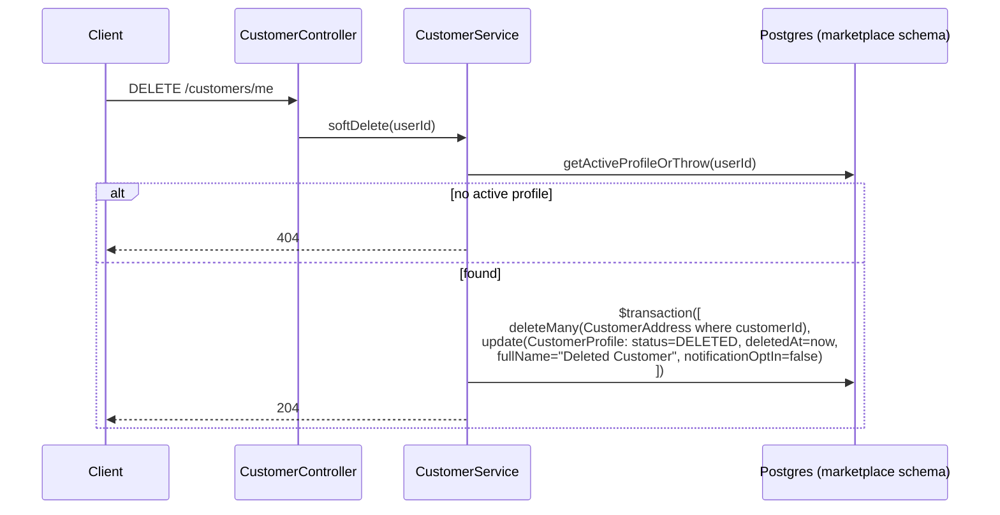

# Customer Module — Implementation Documentation

This documents **how** the Customer module (`src/customer/`) actually works
internally — control flow, data model, and the reasoning behind each
design decision. Same three-document split as Auth/IAM
(`docs/modules/AUTH_IMPLEMENTATION.md` §0):

| Document | Answers |
|---|---|
| `docs/ARCHITECTURE.md` §5.3 / §7.1 | Why the system is shaped this way, system-wide |
| `docs/api/CUSTOMER.md` + `docs/api/openapi.json` | What the HTTP contract is (external, for the frontend team) |
| **This document** | How the contract is actually implemented (internal, for backend engineers) |

If code and this document disagree, the code wins.

## 1. Scope boundary

Per `docs/ARCHITECTURE.md`'s module map (§5.2/§5.3, Phase 1a module #3):
**Customer owns profile, addresses, preferences, and account lifecycle** —
nothing else. It is deliberately separate from `auth.User`
(`docs/modules/AUTH_IMPLEMENTATION.md` §1: "Profile data... is explicitly
not [in Auth] either — that belongs to Customer/Provider/Agent"). A user
can be authenticated (has an `auth.User` row) without being a customer —
`CustomerProfile` is created explicitly via `POST /customers/me`, never
auto-created on login the way Auth's OTP flow auto-registers a bare user.

Customer's tables live in the `marketplace` Postgres schema
(`docs/ARCHITECTURE.md` §7.1) — the first module to use that schema; Auth
and IAM share `auth`.

## 2. File map

```
src/customer/
├── customer.module.ts          wires everything below together
├── customer.controller.ts      POST/GET/PATCH/DELETE /customers/me
├── customer.service.ts         profile CRUD + soft-delete/anonymization; owns getActiveProfileOrThrow()
├── address/
│   ├── address.controller.ts   CRUD under /customers/me/addresses
│   └── address.service.ts      depends on CustomerService for profile resolution + ownership
└── dto/                          request DTOs + dto/responses/ (same split as Auth/IAM)
```

Both controllers only need `JwtAuthGuard` — no IAM `PermissionsGuard`.
Every endpoint operates on the caller's own resources (`/customers/me/...`),
so "are you logged in" is the only check that applies; there is no
admin-facing customer-listing surface yet to guard with a permission (§8).

## 3. Data model



**Why `CustomerProfile.userId` is a cross-schema FK to `auth.users`, not a
copy of identity fields:** `docs/ARCHITECTURE.md` §7.1 explicitly permits
cross-schema foreign keys within the single pilot database ("a module
accesses another module's tables only through that module's service
layer, never directly, even though the DB technically allows it" — this is
a *DB constraint*, which is fine, not an *application-layer query* into
Auth's tables, which would violate the boundary). In practice
`CustomerService` never queries `auth.users` at all: `JwtAuthGuard` +
`JwtStrategy` already validated the caller's `userId` before any Customer
controller method runs, so the FK exists purely for referential integrity,
not because the service layer needs to read through it.

**Why `CustomerProfile.status` is separate from `auth.User.status`:** they
answer different questions. `auth.User.status` gates *login* (Auth-level).
`CustomerProfile.status` gates *marketplace standing* — a customer could in
principle be suspended from booking (a future Booking-module concern)
while still being able to log in and manage their account. The two are
never written by the same code path today (nothing sets `CustomerProfile`
to `SUSPENDED` yet — reserved for when Support/Trust modules exist), but
modeling them as one field from the start would have conflated two
different lifecycles.

**Why `town`/`district`/`state` are plain strings, not a Geography FK:**
identical reasoning to IAM's `UserRoleAssignment.scopeId`
(`docs/modules/IAM_IMPLEMENTATION.md` §3) — the Geography module
(`docs/ARCHITECTURE.md` §5.3, Phase 1a module #8) doesn't exist yet to
normalize against. Free text now, a real FK once that module lands and a
migration can backfill it — not a redesign.

**Why `latitude`/`longitude` are plain `Float` columns, not PostGIS
geometry:** matching/radius search is Serviceability's job (module #9,
not yet built). Customer only needs to *store* a coordinate pair today;
introducing a PostGIS `geometry` column (via Prisma's `Unsupported(...)`
escape hatch, since Prisma has no native geometry type) is premature until
a module actually queries it spatially.

## 4. Core flows

### 4.1 Profile creation is explicit, not auto-provisioned

Unlike `AuthService.findOrCreateUserByPhone` (OTP login auto-registers),
`CustomerService.create` requires an existing, active `auth.User` (already
guaranteed by `JwtAuthGuard`) plus a **409 if a profile already exists**
for that user — `userId` is `@unique` at the DB level, but the service
checks first to return a clean `ConflictException` rather than a raw
Postgres unique-violation error.

### 4.2 Soft delete = anonymize the profile, hard-delete the addresses



**Why the profile row survives (anonymized) but addresses don't:** BRD
§14.4's policy — quoted already in `docs/ARCHITECTURE.md` §18 — is that
account deletion anonymizes PII rather than deleting records that other
modules will reference durably. A future Booking module will hold
`booking.customerId → marketplace.customer_profiles.id`; deleting the row
outright would either cascade-delete a customer's entire booking history
or require nullable FKs everywhere bookings reference a customer. Anonymizing
in place avoids both. Addresses, by contrast, have no other module
referencing them (yet) and carry no retention requirement of their own, so
they're hard-deleted — simpler, and there's nothing forcing the more
complex anonymize-in-place treatment onto data that doesn't need it.

**Why this doesn't touch `auth.User` or revoke sessions:** deleting the
*customer profile* is not the same as deleting the *account*. The
`auth.User` row and its login ability are untouched — the person can still
log in, they simply have no customer profile until they create a new one
(`getActiveProfileOrThrow` treats a `DELETED` profile identically to no
profile at all, so every read/write 404s the same way). Full account
deletion (if ever needed) is an Auth-module concern, out of scope here.

### 4.3 Exactly one default address, enforced at write time

`AddressService.create`/`update` never trust the caller's `isDefault` flag
in isolation:
- **First address for a customer** → forced to `isDefault: true`
  regardless of what was sent (a customer should never have zero default
  addresses once they have at least one).
- **`isDefault: true` on any other create/update** → a preceding
  `updateMany` clears `isDefault` on every other address for that
  `customerId` before the create/update happens, so the invariant "at most
  one default" holds without a DB-level partial unique index (Prisma
  doesn't support partial unique indexes without a raw-SQL migration
  addition — this was judged unnecessary complexity for pilot scale; the
  invariant is enforced entirely in the service layer, covered by
  `address.service.spec.ts`).
- **Deleting the default address** → no automatic promotion of another
  address to default. Left as a deliberate simplification (§8), not a bug.

### 4.4 Address ownership is a 404, not a 403

`AddressService`'s private `getOwnedAddressOrThrow` mirrors Auth's
deliberately-generic-error philosophy
(`docs/modules/AUTH_IMPLEMENTATION.md` §5.4): an address that exists but
belongs to a different customer produces the exact same `404 Address not
found` as an address that doesn't exist anywhere. This never confirms to a
caller that a given `addressId` exists at all, let alone whose it is.

## 5. Configuration reference

No new environment variables. The module reads nothing from
`ConfigService` — `PrismaService` (global) is its only dependency outside
its own folder and the `Auth` guard/decorator/interface imports it reuses
(`JwtAuthGuard`, `CurrentUser`, `AuthenticatedUser`).

## 6. Extension points for future modules

- **Booking**, once built, references `CustomerProfile.id` (never
  `auth.User.id` directly) for "who booked this" — consistent with
  Customer being the module that owns customer-facing profile identity,
  per §6.5 of `docs/ARCHITECTURE.md` ("Booking is deliberately the
  largest, most central module... Booking methods are never scattered
  into Customer or Provider modules").
- **Geography**, once built, is the natural place to migrate
  `CustomerAddress.town/district/state` from free text to a real FK — see
  §3.
- **Serviceability**, once built, is what finally makes
  `latitude`/`longitude` queryable (radius/polygon match) — see §3.
- **Support/Trust modules**, once built, are the natural callers of a
  future `CustomerService.suspend(userId)` — `CustomerStatus.SUSPENDED`
  exists in the enum today but nothing sets it yet (§8).

## 7. Extension points this module offers others

`CustomerModule` exports `CustomerService` (not `AddressService`) — a
future Booking module needing to confirm a customer profile exists (e.g.
before creating a booking) can inject `CustomerService` and call
`getActiveProfileOrThrow`, the same method `AddressService` already uses
internally, rather than querying `marketplace.customer_profiles` directly.

## 8. Known gaps (tracked, not yet done)

- **No admin-facing customer listing/lookup endpoint.** Every endpoint is
  `/customers/me/...`; there is no `GET /customers/:id` for ops/support to
  look up a customer by id. Deliberately out of scope until an admin
  surface actually needs it — avoids speculative endpoints ahead of real
  demand, the same restraint IAM's docs note about its own admin gaps.
- **`CustomerStatus.SUSPENDED` is modeled but unused.** No code path sets
  it yet — reserved for when Support/Trust modules exist to drive it.
- **No automatic default-address promotion on delete.** Deleting the
  default address leaves the customer with no default until they set one
  explicitly.
- **No integration/e2e tests** — only unit tests with mocked Prisma
  (`customer.service.spec.ts`, `address/address.service.spec.ts`),
  mirroring Auth/IAM's approach. Manually smoke-tested against a real
  database: profile create → 409 on duplicate → address create (auto-
  default) → second address as default (swap verified) → pincode
  validation (400) → soft-delete (anonymization verified directly in
  Postgres: row retained, `status=DELETED`, `fullName` anonymized,
  addresses hard-deleted) → post-delete reads 404 identically to
  never-created.
