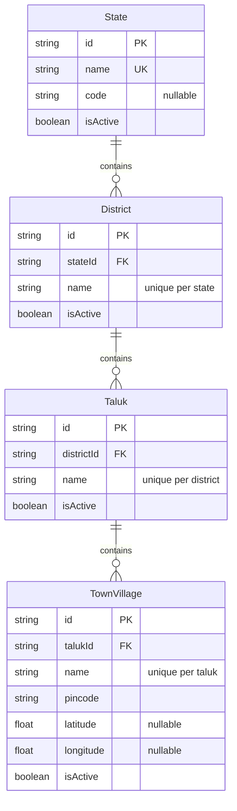

# Geography Module — Implementation Documentation

This documents **how** the Geography module (`src/geography/`) actually
works internally — control flow, data model, and the reasoning behind
each design decision. Same three-document split as every other module
(`docs/modules/AUTH_IMPLEMENTATION.md` §0).

| Document | Answers |
|---|---|
| `docs/ARCHITECTURE.md` §5.3 / §6.4 | Why the system is shaped this way, system-wide |
| `docs/api/GEOGRAPHY.md` + `docs/api/openapi.json` | What the HTTP contract is (external, for the frontend team) |
| **This document** | How the contract is actually implemented (internal, for backend engineers) |

If code and this document disagree, the code wins.

## 1. Scope boundary

Per `docs/ARCHITECTURE.md`'s module map (§5.2/§5.3, Phase 1a module #8):
**"Country/state/district/taluk/town/village/PIN master data."** §6.4
draws a hard line this module stays inside:

> **Geography** stores static master data: state, district, taluk, town,
> village, PIN, coordinates. **Serviceability** answers a dynamic business
> question at request time: "Can provider X deliver service Y at customer
> location Z, right now?"

Nothing in this module ever answers a dynamic question — no coverage
matching, no radius search, no "is this taluk currently in the pilot"
business logic. It only stores names and parent-child relationships.

**Why this module has 4 levels (State → District → Taluk → Town/Village),
not the 5 `docs/ARCHITECTURE.md` §7.2 illustrates** (which starts with
`Country`): two BRD passages describe the actual customer/provider
selection flow directly —

- §12.3: "customer address entry relies on structured Geography master
  data (state → district → taluk → town/village → PIN selection)"
- §13.1: current location, PIN code, town/village selection, taluk and
  area selection, saved service address

Both are 4 levels plus a PIN step, never a country step. §7.2's own text
flags itself as "illustrative... not exhaustive — a full ERD is a
follow-on deliverable," and BRD §30.2's full rollout roadmap (pilot → 3
taluks → phase 2 adjacent villages → phase 3 additional districts/states →
phase 4 pan-India) never leaves India at any named phase. A `Country`
table would have zero real rows beyond "India" and zero consumer — adding
it back is a pure additive migration whenever genuine multi-country scope
actually appears, not a redesign.

## 2. File map

```
src/geography/
├── geography.module.ts       imports IamModule; exports all four *Service classes
├── state/                    /geography/states — flat CRUD, no parent
├── district/                 /geography/districts — flat, filterable ?stateId=
├── taluk/                    /geography/taluks — flat, filterable ?districtId=
├── town-village/             /geography/taluks/:talukId/towns — nested, mirrors Catalogue's variants
└── dto/                       request DTOs + dto/responses/
```

This file layout, the flat-middle-nested-leaf routing shape, and the
`assertExistsOrThrow` chain between services are a direct copy of the
Catalogue module's structure
(`docs/modules/CATALOGUE_IMPLEMENTATION.md` §2) — both are 3-4 level
admin-managed master-data hierarchies with the same authorization needs,
so this module reuses that exact shape rather than inventing a new one.
`TownVillageService` depends on `TalukService.assertExistsOrThrow`, which
depends on `DistrictService.assertExistsOrThrow`, which depends on
`StateService.assertExistsOrThrow` — three levels of "validate your
immediate parent exists through its owning service," never querying a
grandparent's table directly.

## 3. Data model



**Why `District`/`Taluk`/`TownVillage` names are unique per-parent, not
globally** (`@@unique([stateId, name])` etc.), unlike `State.name` and
`ServiceCategory.name` which are globally unique: district and taluk
names legitimately repeat across different parents in India (many states
have a district or taluk sharing a name with one elsewhere), so global
uniqueness would be actively wrong here, not just unnecessary — a real
difference from Catalogue, where `ServiceCategory.name` uniqueness is
global because there's no parent to scope it to.

**Why "town/village" is one entity, not two hierarchy levels:** BRD
consistently treats them as a single interchangeable selection step
("town/village selection" in §13.1, "town/village → PIN selection" in
§12.3), never as two nested levels a user picks through in sequence.
Splitting them into `Town` and `Village` models would invent a
distinction the BRD doesn't draw.

**Why `pincode` is a plain field on `TownVillage`, not its own master
table:** a PIN code commonly covers several villages, and BRD describes
it as the step *after* town/village selection, not a parallel hierarchy
level with its own identity. A separate `PinCode` table would need either
a many-to-many join (no BRD requirement drives that complexity yet) or an
arbitrary choice of which village "owns" a shared PIN. Storing it as an
indexed field keeps PIN-based lookup/filtering available
(`@@index([pincode])`) without inventing structure nothing asks for.

**Why `latitude`/`longitude` are plain `Float?` columns, not PostGIS
geometry:** identical reasoning to `CustomerAddress`
(`docs/modules/CUSTOMER_IMPLEMENTATION.md` §3) — this module only needs
to *store* a coordinate pair; radius/polygon spatial queries are
Serviceability's job once it exists to actually run them.

## 4. Core flows

### 4.1 Per-parent uniqueness, checked explicitly

Every create/update path calls a private `assertNameFreeWithin*` helper
(`assertNameFreeWithinState` doesn't exist at the `State` level since its
uniqueness is global and Prisma's own `@unique` constraint plus a
find-before-create check is sufficient — but `District`/`Taluk`/
`TownVillage` each have one) that queries the compound unique index
directly (e.g. `where: { stateId_name: { stateId, name } }`) rather than
listing all children and filtering in code. This is the same pattern
`CategoryService`/`AgentCompanyService` use for their own uniqueness
checks, just parameterized by parent id here.

### 4.2 Re-parenting revalidates uniqueness against the *target* parent

`DistrictService.update` (and the identical shape in `TalukService`)
computes `targetStateId = dto.stateId ?? existing.stateId` before running
the uniqueness check — a rename that doesn't change the parent checks
against the *current* parent; a re-parent (`stateId` provided) checks
against the *new* one. Getting this wrong either blocks legitimate
renames-in-place or lets a re-parent silently collide. Covered in
`district.service.spec.ts`'s "checks name uniqueness against the current
state when stateId is not changing" case.

### 4.3 Town/village ownership is a 404, not a 403

`TownVillageService`'s private `getOwnedTownVillageOrThrow` is the exact
same pattern as `VariantService`
(`docs/modules/CATALOGUE_IMPLEMENTATION.md` §4.2) and `AddressService`
(`docs/modules/CUSTOMER_IMPLEMENTATION.md` §4.4): a town/village that
exists but belongs to a different `talukId` than the one in the URL
produces the identical `404 Town/village not found` as one that doesn't
exist anywhere — verified in `town-village.service.spec.ts` and against a
live database (two taluks created, an update attempted through the wrong
taluk's path, confirmed 404).

## 5. Configuration reference

No new environment variables.

## 6. Extension points for future modules

- **Serviceability** (`docs/modules/SERVICEABILITY_IMPLEMENTATION.md`) is
  now built and answers the dynamic "can provider X serve here" question
  §6.4 explicitly keeps out of Geography — via plain Haversine distance
  in application code, not spatial database queries (that's still a real
  gap, see Serviceability's own §7). Building it required adding
  `TownVillageService.findByIdOrThrow` — a flat, taluk-agnostic existence
  check — since every consumer before Serviceability already had a
  `talukId` in hand and none needed to resolve a bare `townVillageId`.
- **Customer/Provider/Agent addresses**, once Serviceability exists to
  consume structured geography, are the natural candidates to migrate
  from free text to real `TownVillage`/`Taluk`/`District`/`State`
  references — see §7 below for why that migration isn't done yet.
- **IAM's `GEOGRAPHY` scope type** (`docs/modules/IAM_IMPLEMENTATION.md`
  §3) can start storing a real `TownVillage`/`Taluk`/`District`/`State`
  id in `UserRoleAssignment.scopeId` once a module actually needs to
  resolve that id against something — this module is what makes that id
  resolvable, but nothing wires the two together yet.

`GeographyModule` exports all four services so those future modules can
resolve geography entities through the service layer (e.g.
`StateService.assertExistsOrThrow`) rather than querying
`marketplace.geo_*` tables directly.

## 7. Known gaps (tracked, not yet done)

- **No `Country` level** — see §1.
- **No PIN-code master table** — `pincode` is unvalidated free text
  beyond the 6-digit format check, not checked against any real postal
  database.
- **No "area"/locality sub-level** (BRD §30.1 names "area" alongside
  taluk/town/village/pincode without enough concrete structure to model
  yet — town/village remains the finest level).
- **`isActive` doesn't cascade** across levels, same as Catalogue
  (`docs/modules/CATALOGUE_IMPLEMENTATION.md` §8).
- **Nothing else in the codebase references this module yet — a
  deliberate non-decision, not an oversight.** `CustomerAddress.town/
  district/state`, `AgentProfile.geographyNote`, and IAM's
  `UserRoleAssignment.scopeId` were all built as free-text/opaque
  placeholders explicitly pending this module
  (`docs/modules/CUSTOMER_IMPLEMENTATION.md` §3,
  `docs/modules/AGENT_IMPLEMENTATION.md` §3,
  `docs/modules/IAM_IMPLEMENTATION.md` §3) — none of them were changed to
  reference real `TownVillage`/`Taluk`/etc. ids as part of building this
  module. Backfilling them is a real, reasonable follow-up but a separate
  decision with its own migration/compatibility questions (existing free
  text vs. new foreign keys) — left for a future session to decide
  explicitly rather than bundled unprompted into this module's scope.
- **No integration/e2e tests** — only unit tests with mocked Prisma
  (`state.service.spec.ts`, `district.service.spec.ts`,
  `taluk.service.spec.ts`, `town-village.service.spec.ts`), mirroring
  every other module. Manually smoke-tested against a real database: full
  hierarchy built (Karnataka → Mysuru → Mysuru Taluk → Nanjangud/571301)
  → duplicate state name rejected (409) → district creation against a
  bogus state rejected (404) → invalid pincode rejected (400) →
  state-filtered district list confirmed → a second taluk created and
  used to confirm cross-taluk town/village access 404s.
