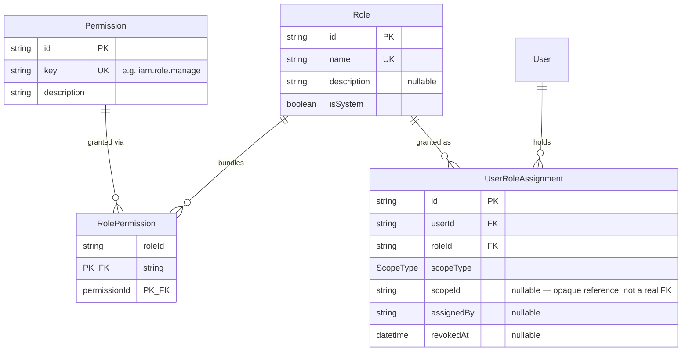
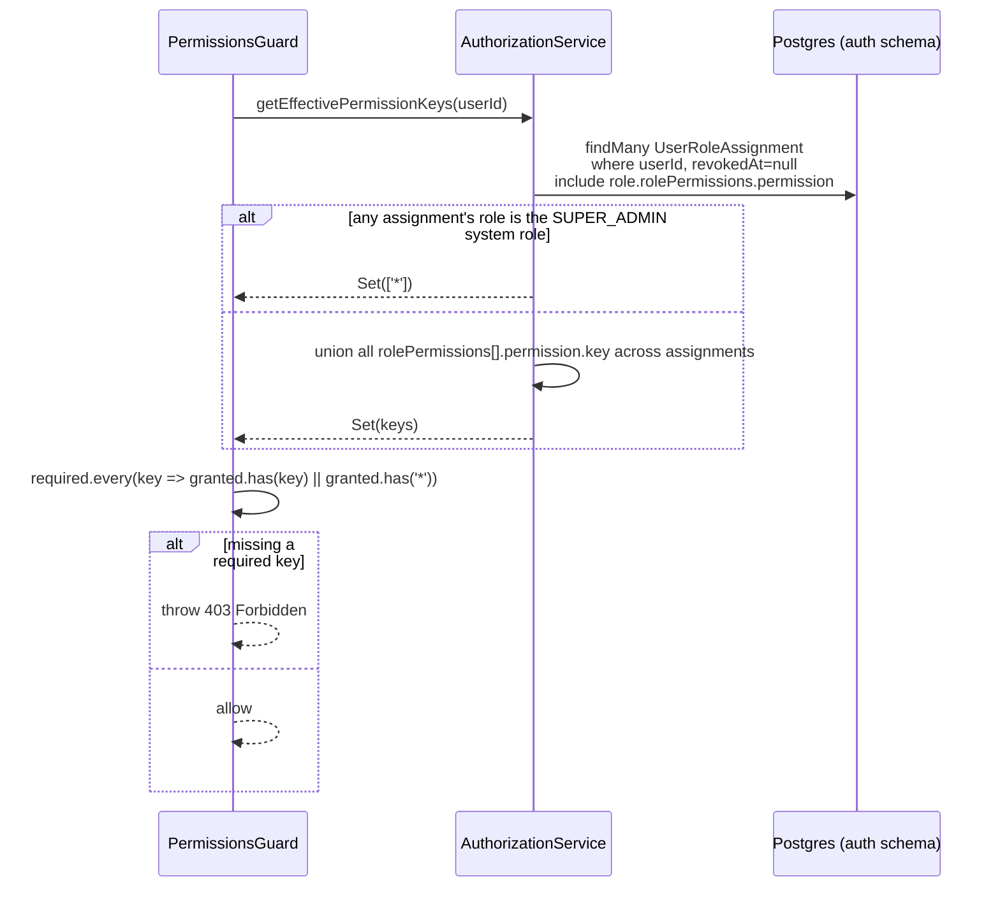

# IAM Module — Implementation Documentation

This documents **how** the IAM module (`src/iam/`) actually works
internally — control flow, data model, and the reasoning behind each
design decision. Same three-document split as Auth
(`docs/modules/AUTH_IMPLEMENTATION.md` §0):

| Document | Answers |
|---|---|
| `docs/ARCHITECTURE.md` §9.2 | Why the system is shaped this way, system-wide |
| `docs/api/IAM.md` + `docs/api/openapi.json` | What the HTTP contract is (external, for the frontend team) |
| **This document** | How the contract is actually implemented (internal, for backend engineers) |

If code and this document disagree, the code wins.

## 1. Scope boundary

Per `docs/ARCHITECTURE.md` §6.1: **IAM answers "what are you allowed to
do," never "who are you."** It has no concept of credentials, tokens, or
sessions — that's Auth. IAM's only job is to compute a caller's effective
permission set from their role assignments, per BRD §9's
`User Type → Role → Permissions → Scope` model.

IAM tables live in the same `auth` Postgres schema as Auth's tables (see
`prisma/schema.prisma`'s header comment) — this is two NestJS modules
sharing one schema, not two schemas, matching the note left in that file
when the Auth module was built (`docs/modules/AUTH_IMPLEMENTATION.md` §9).

## 2. File map

```
src/iam/
├── iam.module.ts                    wires everything below together
├── role/
│   ├── role.service.ts              CRUD for roles + their permission bundles
│   └── role.controller.ts           POST/GET/PATCH/DELETE /iam/roles
├── permission/
│   ├── permission-catalog.ts        the fixed list of real permission keys — single source of truth for prisma/seed.ts and controllers' @RequirePermissions()
│   ├── permission.service.ts        read-only — lists the seeded catalog
│   └── permission.controller.ts     GET /iam/permissions
├── assignment/
│   ├── role-assignment.service.ts   assign/revoke a role (with scope) for a user
│   └── role-assignment.controller.ts POST/DELETE /iam/assignments, GET /iam/users/:userId/assignments
├── authorization/
│   ├── authorization.service.ts     computes effective permission keys for a user; SUPER_ADMIN bypass
│   ├── permissions.guard.ts         NestJS CanActivate — reads @RequirePermissions(), calls AuthorizationService
│   ├── require-permissions.decorator.ts  @RequirePermissions(...keys) — sets route metadata
│   └── system-roles.ts              SUPER_ADMIN_ROLE constant
└── dto/                              request DTOs + dto/responses/ (same split as Auth — see AUTH_IMPLEMENTATION.md §7)
```

`AuthGuard('jwt')` (from Auth) always runs before `PermissionsGuard` — the
latter reads `request.user`, which only the former populates.

## 3. Data model



**Why `Permission` rows are seeded, not admin-creatable:** a permission key
only means something if some guard somewhere actually checks it
(`@RequirePermissions('iam.role.manage')`). Letting admins invent arbitrary
keys through the API would let them create permissions that gate nothing.
What *is* admin-configurable, per BRD §9, is which permissions a **Role**
bundles — that's `RolePermission`, a plain admin-editable join table.

**Why `UserRoleAssignment.scopeId` is a loose string, not a foreign key:**
BRD §9 says a role's scope can be a geography, organization, provider
group, or provider company — none of those modules exist yet
(`docs/ARCHITECTURE.md` §5.3 phasing). Modeling `scopeId` as a real FK would
mean IAM has to pre-model other modules' entities just to exist, which
breaks the module-boundary rule in §7.1 (a module accesses another
module's tables only through that module's service layer). `scopeId` is
therefore deliberately opaque — validated only for presence (DTO-level,
§5), not for pointing at something real, until the module it references
actually exists to check against.

**Why role deletion is blocked by active assignments instead of cascading:**
`UserRoleAssignment.roleId` has `onDelete: Cascade` at the DB level (so
orphaned rows are impossible), but `RoleService.remove` checks for active
assignments first and throws `409 Conflict` rather than silently revoking
someone's access as a side effect of an unrelated role edit. Revoked
(historical) assignments don't block deletion — only active ones do.

## 4. Core flows

### 4.1 Effective permission computation (`AuthorizationService`)



A user can hold several active assignments simultaneously (e.g. a Taluk Ops
role in one geography plus a platform-wide Support role) — the effective
set is the **union** across all of them, computed fresh on every guarded
request (no caching), same tradeoff Auth made for account-status checks
(`docs/modules/AUTH_IMPLEMENTATION.md` §4.4): correctness over one extra
query per protected request.

### 4.2 SUPER_ADMIN bootstrap (`prisma/seed.ts`)

IAM has a chicken-and-egg problem: the very first admin can't be granted
`iam.assignment.manage` through the API, because nobody yet holds a
permission that would let them call it. Solved outside the HTTP layer:

1. `npm run db:seed` upserts the permission catalog and a `SUPER_ADMIN`
   role (`isSystem: true`).
2. If `IAM_BOOTSTRAP_ADMIN_PHONE`/`IAM_BOOTSTRAP_ADMIN_EMAIL` is set and
   matches an existing `User` (they must have logged in via Auth at least
   once), the seed creates a `PLATFORM`-scoped `UserRoleAssignment` to
   `SUPER_ADMIN` for them, if one doesn't already exist.
3. `AuthorizationService.getEffectivePermissionKeys` special-cases
   `role.isSystem && role.name === SUPER_ADMIN_ROLE` to return `Set(['*'])`
   — a wildcard every `PermissionsGuard` check accepts unconditionally.
   This is checked on `isSystem` **and** `name` together, not name alone,
   so nothing stops an admin from naming an ordinary custom role
   "SUPER_ADMIN" — only the seeded, `isSystem` row bypasses checks
   (verified in `authorization.service.spec.ts`'s "does not bypass for a
   non-system role merely named SUPER_ADMIN" case).

Re-running the seed is safe at any time (idempotent upserts) — it's the
intended way to promote a new admin after they've logged in once.

### 4.3 Assigning a role (`RoleAssignmentService.assign`)

1. Validates `userId` and `roleId` both exist (404 otherwise).
2. Normalizes `scopeId` to `null` when `scopeType=PLATFORM`, regardless of
   what the client sent — a platform-wide grant should never carry a
   dangling scope reference.
3. Checks for an existing **active** assignment with the identical
   `(userId, roleId, scopeType, scopeId)` tuple. If found, returns it
   instead of creating a duplicate — assigning the same role/scope twice
   is a no-op, not an error, which makes the endpoint safe to retry.

### 4.4 Replacing a role's permission bundle (`RoleService.update`)

When `permissionKeys` is provided, the entire bundle is replaced (delete
all existing `RolePermission` rows for that role, then insert the new set)
inside a `$transaction` — not diffed/merged. Omitting `permissionKeys`
entirely leaves the current bundle untouched, which is what lets `PATCH`
be used for a name/description-only edit without accidentally clearing
permissions.

## 5. Request validation

`AssignRoleDto.scopeId` uses `@ValidateIf(dto => dto.scopeType !== PLATFORM)`
ahead of `@IsString() @IsNotEmpty()` — `scopeId` is conditionally required
based on a sibling field, not simply optional. Getting this right matters:
stacking `@IsOptional()` alongside `@ValidateIf` here would silently let
`scopeId` be omitted even when `scopeType` requires it (`@IsOptional`
short-circuits before `@ValidateIf`'s condition is ever consulted) — so
`@IsOptional` is deliberately **not** used on this field.

## 6. Configuration reference

| Variable | Used by | Notes |
|---|---|---|
| `IAM_BOOTSTRAP_ADMIN_PHONE` / `IAM_BOOTSTRAP_ADMIN_EMAIL` | `prisma/seed.ts` only | Optional, read directly via `process.env` (not `ConfigService` — the app itself never reads these, only the standalone seed script) |

No new required env vars — IAM reuses Auth's `JWT_ACCESS_SECRET` indirectly
via `JwtAuthGuard`/`JwtStrategy`, which always run ahead of
`PermissionsGuard`.

## 7. Extension points for future modules

- **Any future controller** that needs authorization guards it with
  `@UseGuards(JwtAuthGuard, PermissionsGuard)` +
  `@RequirePermissions('module.action')`, after first adding that key to
  `permission-catalog.ts` and re-running `npm run db:seed`. First used by
  the Agent module's `agent-company.controller.ts`
  (`docs/modules/AGENT_IMPLEMENTATION.md` §4.3/§2), which required
  exporting `PermissionsGuard` from `IamModule` — it wasn't exported
  before, since nothing outside IAM had needed it yet.
- **Geography/Provider Organization/etc.**, once built, are what finally
  gives `UserRoleAssignment.scopeId` something real to validate against —
  at that point, scope-aware enforcement (§8) can be added to
  `AuthorizationService`/`PermissionsGuard` without changing the schema.
- **Audit module**, once built, is a natural consumer of IAM events (role
  created/deleted, assignment granted/revoked) — none of that is emitted
  anywhere yet, same gap Auth already flagged for its own events
  (`docs/modules/AUTH_IMPLEMENTATION.md` §9).

## 8. Known gaps (tracked, not yet done)

- **Permission checks are not scope-aware.** `PermissionsGuard` checks "does
  the user hold this permission through *any* active assignment," not
  "...within this specific resource's scope." A `GEOGRAPHY`-scoped
  assignment currently grants its permissions the same as a
  `PLATFORM`-scoped one from the guard's point of view — only
  `AuthorizationService`'s data model already distinguishes them. This is
  real scope work deferred until a module with an actual scoped resource
  (Geography, Provider Organization) exists to check a request's target
  against (§4.1, §7).
- **No audit logging of authorization decisions or role/assignment
  changes.** `docs/ARCHITECTURE.md` §9.2 calls for every privileged-action
  check to be logged to `ops.audit_log`; that table/module doesn't exist
  yet (Phase 1b per §5.3).
- **No integration/e2e tests** — only unit tests with mocked Prisma
  (`*.spec.ts`, mirroring Auth's approach). Manually smoke-tested against a
  real database: OTP login → 403 with no role → seed-granted SUPER_ADMIN →
  200 on every endpoint → role create/delete → assignment list.
- **`RoleAssignmentDto.assignedBy` is never resolved to a name/email** —
  it's the raw caller `userId` from `@CurrentUser()`, useful for audit but
  not directly displayable; the frontend would need a separate lookup
  (Customer/Provider/Agent modules don't exist yet either).
