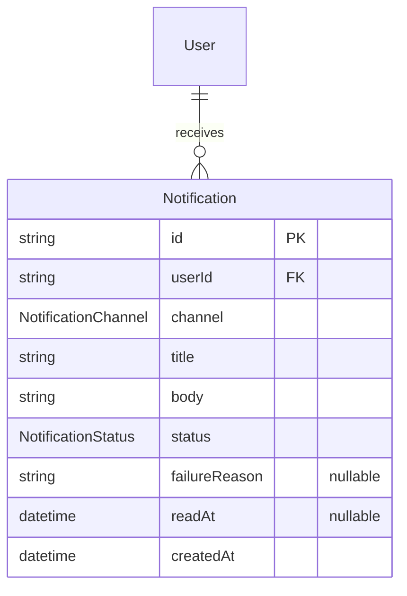
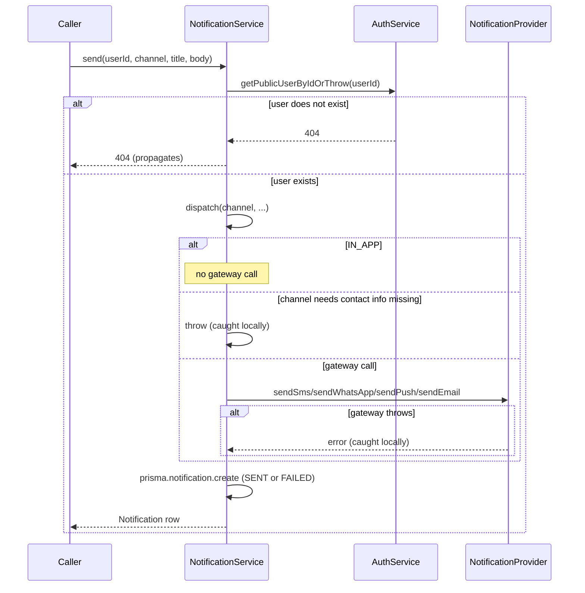

# Notification Module — Implementation Documentation

This documents **how** the Notification module (`src/notification/`)
actually works internally — control flow, data model, and the reasoning
behind each design decision. Same three-document split as every other
module (`docs/modules/AUTH_IMPLEMENTATION.md` §0).

| Document | Answers |
|---|---|
| `docs/ARCHITECTURE.md` §5.3 | Why the system is shaped this way, system-wide |
| `docs/api/NOTIFICATION.md` + `docs/api/openapi.json` | What the HTTP contract is (external, for the frontend team) |
| **This document** | How the contract is actually implemented (internal, for backend engineers) |

If code and this document disagree, the code wins.

## 1. Scope boundary

Per `docs/ARCHITECTURE.md`'s module map (§5.3, Phase 1a module #14, the
other half of the last module in the roadmap): "SMS/WhatsApp/push
delivery." BRD §22.1 lists push, SMS, email, WhatsApp, in-app
notifications, operational alerts, and promotional communications, all
"subject to permissions." `docs/ARCHITECTURE.md` §12.2 specifies the
shape precisely: "a `NotificationProvider` interface (send SMS, send
WhatsApp message, send push, send email)... default pilot
implementation: MSG91."

**Why there's no real MSG91 integration yet:** identical reasoning to
Payment's stubbed Razorpay gateway
(`docs/modules/PAYMENT_IMPLEMENTATION.md` §1) and Auth's OTP delivery
(`src/auth/otp/console-otp.sender.ts`) — no vendor credentials are
configured in this environment, and §21 of the architecture doc flags
MSG91 as "explicitly deferred... needs a real decision before
integration work starts." `NotificationProvider` +
`ConsoleNotificationProvider` is the third use of this exact seam
pattern in the codebase.

**Why `IN_APP` is a fifth channel value even though
`docs/ARCHITECTURE.md` §12.2 only names four:** BRD §22.1 explicitly
lists "in-app notifications" alongside push/SMS/email/WhatsApp as a
distinct thing a user receives. Mechanically it's the simplest of the
five — there is no external gateway call at all, since the
`Notification` row's existence, read back through the self-service
inbox, *is* the delivery. Modeling it as a channel value (rather than,
say, a separate boolean or a different table) keeps one code path and
one table for "a notification was sent to this user," regardless of
which of the five ways it happened.

**Why sending is single-recipient, not a broadcast/campaign system:**
BRD §22.1's "operational alerts and promotional communications" could
imply broadcasting to many users at once, but building audience
targeting/segmentation is a substantial feature in its own right that
BRD doesn't actually specify the rules for (which users, by what
criteria). `POST /notifications/send` deliberately does the minimum
that's unambiguous — one recipient, explicitly named — and multi-
recipient sends are left to a caller looping over recipients, rather
than guessing at a segmentation model that doesn't exist yet.

**Why this module doesn't auto-fire on Booking/Payment state
changes:** that would require reaching back into 13 already-shipped,
tested, committed modules to add `NotificationService` calls at each of
their transition points — real scope creep for a "build the last
module" task. `docs/ARCHITECTURE.md` §6.6 itself describes this kind of
cross-module fan-out (`BookingConfirmed → Notification`) as belonging
to the Event/Outbox architecture, which is Phase 1b. `send()` is
exported now specifically so that wiring is a pure addition later, not
a rework.

## 2. File map

```
src/notification/
├── notification.module.ts        imports AuthModule (contact lookup), IamModule (admin guard)
├── notification.service.ts        send() / listAsUser() / markReadAsUser()
├── notification.service.spec.ts
├── notification.controller.ts     /notifications/me — self-service inbox
├── admin-notification.controller.ts   /notifications/send — IAM-gated
├── provider/
│   ├── notification-provider.interface.ts   NOTIFICATION_PROVIDER token + interface
│   └── console-notification.provider.ts     console-logging stand-in
└── dto/
    ├── send-notification.dto.ts
    ├── list-notifications-query.dto.ts
    └── responses/notification.dto.ts
```

`NotificationService` depends on `AuthService.getPublicUserByIdOrThrow`
(newly added — see §3) to resolve a recipient's phone/email, rather
than querying `auth.users` directly, per the module-boundary rule.

## 3. Data model



`Notification` lives in the same new `ops` Postgres schema as
`AuditLog`. `readAt` doubles as both "has this been read" (`null` =
unread) and "when" — used by both the self-service inbox's `?unread=`
filter and `markReadAsUser`'s idempotency check.

**Why `AuthService` needed a new method
(`getPublicUserByIdOrThrow`):** `AuthModule` exported `AuthService`
already, but nothing on it resolved a bare `userId` to contact info —
every existing method either issues tokens or operates on the
currently-authenticated user via a DTO. This is the same "add the one
method the new module actually needs" pattern as
`TownVillageService.findByIdOrThrow` (added for Serviceability) or
`VariantService.assertBelongsToService` (added for Provider Offering) —
a small, targeted addition to an existing exported service rather than
a new cross-cutting query.

## 4. Core flow

### 4.1 `send()` always persists, regardless of delivery outcome



The only path that actually propagates an exception out of `send()` is
the recipient lookup itself (`userId` doesn't exist at all — a genuine
caller error, correctly a 404). Every other failure mode — missing
phone/email for the requested channel, or the gateway throwing — is
caught inside `send()` and turned into a persisted `FAILED` row with
`failureReason` set, exactly like Payment's `verifyAsCustomer` records
a `FAILED` payment rather than erroring the request
(`docs/modules/PAYMENT_IMPLEMENTATION.md` §4.1). The caller gets back a
`Notification` either way, so "did this succeed" is read from the
response body's `status`, not from whether the HTTP call itself
errored.

### 4.2 `markReadAsUser` is idempotent by early return, not an upsert

If `notification.readAt` is already set, the method returns the
existing row unchanged without touching the database again — the same
"no-op still succeeds" pattern as IAM's assignment revoke
(`docs/modules/IAM_IMPLEMENTATION.md`). This means calling "mark read"
twice never produces two different `readAt` timestamps or an error on
the second call.

## 5. Configuration reference

No new environment variables — `ConsoleNotificationProvider` needs
none, exactly like `ConsoleOtpSender` and `StubPaymentGateway`.

## 6. Extension points for future modules

- **Booking** and **Payment** are the natural first callers of
  `NotificationService.send()` once notification-on-state-change is
  actually wired up (§1) — e.g. `BookingService.acceptAsProvider` could
  call `notificationService.send(booking.customerId, IN_APP, ...)`
  after accepting. Not done yet; both modules are already shipped and
  untouched by this one.
- **A real MSG91-backed `NotificationProvider`** implementation replaces
  `ConsoleNotificationProvider` in `notification.module.ts`'s provider
  binding only — see §1.
- **Event/Outbox** (Phase 1b) is where the eventual
  Booking/Payment-triggered notifications would actually be dispatched
  from, per `docs/ARCHITECTURE.md` §6.6's `BookingConfirmed →
  Notification` example.

## 7. Known gaps (tracked, not yet done)

- **No push token / device registration** — `sendPush` takes a bare
  `userId`; there is no concept of a registered device to actually push
  to, real or stubbed.
- **No delivery retry/backoff** — a `FAILED` row is terminal; nothing
  retries it. Belongs to the planned `notifications` queue once
  Redis/BullMQ exist (`docs/ARCHITECTURE.md` §11).
- **No broadcast/segmentation** — see §1.
- **No integration/e2e tests** — only unit tests with mocked Prisma,
  `AuthService`, and `NotificationProvider` (`notification.service.spec.ts`).
  Manually smoke-tested against a real database: an admin without
  `notification.send` correctly got **403** → an admin sent an `IN_APP`
  notification (persisted `SENT`, no gateway call) and an `SMS`
  notification (persisted `SENT`, confirmed logged by
  `ConsoleNotificationProvider`) → the recipient's self-service inbox
  listed both, newest first → `?unreadOnly=true` filtering confirmed →
  marking one read updated `readAt`, and marking it again was a
  confirmed no-op (**200**, unchanged `readAt`) → a different user
  attempting to mark it read correctly got **404** (ownership, not
  403) → sending `EMAIL` to a user with no email on file correctly
  persisted a `FAILED` row with the expected `failureReason`, without
  the HTTP call itself erroring → an invalid `channel` enum value
  correctly **400**'d → a non-existent `userId` correctly **404**'d.
