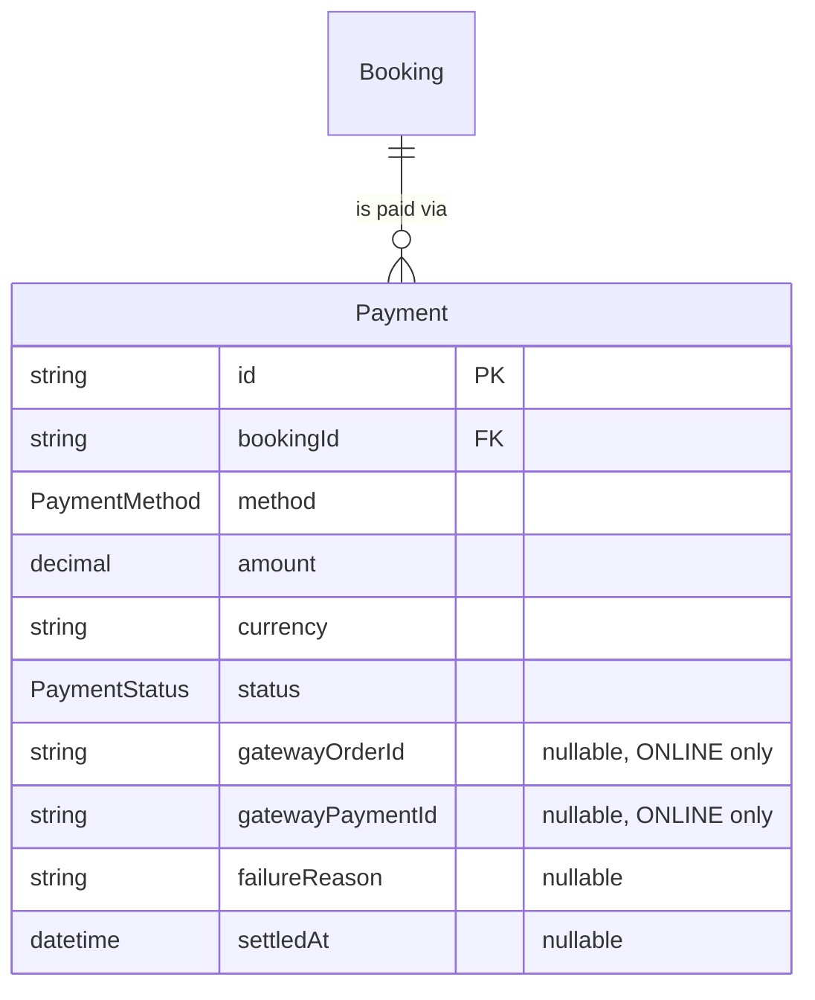
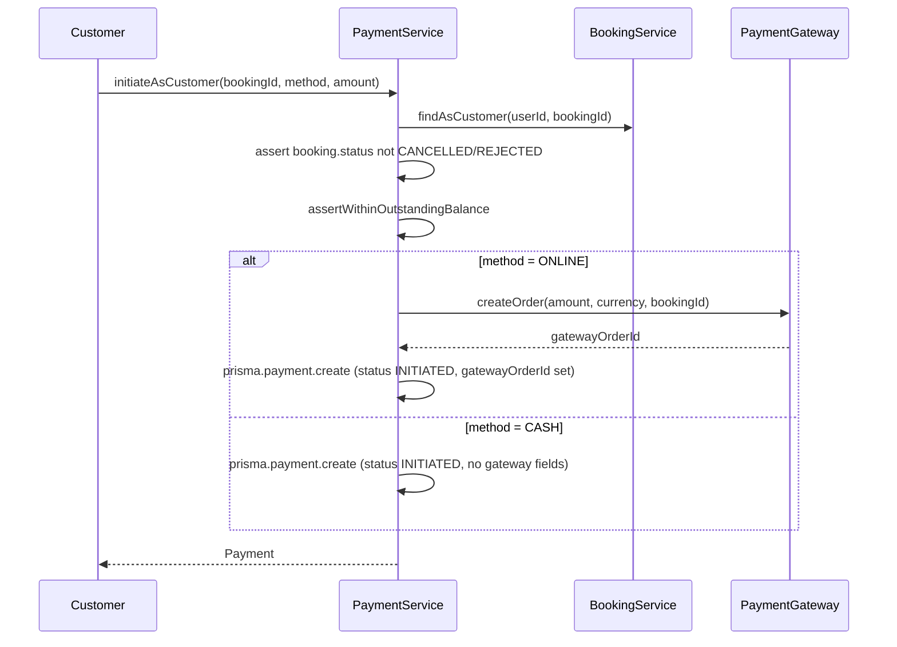

# Payment Module — Implementation Documentation

This documents **how** the Payment module (`src/payment/`) actually
works internally — control flow, data model, and the reasoning behind
each design decision. Same three-document split as every other module
(`docs/modules/AUTH_IMPLEMENTATION.md` §0).

| Document | Answers |
|---|---|
| `docs/ARCHITECTURE.md` §5.3 | Why the system is shaped this way, system-wide |
| `docs/api/PAYMENT.md` + `docs/api/openapi.json` | What the HTTP contract is (external, for the frontend team) |
| **This document** | How the contract is actually implemented (internal, for backend engineers) |

If code and this document disagree, the code wins.

## 1. Scope boundary

Per `docs/ARCHITECTURE.md`'s module map (§5.3, Phase 1a module #13):
"Payment intent, Razorpay integration, transaction status." BRD §36
describes several customer payment modes (online prepaid, pay-after-
service, cash, advance payment, quote-based payment) and requires
settlement cycles, commission, refunds, and reconciliation — this
module deliberately implements only the payment-intent/transaction-
status slice; Commission, Settlement, and Refund are named as separate
Phase 1b modules in `docs/ARCHITECTURE.md` §22 that will read a
`Payment`, never be implemented inside one.

**Why there's no real Razorpay integration yet:** `docs/ARCHITECTURE.md`
§12.1 explicitly calls for the Payment module to "wrap Razorpay behind
an internal interface... without touching Booking/Commission logic."
There are no gateway credentials configured in this environment and no
requirement yet to actually move money in Phase 1a's first working
journey — so, exactly like Auth's OTP delivery
(`src/auth/otp/otp-sender.interface.ts` /
`src/auth/otp/console-otp.sender.ts`), this module defines a
`PaymentGateway` interface and binds it to a `StubPaymentGateway` that
logs and fabricates results. Swapping in real Razorpay Orders API
integration later is a change to `payment.module.ts`'s provider
binding, not to `PaymentService`.

**Why BRD §36's five payment modes collapse into two enum values
(`ONLINE`/`CASH`):** "online prepaid," "pay-after-service," and
"advance payment" are all, mechanically, either an `ONLINE` or `CASH`
payment made at a different point in a booking's lifecycle or for a
different fraction of the total — not a different settlement mechanism.
Allowing a booking to have **multiple** `Payment` rows (see §3) is what
actually makes "advance now, remainder later" and "pay after service
instead of at booking time" possible, without inventing dedicated enum
values or a balance-tracking state machine for each. "Quote-based
payment" isn't a payment mechanism at all — it's
`Booking.pricingModel = QUOTE_BASED` determining that there's no fixed
amount yet (`docs/modules/BOOKING_IMPLEMENTATION.md` §1); once a future
Quote module resolves that to a real number, payment against it proceeds
through the same `ONLINE`/`CASH` mechanics as any other booking. The
same enum-consolidation approach was already used for `BookingStatus`/
`BookingParty` and `PricingModel` elsewhere in this codebase.

**Why this module has no admin approval or IAM gate:** a payment is
created and confirmed entirely by the two parties to its booking — the
customer who's paying and the provider who's collecting cash or getting
paid online. There's no BRD requirement for SevaMitra operations to
approve an individual payment the way Serviceability's coverage areas
need approval. Same reasoning as Booking and Availability before it.

## 2. File map

```
src/payment/
├── payment.module.ts             imports Booking, Customer, Provider modules
├── payment.service.ts             all business logic — both sides
├── payment.service.spec.ts
├── customer/
│   └── customer-payment.controller.ts   /payments/me
├── provider/
│   └── provider-payment.controller.ts   /payments/provider/me
├── gateway/
│   ├── payment-gateway.interface.ts     PAYMENT_GATEWAY token + interface
│   └── stub-payment.gateway.ts          console-logging stand-in
└── dto/
    ├── create-payment.dto.ts
    ├── verify-payment.dto.ts
    ├── list-payments-query.dto.ts
    └── responses/payment.dto.ts
```

`PaymentService` depends on `BookingService` (now exported from
`BookingModule` — the first consumer of that export) rather than
querying the `bookings` table directly, per the module-boundary rule
(`docs/ARCHITECTURE.md` §6): `bookingService.findAsCustomer`/
`findAsProvider` both validate ownership and return the full `Booking`
row this module needs (`status`, `amount`, `visitFee`, `currency`) in
one call, so `initiateAsCustomer` reuses them exactly as they already
exist rather than duplicating an ownership check.

## 3. Data model



`Payment` lives in a new `finance` Postgres schema (`docs/ARCHITECTURE.md`
§7.1's schema-per-domain layout) — the first module to use it.
Deliberately **not** a 1:1 with `Booking`: a booking may have several
`Payment` rows (an advance and a final payment, or a retry after a
`FAILED` attempt), each carrying its own `amount`/`currency` rather than
the booking's total. There is no "the booking's payment" — only "the
booking's payments," summed where a total matters (§4.2).

**Why no `REFUNDED` status:** a refund reverses a `SUCCEEDED` payment,
but *acting on it* is explicitly a separate Phase 1b Refund module's
job (`docs/ARCHITECTURE.md` §22) that doesn't exist yet. Adding a status
this module never transitions into would be speculative.

## 4. Core flows

### 4.1 ONLINE vs. CASH diverge only at creation



After creation, the two methods resolve differently: an `ONLINE`
payment moves `INITIATED → SUCCEEDED/FAILED` via
`verifyAsCustomer` (customer-triggered, gateway-verified); a `CASH`
payment moves `INITIATED → SUCCEEDED` via
`markCashCollectedAsProvider` (provider-triggered, no gateway
involved). Each transition method asserts the *other* method's field
value (`payment.method !== ONLINE` / `!== CASH`) before proceeding, so
neither path can be used to confirm the other kind of payment.

### 4.2 Outstanding-balance check sums prior payments, not booking state

`assertWithinOutstandingBalance` computes
`totalDue = booking.amount + booking.visitFee` (both nullable, treated
as 0), then sums every existing `Payment` for that booking in
`INITIATED` or `SUCCEEDED` status (a `FAILED` payment doesn't count
against the balance — it never collected anything) and rejects if
`alreadyCommitted + newAmount > totalDue`. This is deliberately a fresh
sum on every call rather than a maintained running-balance column on
`Booking` — at this volume there's no performance reason to denormalize
it, and a computed sum can never drift out of sync with the underlying
`Payment` rows the way a cached counter could.

**Why `INITIATED` counts, not just `SUCCEEDED`:** an `ONLINE` payment
reserves its amount against the balance the moment it's created (the
customer has started checkout), not only once verified — otherwise two
concurrent `INITIATED` payments could each pass the check and jointly
overcommit the booking. This is a best-effort reservation, not a
database-level lock; see §7 for what that doesn't cover.

**Why the check is skipped entirely when `totalDue === 0`:** a booking
with `amount`/`visitFee` both `null` is an unresolved `QUOTE_BASED`
booking with no number to validate against yet (§1) — there is no
Quote module to have set one. Enforcing "amount ≤ 0" here would block
every quote-based payment outright, which is worse than not validating
at all until that module exists.

## 5. Configuration reference

No new environment variables — `StubPaymentGateway` needs none, exactly
like `ConsoleOtpSender`.

## 6. Extension points for future modules

- **Commission** (`src/commission/`) now reads the sum of a booking's
  `SUCCEEDED` `Payment` rows to calculate what the platform earns, via
  a new `PaymentService.sumSucceededAmount(bookingId)` — the first
  method exported from this module (`PaymentModule` had no `exports`
  array at all before Commission needed one). See
  `docs/modules/COMMISSION_IMPLEMENTATION.md` §2.
- **Settlement** (`src/settlement/`) reads `SUCCEEDED` `CommissionCalculation`
  earnings (not `Payment` directly) grouped by provider, to calculate
  payouts — see `docs/modules/SETTLEMENT_IMPLEMENTATION.md`.
- **Refund** (`src/refund/`) now reuses the same
  `sumSucceededAmount(bookingId)` Commission introduced, to compute the
  gross amount a cancelled/no-show/rejected booking actually collected
  before applying a refund policy to it — this module still has no
  refund *concept* of its own to collide with; Refund reads, never
  writes, a `Payment`. See `docs/modules/REFUND_IMPLEMENTATION.md` §1.
- **A real Razorpay-backed `PaymentGateway`** implementation replaces
  `StubPaymentGateway` in `payment.module.ts`'s provider binding only —
  see §1.

## 7. Known gaps (tracked, not yet done)

- **No database-level concurrency guard on the outstanding-balance
  check.** Two simultaneous `initiateAsCustomer` calls for the same
  booking could both read the same "already committed" sum before
  either write lands, jointly overcommitting the balance — a
  read-then-write race, not prevented by a unique constraint or
  transaction isolation level here. Low real-world risk (a single
  customer paying for their own booking twice at the same instant) but
  not actively guarded against.
- **No webhook endpoint.** `docs/ARCHITECTURE.md` §12.1 calls for a
  signature-verified webhook feeding Payment/Settlement — this module's
  `verify` endpoint is client-driven (the customer's app calls it after
  checkout), not gateway-driven. Once a real gateway exists, a webhook
  path that also calls into the same verification logic would need
  adding.
- **No integration/e2e tests** — only unit tests with mocked Prisma and
  mocked `BookingService`/`CustomerService`/`ProviderService`/
  `PaymentGateway` (`payment.service.spec.ts`). Manually smoke-tested
  against a real database: an ONLINE payment for a FIXED-price booking's
  full outstanding balance (499 + 100 visit fee) created via the stub
  gateway → a second payment against the same booking correctly
  **409**'d (balance exceeded) → a provider correctly could not mark an
  ONLINE payment collected (**409**, wrong method) → customer verified
  the ONLINE payment, moving it to SUCCEEDED → re-verifying correctly
  **409**'d (already SUCCEEDED) → on a second booking, a CASH advance
  (100) collected by the provider, followed by a CASH final payment
  (499) exactly exhausting the balance, then a further payment
  correctly **409**'d → a CASH payment correctly could not be verified
  (**409**, wrong method) → a payment against a CANCELLED booking
  correctly **409**'d → a payment against a QUOTE_BASED booking with no
  fixed price allowed a large amount through (balance check correctly
  skipped) → cross-party ownership checks confirmed **404** (a bogus id
  on the provider route, a customer token against a provider-only
  action) → DTO validation confirmed **400** for a negative amount and
  an invalid `method` value, and **404** for a non-existent booking.
