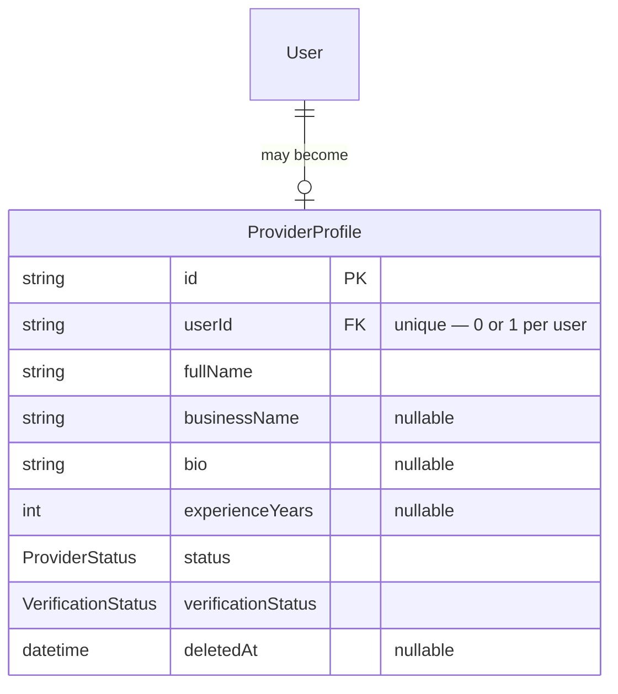

# Provider Module — Implementation Documentation

This documents **how** the Provider module (`src/provider/`) actually
works internally — control flow, data model, and the reasoning behind each
design decision. Same three-document split as Auth/IAM/Customer
(`docs/modules/AUTH_IMPLEMENTATION.md` §0).

| Document | Answers |
|---|---|
| `docs/ARCHITECTURE.md` §5.3 / §7.1 | Why the system is shaped this way, system-wide |
| `docs/api/PROVIDER.md` + `docs/api/openapi.json` | What the HTTP contract is (external, for the frontend team) |
| **This document** | How the contract is actually implemented (internal, for backend engineers) |

If code and this document disagree, the code wins.

## 1. Scope boundary

Per `docs/ARCHITECTURE.md`'s module map (§5.2/§5.3, Phase 1a module #4):
**"Individual provider profiles, verification, status" — nothing else.**
Three adjacent concerns are explicitly modules of their own, not folded in
here:

| Concern | Owned by | Built? |
|---|---|---|
| Documents, approval workflow, self/agent/bulk onboarding | Provider Onboarding (#6) | No |
| Company/staff/branches | Provider Organization (Phase 1b) | No |
| Operational area/coverage matching | Serviceability (#9) | No |

This module is deliberately the narrowest possible slice: a profile record
plus two status fields, with no workflow wired up yet to move those status
fields — see §8.

Structurally this module is almost identical to Customer
(`docs/modules/CUSTOMER_IMPLEMENTATION.md`) — same "explicit profile
creation on top of `auth.User`" pattern, same anonymize-on-delete policy.
Differences are called out below rather than re-explained; read Customer's
doc first if this is your first module in this pair.

## 2. File map

```
src/provider/
├── provider.module.ts        wires everything below together
├── provider.controller.ts    POST/GET/PATCH/DELETE /providers/me
├── provider.service.ts       profile CRUD + soft-delete/anonymization; owns getActiveProfileOrThrow()
└── dto/                        request DTOs + dto/responses/
```

No `address/` subfolder — unlike Customer, Provider has no addresses (§1).

## 3. Data model



**Two status enums, not one** — same reasoning as Customer's
status-vs-`auth.User.status` split
(`docs/modules/CUSTOMER_IMPLEMENTATION.md` §3), but Provider needs two of
its *own* fields because they answer genuinely different questions:

- **`ProviderStatus`** (`PENDING → ACTIVE`, plus `SUSPENDED`/`DELETED`) —
  operational/account status: can this provider receive work at all.
- **`VerificationStatus`** (`UNVERIFIED → PENDING → VERIFIED`/`REJECTED`)
  — identity/KYC-level trust (BRD §39): has this specific person been
  confirmed to be who they say they are. This is deliberately **not**
  per-service eligibility — BRD §39 draws that as a separate concept
  ("service eligibility" — allowed/restricted/requires-additional-
  verification/prohibited *per service*), which belongs to a future
  Provider Offering check, not a single provider-wide field here.

**Why `ProviderProfile` starts `PENDING`, unlike `CustomerProfile` starting
`ACTIVE`:** not an inconsistency — it's the BRD's actual state machine.
BRD §16.2 (provider journey): "Provider expresses interest, submits profile
and verification. SevaMitra validates... Provider becomes active." A
customer has no equivalent gate (§16.1's customer journey has no
validation step before a customer can act). Modeling `CustomerProfile` and
`ProviderProfile` with the same default would have been the "uniform
pattern" instinct winning over what each BRD section actually specifies.

**Why no `ProviderAddress` model:** per §1, coverage/operational area is
Serviceability's job. Whatever "address" ultimately means for
serviceability (a point, a polygon, a PIN-code radius) isn't decided by
this module — adding a `ProviderAddress` table now, shaped like
`CustomerAddress`, would guess at a structure Serviceability might not
want.

## 4. Core flows

Both are close enough to Customer's flows
(`docs/modules/CUSTOMER_IMPLEMENTATION.md` §4.1/§4.2) that only the deltas
are worth documenting:

- **Creation** (`ProviderService.create`): identical shape to
  `CustomerService.create` (existing-profile check → 409, else create) —
  except the created row's `status`/`verificationStatus` come from the
  Prisma schema defaults (`PENDING`/`UNVERIFIED`), not anything the
  service sets explicitly. `CreateProviderProfileDto` has no `status` or
  `verificationStatus` field at all — see §5.
- **Soft delete** (`ProviderService.softDelete`): a single
  `providerProfile.update` (**no `$transaction`**, unlike Customer's
  delete) — because there's no `ProviderAddress` table to clean up
  alongside it. Anonymizes `fullName`/`businessName`/`bio` and sets
  `status: DELETED`, `deletedAt: now()`, following the same BRD §14.4
  policy as Customer (`docs/modules/CUSTOMER_IMPLEMENTATION.md` §4.2) —
  BRD §14.4 in fact discusses provider offboarding explicitly ("settling
  outstanding commission and escrow balance" on exit), which is a Finance-
  module concern not implemented anywhere yet; this module only handles
  the profile-anonymization half of that section.

## 5. Why `status`/`verificationStatus` can't be set through the API

`CreateProviderProfileDto` and `UpdateProviderProfileDto` simply don't
declare `status` or `verificationStatus` as fields. Combined with the
global `ValidationPipe({ whitelist: true, forbidNonWhitelisted: true })`
in `main.ts`, sending either in a request body is rejected outright
(`400 property status should not exist`) rather than silently ignored.
This is a stronger guarantee than a service-layer check would give: it's
structurally impossible for a self-service caller to move these fields,
not just discouraged by convention. Verified in `provider.service.spec.ts`
implicitly (the service methods never reference `dto.status` at all) and
directly at the HTTP layer during manual smoke testing (§8).

## 6. Configuration reference

No new environment variables — identical situation to Customer
(`docs/modules/CUSTOMER_IMPLEMENTATION.md` §5).

## 7. Extension points for future modules

- **Provider Onboarding**, once built, is the intended owner of
  transitioning `status`/`verificationStatus` — most likely via its own
  service calling into `ProviderService` (or a method added to it) rather
  than writing to `marketplace.provider_profiles` directly, keeping the
  module-boundary rule (`docs/ARCHITECTURE.md` §7.1) intact.
- **Provider Offering**, once built, is where per-service eligibility
  (BRD §39's allowed/restricted/requires-verification/prohibited
  classification) actually lives — distinct from this module's
  provider-wide `verificationStatus` (§3).
- **Serviceability**, once built, is where operational area/coverage gets
  modeled — this module intentionally has no opinion on that shape (§3).
- **Booking/Settlement**, once built, reference `ProviderProfile.id` for
  "who did the work" / "who gets paid," the same way a future Booking
  module references `CustomerProfile.id` on the customer side
  (`docs/modules/CUSTOMER_IMPLEMENTATION.md` §6).

`ProviderModule` exports `ProviderService` (mirroring `CustomerModule`
exporting `CustomerService`) so those future modules can call
`getActiveProfileOrThrow` instead of querying
`marketplace.provider_profiles` directly.

## 8. Known gaps (tracked, not yet done)

- ~~No verification/approval workflow~~ **Resolved by the Provider
  Onboarding module** (`docs/modules/PROVIDER_ONBOARDING_IMPLEMENTATION.md`)
  — `ProviderService.markVerified`/`markRejected` are the two methods it
  added specifically to drive these transitions from outside this module,
  honoring §7.1's module-boundary rule.
- **No document collection *by this module*.** BRD §39's identity/
  address/business/skill/license/certificate inputs are now collected by
  Provider Onboarding, but only as URL references — the real Media/
  Document module (S3) is still Phase 1b.
- **No admin-facing provider listing/lookup endpoint** — same gap as
  Customer (`docs/modules/CUSTOMER_IMPLEMENTATION.md` §8).
- **No integration/e2e tests** — only unit tests with mocked Prisma
  (`provider.service.spec.ts`), mirroring Auth/IAM/Customer. Manually
  smoke-tested against a real database: profile create (verified
  PENDING/UNVERIFIED defaults) → 409 on duplicate → PATCH update → 400 on
  out-of-range `experienceYears` → 400 on attempting to set `status`
  (confirms whitelist rejection, §5) → soft-delete → anonymization
  verified directly in Postgres (row retained, `status=DELETED`, PII
  cleared) → post-delete reads 404 identically to never-created.
