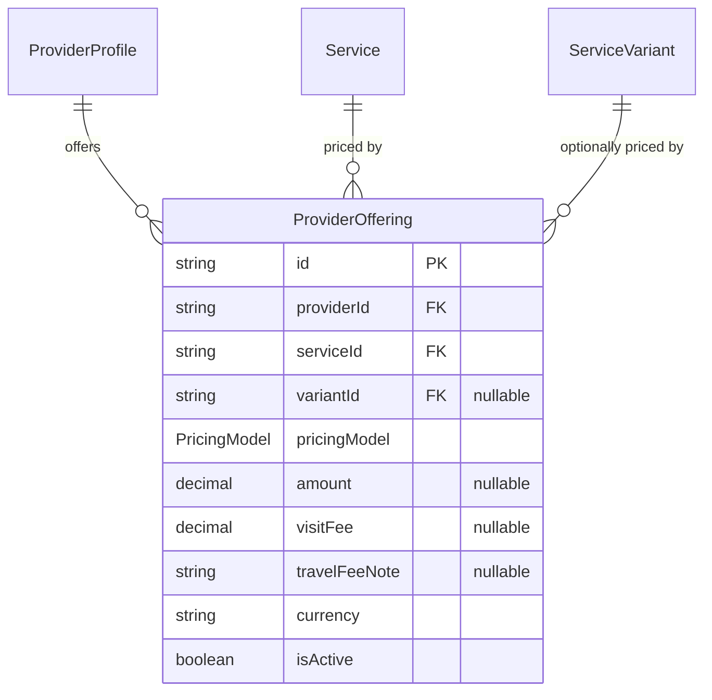
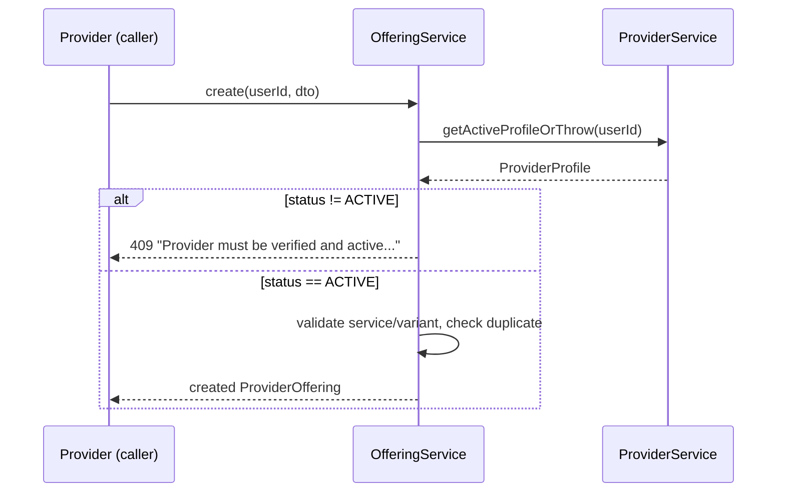

# Provider Offering Module — Implementation Documentation

This documents **how** the Provider Offering & Pricing module
(`src/provider-offering/`) actually works internally — control flow, data
model, and the reasoning behind each design decision. Same three-document
split as every other module (`docs/modules/AUTH_IMPLEMENTATION.md` §0).

| Document | Answers |
|---|---|
| `docs/ARCHITECTURE.md` §5.3 / §6.2 / §6.3 | Why the system is shaped this way, system-wide |
| `docs/api/PROVIDER_OFFERING.md` + `docs/api/openapi.json` | What the HTTP contract is (external, for the frontend team) |
| **This document** | How the contract is actually implemented (internal, for backend engineers) |

If code and this document disagree, the code wins.

## 1. Scope boundary

Per `docs/ARCHITECTURE.md`'s module map (§5.2/§5.3, Phase 1a module #10):
**"What a provider offers, at what price, price rules/quotes."** §6.2
names this module explicitly as the other half of a boundary Catalogue
drew first:

> **Provider Offering** links a specific provider to specific catalogue
> services, with that provider's price, coverage, availability, and
> status. This separation is what makes the "open service marketplace"
> principle real rather than aspirational.

This module implements the **price** part of that sentence only.
"Coverage" is Serviceability (already built,
`docs/modules/SERVICEABILITY_IMPLEMENTATION.md`); "availability" is a
future Availability module; "status" — whether the provider themselves
is active — is Provider's `ProviderStatus`, checked here (§4.1) but never
duplicated as a field on `ProviderOffering`. An offering's own `isActive`
flag is a distinct, narrower "status": whether *this specific listing* is
currently public, independent of the provider's own account status.

**Why this is the first module with no IAM-gated mutation:** every prior
module with shared/admin-relevant data (Catalogue, Geography, IAM itself,
Agent companies, Provider Onboarding approvals, Serviceability coverage
areas) gated writes behind a permission. BRD §17.1 says the opposite for
pricing: *"Service prices are fundamentally controlled by providers.
SevaMitra should not impose mandatory platform-wide pricing."* Adding a
`provider-offering.manage`-style admin gate here would work against that
explicit business rule, not just be unnecessary — so this module
deliberately has none. §18's platform commission (a genuinely
admin-configured concept) is a distinct, not-yet-built module precisely
because commission and provider-set price are different things (§6.3's
pricing→payment→commission→earning chain keeps them as five separate
concepts, never collapsed into one).

**Why `travelFeeNote` is free text, not computed from Serviceability's
radius data:** BRD §17.1 lists "distance fees" as one of several
additional-charge types a provider may quote, alongside visit fees and
materials — described as something "clearly communicated to customers,"
not as a formula the platform computes. Serviceability's Haversine
distance (`docs/modules/SERVICEABILITY_IMPLEMENTATION.md` §1) answers
"can this provider reach this location," a yes/no coverage question —
it was never built to produce a billable per-km rate, and nothing in BRD
asks for that computation to exist yet.

## 2. File map

```
src/provider-offering/
├── provider-offering.module.ts    imports ProviderModule, CatalogueModule
├── offering.controller.ts         /provider-offerings/me — self-service CRUD
├── offering-browse.controller.ts  /provider-offerings — public read-only browsing
├── offering.service.ts            the only writer of ProviderOffering; shared by both controllers
└── dto/                            request DTOs + dto/responses/
```

**Controller registration order matters here, same reason as Provider
Onboarding's split** (`docs/modules/PROVIDER_ONBOARDING_IMPLEMENTATION.md`
§2): `OfferingController`'s literal `/provider-offerings/me` path must be
registered before `OfferingBrowseController`'s `/provider-offerings/:id`
in `provider-offering.module.ts`'s `controllers` array, or a request to
`.../me` could be matched against `:id` instead. The module file carries
an explicit comment calling this out.

Also exported `VariantService` from `CatalogueModule` as part of building
this module (`docs/modules/CATALOGUE_IMPLEMENTATION.md` didn't need to —
every prior consumer of variants already worked within Catalogue itself),
and added `VariantService.assertBelongsToService`, the same
"flat, cross-module existence/ownership check" pattern as
`TownVillageService.findByIdOrThrow`
(`docs/modules/GEOGRAPHY_IMPLEMENTATION.md` §6).

## 3. Data model



**Why `PricingModel` consolidates BRD §17.1's longer list into six
values:** BRD names fixed price, starting price, "quotation after
inspection/visit fee," "custom quotation," labor-and-materials,
hourly/daily/project-based, distance fees, and emergency pricing. Several
of these are the same underlying shape from a data-modeling standpoint —
"quotation after visit" and "custom quotation" are both "no number now, a
quote comes later" (`QUOTE_BASED`); "labor and materials" is either a
concrete number up front (`FIXED`/`STARTING_AT`) or a quote
(`QUOTE_BASED`) depending on whether the provider commits to a figure,
not a distinct model of its own; distance fees and emergency pricing are
additive *modifiers* (a note or a separate charge), not alternative
pricing structures for the base service. Six enum values cover every
real distinction BRD draws without inventing separate models for
descriptions that resolve to the same stored shape.

**Why there's no `@@unique([providerId, serviceId, variantId])` at the
database level:** Postgres treats `NULL` as distinct from every other
`NULL` in a unique index, so a compound unique constraint including the
nullable `variantId` would **not** prevent two offerings for the same
`(providerId, serviceId)` with `variantId` both left `NULL` — exactly the
common case (offering the base service, no variant). This is the same
category of null-and-uniqueness issue Geography's district/taluk naming
could have hit but didn't need to (those parent ids are never null).
Here, the fix is an explicit application-level check
(`assertNoDuplicateOffering`, querying with `variantId: dto.variantId ??
null` before insert) rather than a DB constraint that would silently fail
to do its job for the null case.

**Why `amount`/`visitFee` are `Decimal(10,2)`, not `Float`:** this is the
first module in the codebase to store money. Every other numeric field so
far (latitude/longitude, radius, duration in minutes) is a measurement
where floating-point imprecision is harmless; money is not — `Decimal`
avoids the classic `0.1 + 0.2` class of bug for currency arithmetic
later in the pricing→payment chain (§6.3). Prisma serializes `Decimal`
to a JSON string (verified live: `"amount": "499"` in the actual API
response), which is why the response DTO types these fields as `string`,
not `number`.

## 4. Core flows

### 4.1 The ACTIVE-provider gate is the real payoff of Provider Onboarding



This is the second module (after Provider Onboarding itself) whose
behavior depends on `ProviderProfile.status` actually being `ACTIVE` —
and the first one that *gates a whole feature* on it rather than just
recording it. A provider stuck at `PENDING` (no onboarding application
approved yet) cannot list a single paid offering — verified live: created
a fresh provider profile, confirmed the 409, then switched to a different
account whose provider had already been approved in
`docs/modules/PROVIDER_ONBOARDING_IMPLEMENTATION.md`'s own smoke test,
and confirmed offering creation succeeded there.

### 4.2 Conditional `amount` requirement, validated via `ValidateIf`

Same DTO pattern as Provider Onboarding's `reviewNote`
(`docs/modules/PROVIDER_ONBOARDING_IMPLEMENTATION.md` §5) and IAM's
`scopeId` (`docs/modules/IAM_IMPLEMENTATION.md` §5): `@ValidateIf` gates
`@IsNumber() @Min(0)` on `amount`, running validation whenever
`pricingModel` is one of `FIXED`/`STARTING_AT`/`HOURLY`/`DAILY`, **or**
whenever `amount` was supplied regardless of model (so a stray `amount`
on a `QUOTE_BASED` offering is still type/range-checked, not silently
ignored). Verified live: `FIXED` without `amount` → 400; `QUOTE_BASED`
without `amount` → 201.

### 4.3 Re-parenting a variant validates against the *effective* service

`OfferingService.update` computes
`effectiveServiceId = dto.serviceId ?? existing.serviceId` before
validating a new `variantId` — identical reasoning to Geography's
`DistrictService.update` re-parenting check
(`docs/modules/GEOGRAPHY_IMPLEMENTATION.md` §4.2): changing only
`variantId` (not `serviceId`) must validate against the offering's
*current* service, not silently skip validation because `serviceId`
happened to be absent from that particular request body. Covered in
`offering.service.spec.ts`'s two `update` cases (variant validated
against existing vs. new service).

## 5. Configuration reference

No new environment variables.

## 6. Extension points for future modules

- **Booking**, once built, references `ProviderOffering.id` directly to
  capture "what price did the customer actually agree to" (§6.3's
  "Booking Price" step) — a copy taken at booking time, not a live
  pointer, since a provider changing `amount` later shouldn't retroactively
  change an already-agreed booking's price (that copying isn't
  implemented here — it's Booking's responsibility when it exists).
- **Commission** (BRD §18, Phase 1b), once built, is what finally computes
  what SevaMitra earns from a completed booking — reading
  `ProviderOffering`/`Booking` price data, never writing to it.
- **Availability**, once built, is the other missing half of §6.2's "what
  a provider offers, at what price, coverage, availability, and status" —
  this module deliberately has no time-based fields.

`ProviderOfferingModule` exports `OfferingService` for those future
modules to resolve offerings through the service layer rather than
querying `marketplace.provider_offerings` directly.

## 7. Known gaps (tracked, not yet done)

- **No commission/platform-fee data anywhere in this module** — see §1.
- **No quote/negotiation workflow** for `QUOTE_BASED`/`PROJECT_BASED`
  offerings (BRD §40, future scope).
- **`travelFeeNote` is unstructured** — no computed distance pricing,
  see §1.
- **No price history/audit trail** — `PATCH` overwrites `amount` in
  place.
- **No integration/e2e tests** — only unit tests with mocked Prisma
  (`offering.service.spec.ts`), mirroring every other module. Manually
  smoke-tested against a real database: offering creation blocked for a
  `PENDING` provider (409) → succeeded for an `ACTIVE` one → duplicate
  service/variant pair rejected (409) → `QUOTE_BASED` without `amount`
  succeeded, `FIXED` without `amount` rejected (400) → public browse
  filtered by `serviceId` → `isActive: false` confirmed removing the
  offering from public browsing while it remained visible in the
  provider's own list.
