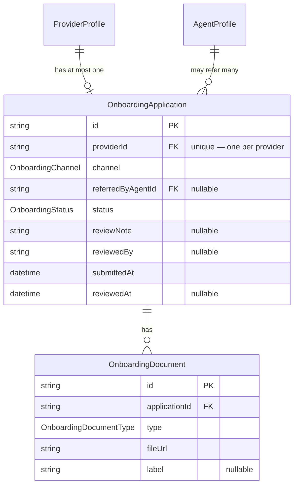
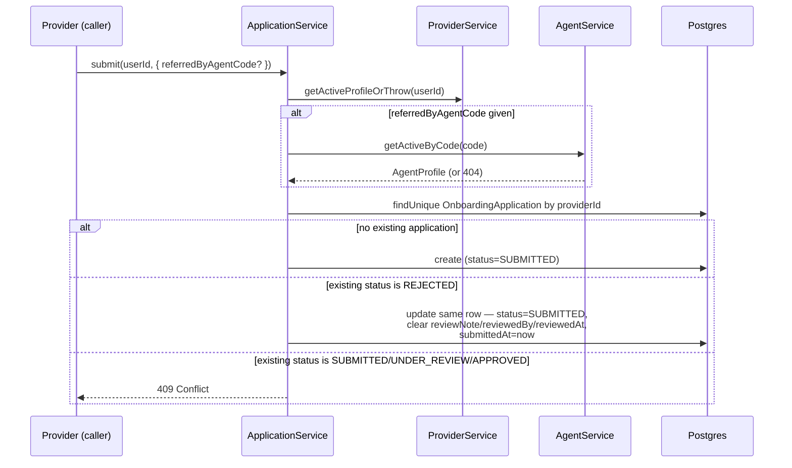
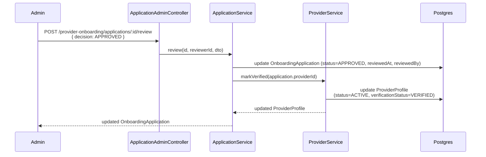

# Provider Onboarding Module — Implementation Documentation

This documents **how** the Provider Onboarding module
(`src/provider-onboarding/`) actually works internally — control flow,
data model, and the reasoning behind each design decision. Same
three-document split as every other module
(`docs/modules/AUTH_IMPLEMENTATION.md` §0).

| Document | Answers |
|---|---|
| `docs/ARCHITECTURE.md` §5.3 | Why the system is shaped this way, system-wide |
| `docs/api/PROVIDER_ONBOARDING.md` + `docs/api/openapi.json` | What the HTTP contract is (external, for the frontend team) |
| **This document** | How the contract is actually implemented (internal, for backend engineers) |

If code and this document disagree, the code wins.

## 1. Scope boundary

Per `docs/ARCHITECTURE.md`'s module map (§5.2/§5.3, Phase 1a module #6):
**"Self/agent/bulk onboarding, documents, approval workflow."** This
module closes two gaps deliberately left open by earlier modules:

- **Provider** (`docs/modules/PROVIDER_IMPLEMENTATION.md` §8) flagged "no
  verification/approval workflow exists anywhere" — this module is that
  workflow.
- **Agent** (`docs/modules/AGENT_IMPLEMENTATION.md` §8) flagged "no
  attribution records" — an approved application's
  `(providerId, referredByAgentId)` pair **is** the attribution record;
  nothing else in the codebase stores one.

Two things named in the BRD are deliberately **not** built here:

- **Documents** are URL references, not uploads. The Media/Document
  module (S3) is Phase 1b; this module's `OnboardingDocument.fileUrl` is
  a plain string, trusted as given, exactly the shape a real upload
  endpoint would eventually populate instead of the client supplying it
  directly.
- **BRD §39's multi-stage review pipeline** ("business review,
  eligibility/compliance review, provider verification, and activation")
  collapses to one `OnboardingStatus` field
  (`SUBMITTED → UNDER_REVIEW → APPROVED/REJECTED`). Modeling four separate
  stage fields with no operational process yet driving them would be
  speculative structure — see §3.

BRD §14.2's four onboarding paths (self-registration, individual-agent-
assisted, bulk by agents/admins, provider-company/group) reduce to two
real data shapes here: `SELF` and `AGENT_REFERRED`, distinguished purely
by whether a `referredByAgentCode` was supplied at submission. "Bulk" is
the same endpoint called repeatedly, not a separate code path (§4.1);
company/group onboarding is out of scope until Provider Organization
exists.

## 2. File map

```
src/provider-onboarding/
├── provider-onboarding.module.ts       imports ProviderModule, AgentModule, IamModule
├── application.controller.ts           self-service — /provider-onboarding/applications/me/...
├── application-admin.controller.ts     admin — /provider-onboarding/applications/... (provider.onboarding.review)
├── application.service.ts              submission, resubmission, documents, claim, review — the only writer of OnboardingApplication/OnboardingDocument
└── dto/                                   request DTOs + dto/responses/
```

Two controllers, not one, following the precedent set by
Customer/Provider/Agent (a dedicated `.../me` controller for self-service)
rather than mixing `me` and `:id` routes in a single controller the way
`AgentCompanyController` does (`docs/modules/AGENT_IMPLEMENTATION.md`
§4.3) — with both a literal `me` segment and admin `:id` routes under the
same base path here, splitting into two controllers sidesteps any
Nest route-ordering question entirely rather than relying on registration
order.

## 3. Data model



**Why one application row per provider, reused across resubmissions,
rather than a new row per attempt:** every other module in this codebase
uses the "one mutable row, not an event log" pattern (Customer/Provider/
Agent profiles all update in place rather than accumulating history rows).
Following that same shape here keeps the module consistent with the rest
of the codebase and avoids inventing an application-history feature no
one has asked for yet. The cost is that a rejected-then-resubmitted
application's *first* rejection reason is gone once resubmitted — judged
acceptable for pilot scale; a real audit trail is `ops.audit_log`'s job
(§7) once that module exists.

**Why `OnboardingStatus` is one field, not BRD §39's four-stage
pipeline:** the four named stages ("business review, eligibility/
compliance review, provider verification, and activation") describe an
ops *process*, not necessarily four *data states* every application must
visibly pass through in this system. Building four fields (or four rows)
with no real workflow tooling yet to move between them would be
speculative — `SUBMITTED → UNDER_REVIEW → APPROVED/REJECTED` covers what
this module's actual endpoints can do today (submit, claim, decide).
Revisit if/when ops needs finer-grained stages to actually operate a
queue.

**Why `referredByAgentId` uses `onDelete: SetNull`:** an agent should
never be undeletable because they once referred a provider — same
reasoning as `AgentProfile.agentCompanyId`
(`docs/modules/AGENT_IMPLEMENTATION.md` §3). The attribution record
degrades to "referred by someone, no longer resolvable" rather than
blocking or cascading.

## 4. Core flows

### 4.1 Submission, resubmission, and channel derivation



`channel` is never client-supplied — it's derived entirely from whether
`referredByAgentCode` resolved to an agent (`ApplicationService.submit`,
`application.service.ts`). This is the same "server computes the
derived field, client only supplies the input that determines it" pattern
as Agent's own `agentCode` generation
(`docs/modules/AGENT_IMPLEMENTATION.md` §4.1).

### 4.2 Approval activates the provider — the cross-module write



This is the first cross-module **write**, not just a read, through
another module's service layer — Customer/Provider/Agent only ever
exposed read methods (`getActiveProfileOrThrow`, `findById`) to each
other before this. `ProviderService.markVerified`/`markRejected` exist
specifically so this module never touches `prisma.providerProfile`
directly, honoring the module-boundary rule
(`docs/ARCHITECTURE.md` §7.1) the same way `RoleAssignmentService`
respects `UserService`... except Provider had no such write method until
this module needed one, so `markVerified`/`markRejected` were added to
`ProviderService` as part of building this module, not before.

**Why rejection leaves `ProviderProfile.status` at `PENDING`, only moving
`verificationStatus` to `REJECTED`:** a rejected application is "try
again," not "gone." `status: PENDING` still reads correctly (the provider
still isn't active), and the provider can call `POST .../me` again to
resubmit — resetting `OnboardingApplication` back to `SUBMITTED` and
implicitly giving `verificationStatus` another chance to become `VERIFIED`
on the next approval.

### 4.3 Claim is optional, not required, before review

`POST .../review` accepts an application in either `SUBMITTED` or
`UNDER_REVIEW` (`DECIDABLE_STATUSES` in `application.service.ts`) — claim
is a courtesy step for ops visibility ("someone is looking at this"), not
a required gate. An admin can decide a fresh `SUBMITTED` application
directly without claiming it first.

### 4.4 Document attachment has no status restriction

`addOwnDocument` works regardless of the application's current status —
including after `REJECTED`, so a provider can attach corrected evidence
before resubmitting. This is a deliberate absence of a guard, not an
oversight: restricting it would only add friction to the exact recovery
flow (fix documents, then resubmit) the rejection path exists to support.

## 5. Configuration reference

No new environment variables.

## 6. Extension points for future modules

- **Media/Document**, once built, is what `OnboardingDocument.fileUrl`
  should eventually come from (a presigned upload response) rather than
  raw client input — see §1.
- **Fraud/Risk** (BRD §15's agent collusion prevention, Phase 3+) is the
  eventual place to add real validation on `referredByAgentCode` beyond
  "does this code resolve to a non-deleted agent."
- **Audit** (`ops.audit_log`, not yet built) is the natural home for a
  real history of review decisions — this module's "reuse the same row"
  approach (§3) means that history doesn't exist anywhere today.
- **Provider Organization**, once built, is what would let BRD §14.2's
  4th onboarding path (company/group) actually be modeled here.

## 7. Known gaps (tracked, not yet done)

- **No file upload** — `fileUrl` is a trusted client-supplied string (§1).
- **One coarse status field**, not BRD §39's four-stage pipeline (§3).
- **No real "bulk" endpoint** — an agent or admin submitting for many
  providers just calls `POST .../me` once per provider (as that
  provider, since submission is self-service); there's no batch/CSV
  surface (§1).
- **No agent collusion prevention** (BRD §15) — any non-deleted agent's
  code is accepted regardless of that agent's own `PENDING` status (same
  gap already flagged in `docs/modules/AGENT_IMPLEMENTATION.md` §8,
  now actually reachable through this module).
- **No integration/e2e tests** — only unit tests with mocked Prisma
  (`application.service.spec.ts`, plus new coverage added to
  `provider.service.spec.ts` and `agent.service.spec.ts` for the methods
  this module introduced). Manually smoke-tested against a real database,
  full loop: provider profile created → application blocked with a bogus
  referral code (404) → submitted with a real agentCode → document
  attached → duplicate submission blocked (409) → admin listed, claimed,
  approved → `ProviderProfile` confirmed `ACTIVE`/`VERIFIED` via a
  separate `GET /providers/me` call → re-reviewing the same application
  confirmed blocked (409).
