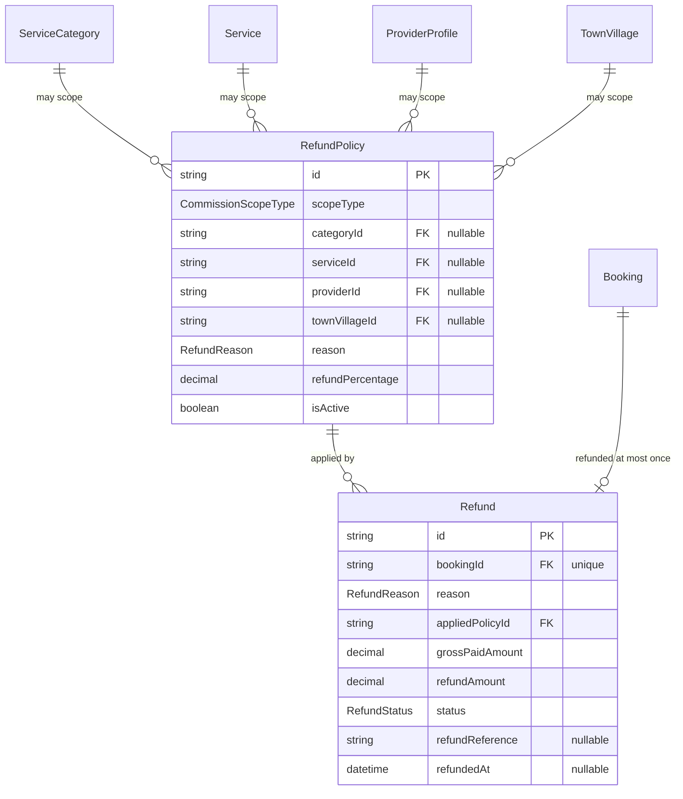
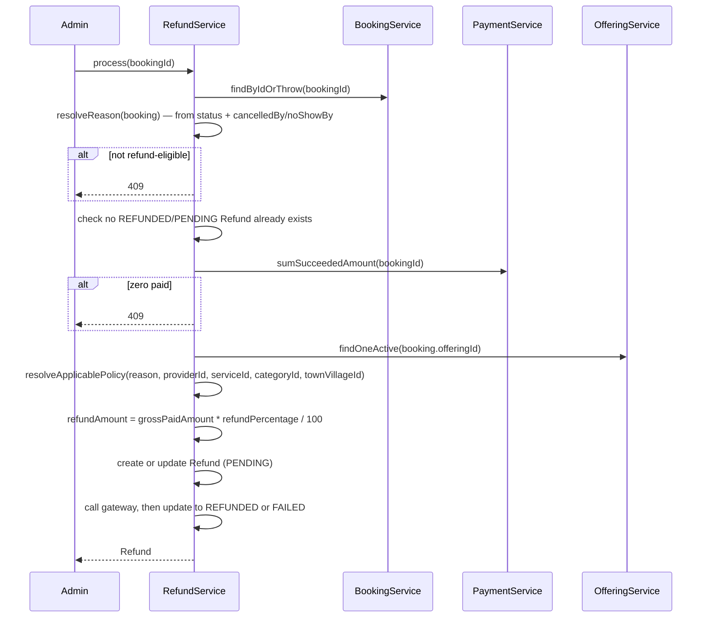

# Refund Module — Implementation Documentation

This documents **how** the Refund module (`src/refund/`) actually
works internally — control flow, data model, and the reasoning behind
each design decision. Same three-document split as every other module
(`docs/modules/AUTH_IMPLEMENTATION.md` §0).

| Document | Answers |
|---|---|
| `docs/ARCHITECTURE.md` §5.3 | Why the system is shaped this way, system-wide |
| `docs/api/REFUND.md` + `docs/api/openapi.json` | What the HTTP contract is (external, for the frontend team) |
| **This document** | How the contract is actually implemented (internal, for backend engineers) |

If code and this document disagree, the code wins.

## 1. Scope boundary

Per `docs/ARCHITECTURE.md`'s Phase 1b module list (§5.3): "cancellations/
no-shows require refund handling" — the third Phase 1b module, after
Commission and Settlement. BRD §37 governs scope: clear business rules
for customer/provider cancellation and customer/provider no-show;
outcomes may depend on booking status, acceptance, and commercial
policy; refund outcomes are full, partial, or no refund; refunds may
need commission/cashback/loyalty adjustments; rules should be
configurable by service, provider, category, or geography.

**Why exactly five `RefundReason` values, derived entirely from
`Booking`'s own state machine:** rather than inventing a reason
taxonomy, `RefundService.resolveReason` maps directly onto the actual
`BookingStatus`/`BookingParty` combinations a `Booking` can reach
without completing — `CANCELLED`×`CUSTOMER`, `CANCELLED`×`PROVIDER`,
`NO_SHOW`×`CUSTOMER`, `NO_SHOW`×`PROVIDER`, and `REJECTED` (which has
no party, since only a provider can reject). This is exhaustive:
`docs/modules/BOOKING_IMPLEMENTATION.md`'s state machine has no other
way for a booking to end without reaching `COMPLETED`. BRD §37's
"provider travel/arrival status" and "service start" as additional
cancellation-outcome factors aren't modeled — `Booking` itself has no
travel/arrival tracking (that would be a Booking-module concern, not
Refund's, and doesn't exist).

**Why `COMPLETED` is never a refund trigger, and why this means
Commission and Refund never overlap for the same booking:** Commission
only calculates for `COMPLETED` bookings
(`docs/modules/COMMISSION_IMPLEMENTATION.md` §1); Refund only processes
for bookings that reached `CANCELLED`/`NO_SHOW`/`REJECTED`, none of
which are reachable from `COMPLETED` in `BookingService`'s transition
guards. A given booking is therefore structurally either commissioned
or (potentially) refunded, never both — which is also *why* BRD §37's
"refunds may require commission adjustments" doesn't need any code
here: there is never a commission calculation to adjust for a
refund-eligible booking.

**Why `RefundPolicy` reuses `CommissionScopeType`, same as
`SettlementConfig`:** identical reasoning — "at what level is this rule
scoped" is the same question across all three finance modules.

**Why a `RefundPolicy`'s uniqueness is per `(scopeType, entity,
reason)`, unlike `CommissionRule`/`SettlementConfig`'s per-scope-alone
uniqueness:** a customer cancellation and a provider no-show plainly
need different refund percentages at the very same scope (BRD §37's
whole point is that outcomes differ by *why* the booking ended) — scope
alone isn't a specific enough key here. `refundPercentage` (0-100)
alone covers BRD §37's "full refund, partial refund, or no refund"
without a separate outcome enum, the same "one numeric field covers
several BRD-described outcomes" pattern Commission's percentage/fixed
split and Payment's advance-via-multiple-rows both already use.

**Why refunds are admin-triggered, not automatic on booking
cancellation:** identical reasoning to Commission's and Settlement's
admin-triggered actions — no Event/Outbox exists yet
(`docs/ARCHITECTURE.md` §6.6/§11) to fire this automatically when a
`Booking` transitions to a refund-eligible state.

## 2. File map

```
src/refund/
├── refund.module.ts     imports IAM, Catalogue, Provider, Geography, Customer, Booking, Payment, ProviderOffering
├── policy/                /refund/policies — admin-managed policy config
│   ├── refund-policy.controller.ts
│   ├── refund-policy.service.ts
│   └── refund-policy.service.spec.ts
├── process/
│   ├── refund.controller.ts          /refund — admin process + view
│   ├── refund.service.ts               the actual refund logic
│   ├── refund.service.spec.ts
│   └── customer/
│       └── customer-refund.controller.ts   /refund/me
└── gateway/
    ├── refund-gateway.interface.ts   REFUND_GATEWAY token + interface
    └── stub-refund.gateway.ts         console-logging stand-in
```

`RefundPolicyService` is structurally close to `CommissionRuleService`
and `SettlementConfigService` — same scope-validation, same app-level
"no duplicate active rule" check pattern, extended by one more
dimension (`reason`). `RefundService.resolveApplicablePolicy` reuses
the exact same fixed precedence array shape as
`CommissionCalculationService.resolveApplicableRule`
(`docs/modules/COMMISSION_IMPLEMENTATION.md` §4.1:
`PROVIDER > SERVICE > CATEGORY > GEOGRAPHY > PLATFORM`), just filtered
by `reason` in addition to scope.

**This is the first finance module where the self-service view is
customer-facing, not provider-facing.** Commission and Settlement both
pay providers, so their self-service views are providers looking at
their own earnings/payouts. A refund pays the *customer* back, so
`CustomerRefundController` checks ownership via
`booking.customerId`, using `CustomerService` (newly imported into this
module — Commission/Settlement never needed it).

**Controller registration order** follows the same pattern Settlement
established: `RefundPolicyController` (`/refund/policies`) and
`CustomerRefundController` (`/refund/me`) are registered before
`RefundController`, whose `GET /refund/:id` would otherwise swallow
"policies" and "me" as an `:id` — verified live.

## 3. Data model



`RefundPolicy` and `Refund` both live in the `finance` schema.
`Refund.bookingId` is `@unique` — one refund row per booking, ever,
but unlike `CommissionCalculation` (truly write-once) a `FAILED`
`Refund` row is reused in place by a retry (§4.2), not left
permanently terminal.

## 4. Core flows

### 4.1 `process()` derives its own reason — the caller never supplies one



`POST /refund/process` deliberately takes only `bookingId` — the
`reason` is never client-supplied, since it must always match the
booking's actual recorded outcome (`cancelledBy`/`noShowBy`), not
something a caller could get wrong or spoof.

### 4.2 A `FAILED` refund is retried in place, unlike Commission/Settlement's write-once records

`process()` checks for an existing `Refund` row by `bookingId`. If one
exists and its `status` is anything other than `FAILED`
(`PENDING` or `REFUNDED`), the request **409**s — a refund is never
reprocessed once it has succeeded or is mid-flight. If the existing
row **is** `FAILED`, `process()` re-uses that same row (`prisma.refund.
update`, not `create`) rather than being blocked by the `@unique
bookingId` constraint or creating a second row. This is a genuine
difference from Commission's `CommissionCalculation` (write-once,
never revisited) and Settlement's `Settlement` (append-only batches,
where a failed run just leaves its calculations unlinked for the
*next* run to naturally pick up): a booking only ever has one refund
to give, so "the next attempt" and "this same refund, tried again" are
the same thing, not a new batch. Covered directly in
`refund.service.spec.ts`'s "retries in place (update, not create) when
an existing refund is FAILED" case.

## 5. Configuration reference

No new environment variables — `StubRefundGateway` needs none, exactly
like the other three gateway/provider stubs already in the codebase.

## 6. Extension points for future modules

- **Event/Outbox** (Phase 1b), once built, is where an automatic
  `BookingCancelled/NoShow/Rejected → process refund` trigger belongs —
  see §1.
- **Wallet/Cashback and Loyalty** (Phase 2), once built, are where BRD
  §37's cashback/loyalty-point reversal on refund would be implemented
  — currently moot, since neither exists.
- **Dispute** (Phase 2) may eventually need to override or contest an
  automatically-resolved refund amount — not modeled here, since
  Dispute doesn't exist yet.

## 7. Known gaps (tracked, not yet done)

- **Not wired into Booking's cancellation flow** — admin-triggered
  only. See §1.
- **No commission/cashback/loyalty adjustment** — structurally moot for
  commission (§1); cashback/loyalty don't exist yet.
- **One refund per booking, ever** — no multiple partial refunds, no
  manually-overridden amount outside what the resolved policy computes.
- **No concurrency guard** on refund processing — the same
  read-then-write race already documented for Commission, Settlement,
  and Payment applies.
- **No integration/e2e tests** — only unit tests with mocked Prisma and
  mocked `BookingService`/`PaymentService`/`OfferingService`/
  `ServiceService`/`CustomerService`/`RefundGateway`
  (`refund-policy.service.spec.ts`, `refund.service.spec.ts`).
  Manually smoke-tested against a real database: all five
  `PLATFORM`-scoped policies created (50%/100%/0%/100%/100% for the
  five reasons respectively), a duplicate at the same `(scope, reason)`
  correctly **409**'d → `GET /refund/policies` and `GET /refund/me`
  both confirmed *not* swallowed by `GET /refund/:id` (the same
  literal-path registration-order pattern as Settlement) → a real
  booking paid `ONLINE` in full (599), then customer-cancelled →
  processing its refund correctly resolved `CUSTOMER_CANCELLED` → the
  `PLATFORM` 50% policy → an exact `299.50` refund, `status: REFUNDED`
  → reprocessing the same booking correctly **409**'d (already
  processed) → a `COMPLETED` booking correctly **409**'d as
  refund-ineligible → a `CANCELLED` booking with no successful payment
  correctly **409**'d ("nothing was paid") → a non-existent booking
  correctly **404**'d → non-admin access to processing correctly
  **403**'d → the customer's own refund view and a different party's
  attempt to view it (correctly **404** via the *customer* ownership
  check, not the provider one — confirming this module's self-service
  view really is customer-scoped) → DTO validation confirmed **400**
  for a missing scope entity field, an invalid `reason` enum value, and
  an out-of-range `refundPercentage`.
