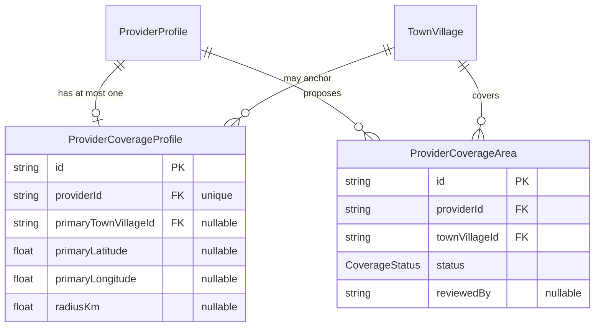
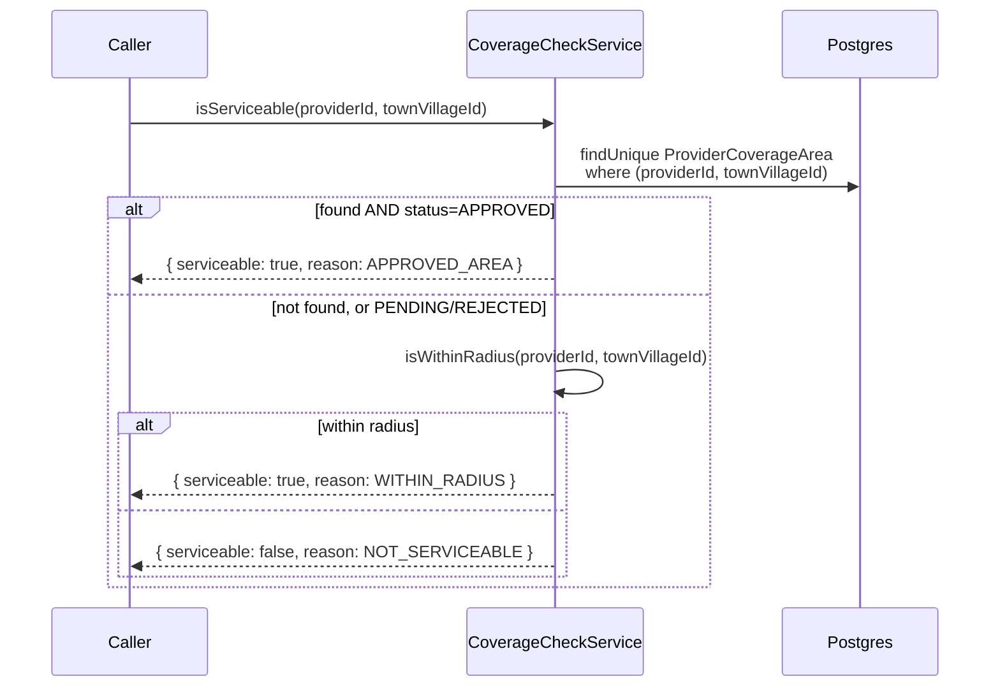
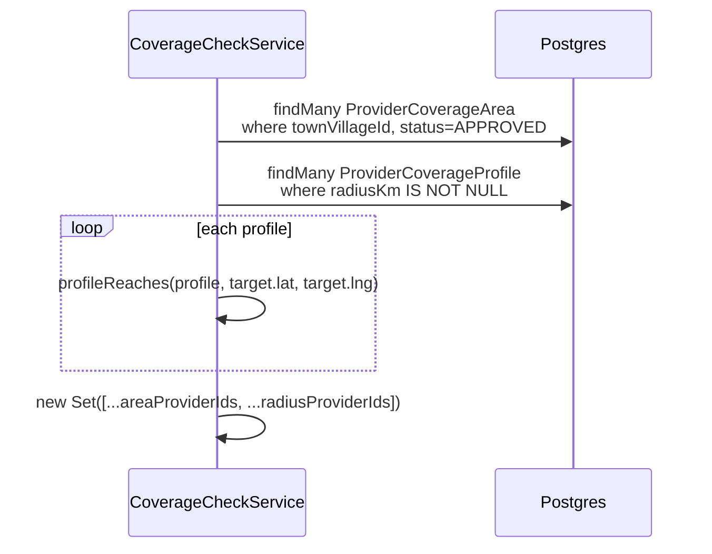

# Serviceability Module — Implementation Documentation

This documents **how** the Serviceability module (`src/serviceability/`)
actually works internally — control flow, data model, and the reasoning
behind each design decision. Same three-document split as every other
module (`docs/modules/AUTH_IMPLEMENTATION.md` §0).

| Document | Answers |
|---|---|
| `docs/ARCHITECTURE.md` §5.3 / §6.4 | Why the system is shaped this way, system-wide |
| `docs/api/SERVICEABILITY.md` + `docs/api/openapi.json` | What the HTTP contract is (external, for the frontend team) |
| **This document** | How the contract is actually implemented (internal, for backend engineers) |

If code and this document disagree, the code wins.

## 1. Scope boundary

Per `docs/ARCHITECTURE.md`'s module map (§5.2/§5.3, Phase 1a module #9):
**"PIN/radius/polygon coverage, provider coverage matching."** §6.4 draws
the line this module exists to fill:

> **Serviceability** answers a dynamic business question at request time:
> "Can provider X deliver service Y at customer location Z, right now?"
> — evaluated from PIN/radius/polygon coverage + service eligibility +
> provider status + availability. Serviceability logic lives in one
> place, never duplicated inside Provider or Booking.

This module implements the **coverage** half of that question only —
"is location Z within provider X's declared area" — not service
eligibility (Catalogue/Provider Offering's concern), provider status
(Provider module's `status`/`verificationStatus`), or availability (a
future Availability module). Nothing calls this module's `/check` yet
(§7) because Booking, the eventual real caller, doesn't exist.

**Why "polygon" coverage isn't literal PostGIS polygon geometry:** BRD
§13.2 lists three provider coverage options — "selected villages/towns or
PIN codes," "a defined travel radius," and "specific approved service
areas." The third is naturally read as an admin-approved *set* of named
areas, which the explicit `ProviderCoverageArea` (village-level, with an
approval workflow) already models — not a requirement for arbitrary
hand-drawn boundary geometry. Building real `POLYGON` storage and
`ST_Contains` queries (Prisma's `Unsupported("geometry")` escape hatch,
raw SQL, SRID handling) is real infrastructure with no named BRD
requirement forcing that specific shape yet, versus the two mechanisms
this module does implement, which map directly onto explicit BRD text.

**Why radius matching is plain Haversine math, not a PostGIS spatial
query:** same reasoning as every other module that deferred PostGIS
(Customer's addresses, Geography's town/village coordinates) — this is
the first module that actually needs to *compute* a distance, but a
single point-to-point great-circle distance is ordinary application-layer
math, not a query requiring a spatial index. `haversineDistanceKm`
(`src/common/util/haversine.ts`) is a plain pure function, unit-tested
directly against known city-pair distances (Mysuru↔Bengaluru,
`haversine.spec.ts`). A real `ST_DWithin` query becomes worth its
complexity once `GET /serviceability/providers` (§4.3) needs to scale
past a full-table scan — see §8.

## 2. File map

```
src/serviceability/
├── serviceability.module.ts        imports ProviderModule, GeographyModule, IamModule
├── coverage-profile/               /serviceability/coverage/me — radius config, self-service
├── coverage-area/
│   ├── coverage-area.controller.ts        /serviceability/coverage-areas/me — propose/list/withdraw
│   └── coverage-area-admin.controller.ts  /serviceability/coverage-areas — list/review (serviceability.review)
├── check/
│   ├── check.controller.ts          /serviceability/check, /serviceability/providers — read-only, login only
│   └── coverage-check.service.ts    the actual matching logic — exported for future modules
└── dto/                              request DTOs + dto/responses/
```

`CoverageAreaService` is shared by both the self-service and admin
controllers (same split-controller-shared-service shape as Provider
Onboarding's `ApplicationService`,
`docs/modules/PROVIDER_ONBOARDING_IMPLEMENTATION.md` §2) — not a
coincidence: coverage area proposals have the exact same "self-service
submit → admin claim/decide" shape as onboarding applications, so this
module reuses that pattern rather than inventing a new one. Also added
`TownVillageService.findByIdOrThrow` to Geography as part of building
this module (`docs/modules/GEOGRAPHY_IMPLEMENTATION.md` didn't need a
flat, taluk-agnostic lookup before — every prior consumer of
`TownVillage` already had the taluk in hand).

## 3. Data model



**Why the primary point can come from either explicit coordinates or a
`TownVillage` reference:** a provider might know their precise shop
location (explicit lat/lng) or might only think in terms of "I'm based in
Nanjangud" (a `TownVillage` reference, whose own coordinates — set when
that Geography row was created — become the effective point).
`CoverageCheckService.profileReaches` resolves explicit coordinates first
and only falls back to the referenced town/village's coordinates if
either explicit field is null — covered directly in
`coverage-check.service.spec.ts`'s "falls back to primaryTownVillage
coordinates" case.

**Why `ProviderCoverageArea` has its own `CoverageStatus` enum, not a
reuse of `OnboardingStatus`:** structurally identical
(`PENDING`/`APPROVED`/`REJECTED` vs. Onboarding's four values including
`SUBMITTED`/`UNDER_REVIEW`), but they're conceptually different resources
in different modules — reusing one module's enum in another would create
an implicit coupling (a schema change to Onboarding's workflow could
silently affect Serviceability) for no real benefit over two small,
independent enums.

**Why `@@unique([providerId, townVillageId])` on `ProviderCoverageArea`:**
a provider can propose a given village only once at a time — the same
resubmission-in-place pattern as `OnboardingApplication`'s
`@@unique([providerId])` (one row per provider, reused across
resubmissions rather than accumulating history), scoped here to the pair
since a provider can have *many* coverage areas (one per village) but
only one per specific village.

## 4. Core flows

### 4.1 The two-check order in `isServiceable`



The approved-area check short-circuits before ever touching the radius
path (verified in `coverage-check.service.spec.ts`'s "without checking
radius" case) — a cheap indexed lookup on the compound unique key beats
computing a distance whenever it can answer the question outright. A
`PENDING` or `REJECTED` row for the exact pair is deliberately treated
the same as no row at all here — falling through to the radius check,
never returning early as "not serviceable" — so a provider who also
declared a radius that happens to reach the same village is still
correctly serviceable via that second mechanism.

### 4.2 Withdrawal has no status restriction, mirroring Customer's addresses

`CoverageAreaService.removeOwn` allows deleting a proposal in any status —
`PENDING`, `APPROVED`, even `REJECTED`. This is the provider's own
request, not admin-managed reference data (unlike Catalogue/Geography's
`isActive`-only pattern) — the same reasoning `CustomerAddress` uses for
having a real `DELETE` (`docs/modules/CUSTOMER_IMPLEMENTATION.md` §2)
where Catalogue/Geography deliberately don't.

### 4.3 `listServiceableProviderIds` — union, not intersection, deduplicated



A provider appearing in both sets (an approved area *and* a radius that
happens to reach the same village) is deduplicated via `Set` — covered in
`coverage-check.service.spec.ts`'s "unions providers... without
duplicates" case, which deliberately includes a provider in both source
lists to prove the dedup, not just a trivial non-overlapping union.

## 5. Configuration reference

No new environment variables.

## 6. Extension points for future modules

- **Booking**, once built, is the intended real caller of
  `CoverageCheckService.isServiceable` before allowing a booking to be
  created — `ServiceabilityModule` exports `CoverageCheckService`
  specifically for this.
- **Discovery/Matching**, once formalized, is the intended caller of
  `listServiceableProviderIds` for "find providers near me" search — same
  export.
- **Availability**, once built, is the other half of "can this provider
  serve me *right now*" that this module explicitly doesn't answer (§1) —
  location coverage and time-based availability are orthogonal checks a
  future Booking flow would combine.

## 7. Known gaps (tracked, not yet done)

- **No polygon geometry** — see §1.
- **`GET /serviceability/providers` is O(n) over every coverage profile
  with a radius set**, not spatially indexed. Acceptable at pilot
  provider counts; a real bottleneck once provider count grows — the
  natural fix is a PostGIS `ST_DWithin` query once that infrastructure
  exists, not an optimization of the current Haversine loop.
- **Nothing else in the codebase calls this module yet** — Booking is the
  intended real consumer and doesn't exist. `/check` and `/providers`
  are fully functional and manually verified (§8) but currently only
  reachable directly, not enforced anywhere in a booking flow.
- **No integration/e2e tests** — only unit tests with mocked Prisma
  (`coverage-profile.service.spec.ts`, `coverage-area.service.spec.ts`,
  `coverage-check.service.spec.ts`, plus `haversine.spec.ts` for the
  distance math itself and new coverage added to
  `town-village.service.spec.ts` for the method this module added to
  Geography). Manually smoke-tested against a real database: coverage
  profile created with a 30km radius from Mysuru → check against
  Nanjangud (~23km away) confirmed `WITHIN_RADIUS` → check against a
  newly-created far village (~130km, Bengaluru coordinates) confirmed
  `NOT_SERVICEABLE` → proposed that far village as an explicit coverage
  area → confirmed it stayed `NOT_SERVICEABLE` while `PENDING` (BRD §13.3
  verified directly, not just asserted) → approved it as admin → confirmed
  it flipped to `APPROVED_AREA` → confirmed it appears in
  `/serviceability/providers` for that village.
