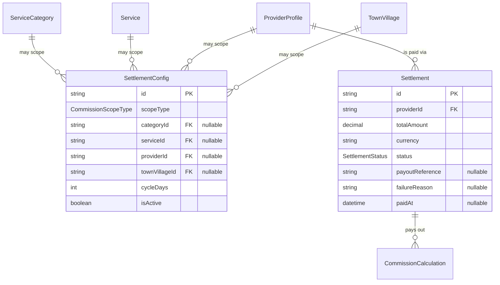
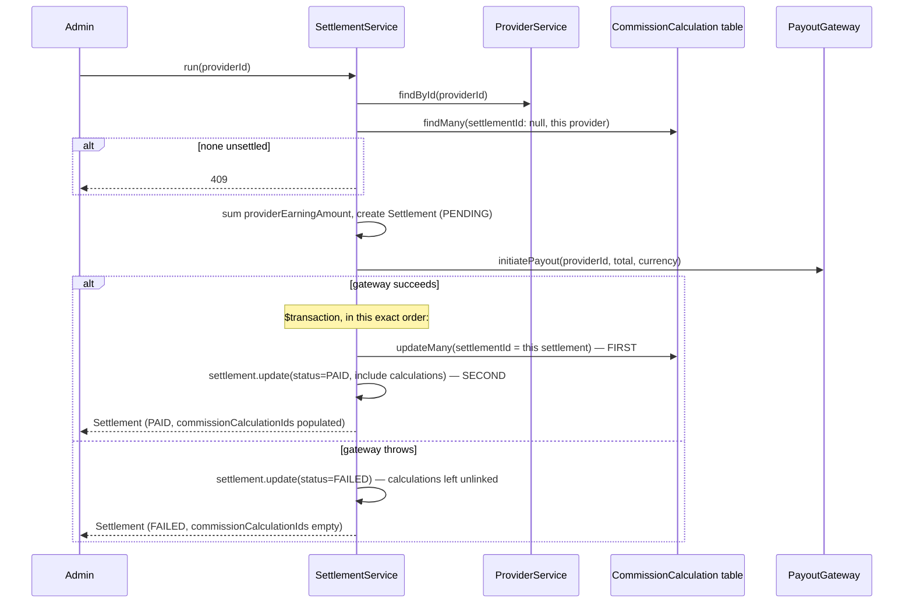

# Settlement Module — Implementation Documentation

This documents **how** the Settlement module (`src/settlement/`)
actually works internally — control flow, data model, and the
reasoning behind each design decision. Same three-document split as
every other module (`docs/modules/AUTH_IMPLEMENTATION.md` §0).

| Document | Answers |
|---|---|
| `docs/ARCHITECTURE.md` §5.3 | Why the system is shaped this way, system-wide |
| `docs/api/SETTLEMENT.md` + `docs/api/openapi.json` | What the HTTP contract is (external, for the frontend team) |
| **This document** | How the contract is actually implemented (internal, for backend engineers) |

If code and this document disagree, the code wins.

## 1. Scope boundary

Per `docs/ARCHITECTURE.md`'s Phase 1b module list (§5.3): "providers
must actually get paid out" — the second Phase 1b module, the natural
next step after Commission since the pricing chain (§6.3) ends
`Provider Earning → Settlement: "Has that money actually been paid
out?"`. BRD §36 governs scope: provider settlement cycles must be
configurable; commission/refunds/adjustments/cashback reversal should
be reflected per configured rules; arrangements can vary by provider,
provider company, service, category, or geography; settlements must
support reconciliation and business reporting.

**Why `SettlementConfig` reuses `CommissionScopeType` rather than a new
enum:** BRD §36's "settlement arrangements can vary by individual
provider, provider company, service, category, or geography" is
structurally the same question Commission's scoping already answers —
"at what level is this business rule configured." Introducing a
parallel `SettlementScopeType` enum with identical values would be
pure duplication for no gained expressiveness. The same
provider-group-is-dropped reasoning applies here too (no
`ProviderGroup` model exists yet).

**Why `cycleDays` is a plain positive integer, not a frequency enum
(`WEEKLY`/`MONTHLY`/...):** unlike Commission's `PERCENTAGE`/
`FIXED_AMOUNT` (a genuine two-shape distinction), BRD §36 doesn't
enumerate specific cadences — it just says "configurable." An integer
day-count is strictly more expressive than any fixed preset list
(it captures "every 10 days" or "every 45 days" without needing new
enum values later) and avoids guessing at a BRD-unspecified list of
options.

**Why `SettlementConfig` is stored even though nothing currently reads
it automatically:** identical reasoning to `AvailabilitySchedule`'s
unenforced capacity limits and Commission's rule storage before any
scheduler exists — there is no Scheduler module yet (Phase 1b,
`docs/ARCHITECTURE.md` §11) to run settlement on a cadence, so every
run is admin-triggered via `POST /settlement/run`, exactly like
Commission's calculation trigger. Storing the config now means a
future Scheduler reads an existing value rather than requiring a
migration.

**Why refunds/adjustments/cashback aren't netted into a settlement's
total:** BRD §36 explicitly asks for this, but none of their source
modules exist yet — Refund is a separate not-yet-built Phase 1b module,
and cashback belongs to Phase 2's Promotion/Wallet work. Netting
against data that doesn't exist isn't possible; `totalAmount` is
purely the sum of unsettled `CommissionCalculation.
providerEarningAmount` for now.

## 2. File map

```
src/settlement/
├── settlement.module.ts     imports IAM, Catalogue, Provider, Geography
├── config/                   /settlement/config — admin-managed cycle metadata
│   ├── settlement-config.controller.ts
│   ├── settlement-config.service.ts
│   └── settlement-config.service.spec.ts
├── run/
│   ├── settlement.controller.ts          /settlement — admin run + view
│   ├── settlement.service.ts               the payout logic
│   ├── settlement.service.spec.ts
│   └── provider/
│       └── provider-settlement.controller.ts   /settlement/provider/me
└── gateway/
    ├── payout-gateway.interface.ts       PAYOUT_GATEWAY token + interface
    └── stub-payout.gateway.ts             console-logging stand-in
```

`SettlementConfigService` is structurally a near-duplicate of
`CommissionRuleService` (same scope-validation, same app-level
"no duplicate active rule at this scope" check) — deliberately not
factored into a shared generic "scoped config" base class for two
modules; see §6 for when that would become worth doing.

**Controller registration order matters here for a new reason.**
Every prior module's literal-path-vs-`:id` ordering concern involved
routes at *different* base paths (e.g. `/bookings/me` vs
`/bookings/provider/me`). `SettlementController`'s `GET /settlement/:id`
shares its exact base path with `SettlementConfigController`
(`/settlement/config`) and `ProviderSettlementController`
(`/settlement/provider/me`) — both of which have a literal first path
segment (`config`, `provider`) that Express would otherwise match
against `:id`. `settlement.module.ts`'s `controllers` array explicitly
lists `SettlementConfigController` and `ProviderSettlementController`
**before** `SettlementController`, with a comment explaining why —
verified live: `GET /settlement/config` correctly returns the config
array, not a 404 from `SettlementController.findOne('config')`.

## 3. Data model



`Settlement` and `SettlementConfig` both live in the `finance` schema.
`CommissionCalculation.settlementId` (added in this module's migration,
nullable) is the join: `null` means "not yet settled," set means "paid
out by this settlement." A `Settlement` can cover many
`CommissionCalculation` rows (one payout batching everything unsettled
at run time); a `CommissionCalculation` belongs to at most one
`Settlement` ever, once linked.

## 4. Core flows

### 4.1 `run()` links calculations before re-reading them — order matters



**The transaction's operation order is load-bearing, not incidental.**
Prisma's array-form `$transaction` executes its queries **sequentially,
in array order**, within one DB transaction. The settlement `update`
call re-reads its `commissionCalculations` relation via `include` —
if that update ran *before* the `updateMany` that actually sets
`settlementId` on those rows, the `include` would see the pre-update
state and return an empty array. This was caught during live smoke
testing (not by the unit tests, which mock `$transaction` and so
cannot detect a real ordering bug — see §7): the first working version
had the array in the wrong order and `commissionCalculationIds` came
back empty despite a successful payout. The fix was purely reordering
the two operations in the array; `settlement.service.spec.ts`'s
mocked-`$transaction` test was updated to match the corrected order,
but only the live-database check actually proved the fix.

### 4.2 A `FAILED` payout leaves its calculations unlinked, by design

If `payoutGateway.initiatePayout` throws, the `catch` branch updates
the `Settlement` to `FAILED` and **never touches**
`CommissionCalculation.settlementId` — those rows stay `null` and are
picked up again by the very next `run()` call for that provider. There
is no separate "retry" endpoint; retrying a failed settlement is just
calling `POST /settlement/run` again once whatever caused the failure
is resolved.

## 5. Configuration reference

No new environment variables — `StubPayoutGateway` needs none, exactly
like `ConsoleOtpSender`, `StubPaymentGateway`, and
`ConsoleNotificationProvider`.

## 6. Extension points for future modules

- **Scheduler** (Phase 1b), once built, is the intended reader of
  `SettlementConfig.cycleDays` to run `SettlementService.run()`
  automatically per provider on a cadence, instead of requiring an
  admin to call `POST /settlement/run` — see §1.
- **Refund** and **Wallet/Cashback** (Phase 1b/2), once built, would
  extend `run()`'s total calculation to net their amounts in, per BRD
  §36 — see §1.
- **Reporting** (Phase 1b) would read `Settlement`/`CommissionCalculation`
  together for the reconciliation view BRD §36 asks for.
- **If a third module ever needs the same "scoped config with app-level
  uniqueness" shape** that `CommissionRuleService` and
  `SettlementConfigService` both already implement near-identically,
  that would be the point to factor out a shared abstraction — not
  before, per this codebase's general anti-premature-abstraction stance
  ("three similar lines is better than a premature abstraction").

## 7. Known gaps (tracked, not yet done)

- **Settlement cycle config is inert** — see §1.
- **No refund/adjustment/cashback netting** — see §1.
- **Single-currency assumption** — `currency` is taken from the first
  unsettled calculation found, with no validation that a provider's
  unsettled calculations don't mix currencies (they never do in
  practice today, since nothing in the codebase supports multi-currency
  yet).
- **No concurrency guard** on a settlement run — the same
  read-then-write race already documented for Commission and Payment
  applies: two simultaneous `run()` calls for the same provider could
  both read the same "unsettled" set before either links them.
- **No reconciliation export/report** — see §1.
- **No integration/e2e tests** — only unit tests with mocked Prisma and
  mocked `ProviderService`/`PayoutGateway`
  (`settlement-config.service.spec.ts`, `settlement.service.spec.ts`).
  Manually smoke-tested against a real database: a `PLATFORM` settlement
  config created, a duplicate correctly **409**'d, a missing scope
  entity field correctly **400**'d → `GET /settlement/config` confirmed
  it is *not* swallowed by `GET /settlement/:id` (the literal-path
  registration-order fix, §2) → a real provider with one unsettled
  commission calculation (527.12) settled successfully, `status: PAID`,
  a fabricated `payoutReference` logged by the stub gateway → running
  again immediately correctly **409**'d (nothing left unsettled) → a
  second booking driven through to a second commission calculation
  (85.00, correctly falling back to the `PLATFORM` rate after the
  `PROVIDER` rule had been deactivated in earlier Commission testing)
  → settling it surfaced **the `commissionCalculationIds` ordering bug
  described in §4.1**, fixed, and reverified live (the array correctly
  populated on the second attempt) → non-admin access to running/
  listing correctly **403**'d, a non-existent provider correctly
  **404**'d → the provider's own self-service view and a different
  party's attempt to view it (correctly **404**, not 403) both
  confirmed.
